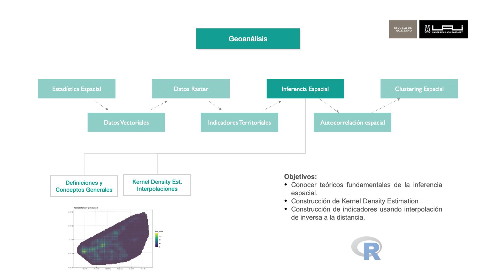
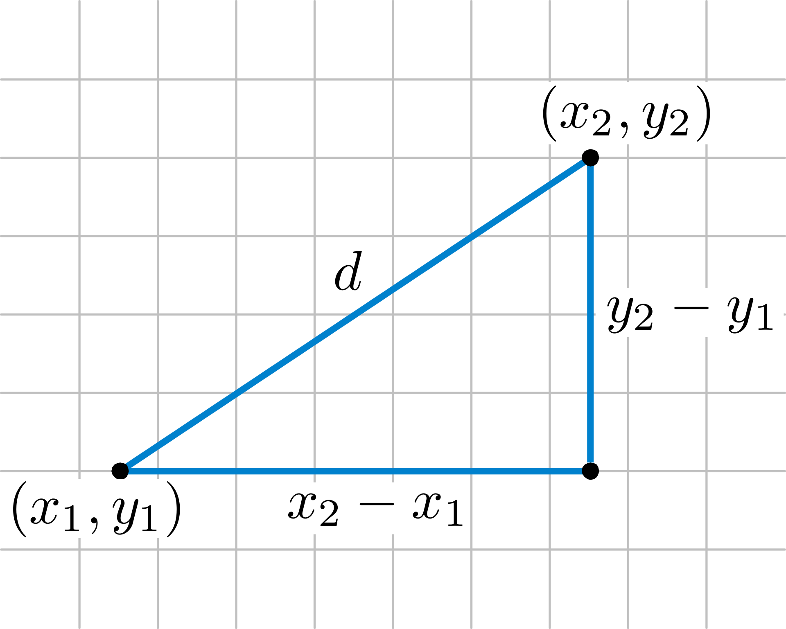
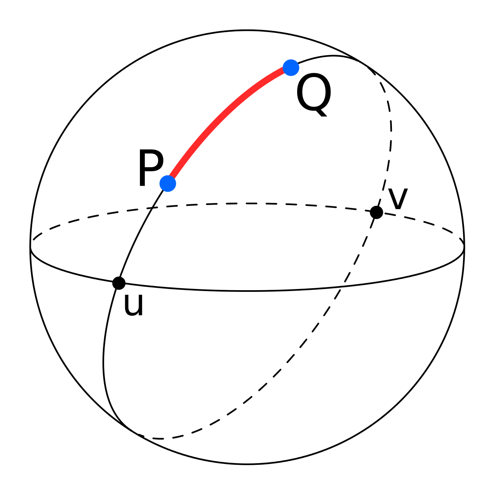
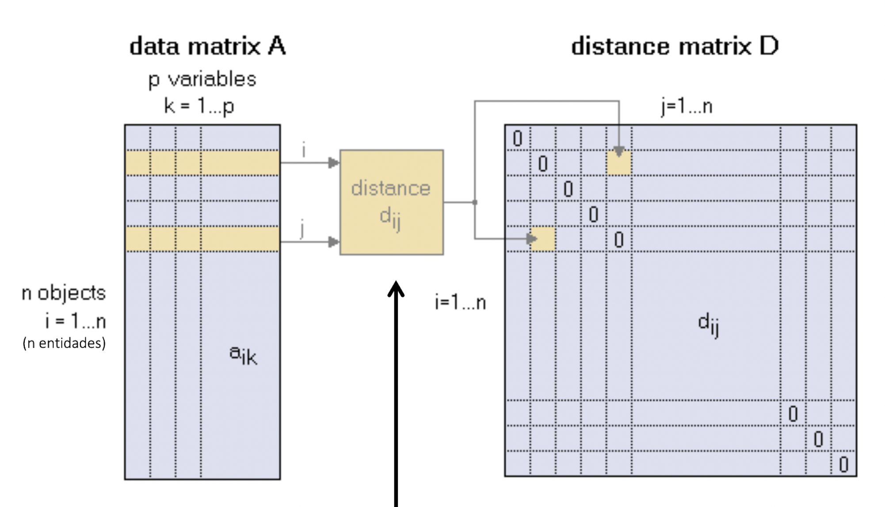

```{r setup, include=FALSE}
knitr::opts_chunk$set(echo = TRUE)
suppressPackageStartupMessages(library(dplyr))
suppressPackageStartupMessages(library(sf))
suppressPackageStartupMessages(library(raster))
suppressPackageStartupMessages(library(ggplot2))
suppressPackageStartupMessages(library(mapview))
suppressPackageStartupMessages(library(spdep))
suppressPackageStartupMessages(library(spatstat))
```

## Objetivos del Módulo



-   Conceptos Generales de Autocorrelación Espacial
-   Definición de Matrices de vecindad
-   Cálculo de índice de Moran (global y local)

## Conceptos Generales de Autocorrelación Espacial

### Introducción

Imaginemos que caminamos por una ciudad cualquiera. Notamos que en ciertas zonas, las viviendas tienen características similares: el tamaño de las casas, el tipo de construcciones, el acceso a servicios como parques, centros comerciales, o el estado de las calles. En un barrio de alto nivel socioeconómico, es más probable que las viviendas tengan características como jardines amplios, buena iluminación pública y servicios de calidad. En cambio, en otras zonas con un nivel socioeconómico más bajo, podríamos observar otro tipo de infraestructura, menos servicios públicos y tal vez menos opciones de transporte.

Este fenómeno no ocurre al azar; más bien, es un ejemplo de cómo la autocorrelación espacial actúa en el territorio. La autocorrelación espacial describe cómo los valores de una variable en un lugar están relacionados con los valores de esa misma variable en lugares cercanos. En nuestro ejemplo, si un barrio tiene un nivel socioeconómico alto, es probable que los barrios aledaños también lo tengan, debido a factores como la oferta de servicios o la planificación urbana que tiende a agrupar zonas similares. De manera inversa, los barrios con niveles socioeconómicos bajos tienden a agruparse en otras áreas.

Este patrón de organización espacial afecta cómo se desarrolla una ciudad: la ubicación de escuelas, centros de salud, parques, y hasta las rutas de transporte público se diseñan tomando en cuenta estos clústeres de nivel socioeconómico. Así, la autocorrelación espacial en variables como el nivel socioeconómico no solo es una medida que podemos observar, sino que también tiene implicaciones directas en la vida de las personas, en la distribución de recursos y en las oportunidades que una ciudad puede ofrecer a sus habitantes.

### Importancia de la Autocorrelación Espacial

En cada caso, la autocorrelación espacial proporciona una visión detallada de cómo y dónde se concentran ciertas características o problemáticas en una ciudad. Por ejemplo:

-   **Políticas Públicas y Distribución de Recursos**: Para una distribución equitativa de los recursos, es crucial identificar zonas con mayores necesidades. La autocorrelación espacial ayuda a determinar áreas vulnerables o con carencias en servicios, permitiendo orientar políticas públicas, como la construcción de hospitales en zonas de baja cobertura médica o programas de apoyo educativo en zonas de bajo nivel socioeconómico.

-   **Salud Pública y Epidemiología**: En el análisis de enfermedades infecciosas o problemas de salud pública, la autocorrelación espacial es fundamental para localizar focos de riesgo y patrones de propagación. Por ejemplo, en una epidemia, los casos iniciales podrían mostrar una autocorrelación espacial que permite identificar y aislar rápidamente áreas afectadas, ayudando a frenar la propagación.

-   **Seguridad y Prevención de Crimen**: En estudios de criminalidad, la autocorrelación espacial permite detectar puntos críticos de actividad delictiva y áreas de influencia. Con esta información, las fuerzas de seguridad pueden diseñar estrategias de vigilancia y control más efectivas, además de apoyar iniciativas comunitarias en zonas de riesgo.

-   **Gestión Ambiental y Conservación**: En el ámbito de la conservación y gestión de recursos naturales, la autocorrelación espacial permite identificar zonas de alta biodiversidad o áreas que enfrentan problemas similares, como la contaminación. Esto ayuda a desarrollar estrategias de conservación dirigidas y a implementar políticas de protección en zonas específicas.

### ¿Cómo se mide la autocorrelación espacial?

**I de Moran**

Teniendo lo anterior como contexto, existe un test estadístico que nos permite estimar bajo ciertas condiciones evidencia la autoproducción espacial llamado *I de Moran* es posiblemente el indicador más utilizado de autocorrelación espacial global y para ampliamente utilizado para en temáticas segregación o clusterización social. Fue sugerido inicialmente por @moran_interpretation_1948 y popularizado a través del trabajo clásico sobre autocorrelación espacial de @Cliff_1972.

A continuación se realizará un análisis teórico y práctico de las diferentes técnicas de autocorrelación espacial usado en ciencias sociales, en particular haciendo usos de Índice de Moran y todos los tratamientos previos. Se tratará evidenciar estadísticamente si existe agrupamiento o segregación por nivel Socieconómico en la una comuna de Chile, haciendo uso del nivel de años de estudio de jefe de hogar, más aún, identificar espacialmente donde se ubican estas concentraciones tanto de ingresos alto como bajos.

Pasos:

-   Preparación de Datos
-   Matriz de Vecindad
-   Indicador de Global Moran
-   Indicador de Local Moran

## Prepararación de Datos

**Cargar Librerías**

```{r eval=FALSE}
library(dplyr)
library(sf)
library(ggplot2)
library(raster)
library(mapview)
library(spdep)
library(spatstat)
```

**Lectura de Manzanas Censales**

Se procede a leer las manzanas censales y se filtra la comuna objeto de estudio, para efecto de este documento se seleccionará la comuna de *LAS CONDES*.

```{r}
mi_comuna <-  "LAS CONDES"
mz_comuna <- readRDS("data/censo/manzanas.rds") %>% 
  filter(NOM_COM == mi_comuna) %>% 
  st_transform(32719)

```

**Eliminar valores Nulos**

Es procedimiento es clave para realizar los cálculos posteriores, por lo cual se debe eliminar las manzanas sin registros de población y por ende sin registro de escolaridad del jefe de hogar.

```{r}

mz_comuna <-  mz_comuna %>% 
  mutate(nived = JH_ESC_P) %>% # Usaremos variable auxiliar de nivel educacional
  filter(!is.na(nived))
```

**Visualización del Escolaridad del Jefe de Hogar**

```{r}
ggplot() +
  geom_sf(data = mz_comuna, aes(fill = nived), color ="gray80", 
          alpha=1,  size= 0.1)+
  scale_fill_distiller(palette= "YlGnBu", direction = 1)+
  ggtitle("Nivel Educacional del Jefe de Hogar") +
  theme_bw() +
  theme(plot.title = element_text(size=12))+
  theme(panel.grid.major = element_line(colour = "gray80"), 
        panel.grid.minor = element_line(colour = "gray80"))
```

## Construcción de la Matriz de Vecindad {#sec-matrizVec}

La matriz de vecindad es una estructura clave en el análisis de autocorrelación espacial que define cómo se relacionan espacialmente las unidades de análisis (como barrios, municipios o regiones).

La matriz de vecindad $W_{ij}$ es también un elemento central de la estadística y el análisis espacial es la cercanía y la distancia, a partir de la cual definimos que elementos cercanos, o vecinos.

Matemáticamente se puede expresar si ciertos elementos son continuos:

$$W=(w_{ij}:i,j=1,...,n)$$

Donde los el valor de $w_{ij}$ expresa la relación de vecindad entre los elementos $i$ y $j$:

$$w_{ij} = \begin{cases}1 \space vecino \\
0 \space no \space vecino
\end{cases}$$

Como ilustración, si tuviéramos 3 observaciones y una matriz de la siguiente forma:

$$W=\begin{pmatrix}
 w_{11} & w_{12} & w_{13} \\
 w_{21} & w_{22} & w_{23} \\
 w_{31} & w_{32} & w_{33}
\end{pmatrix}=\begin{pmatrix}
 0 &  1 & 1 \\
 1 &  0 & 0 \\
 1 &  0 & 0 
\end{pmatrix}$$


**Polígonos a puntos**

```{r}
ptos_comuna <- mz_comuna%>%
  st_geometry() %>%
  st_centroid()

ggplot() +
  geom_sf(data = ptos_comuna,  color ="#525252", alpha=1,  size= 0.5)+
  ggtitle("Puntos Centroides de Manzanas") +
  theme_bw() +
  theme(plot.title = element_text(size=12))+
  theme(panel.grid.major = element_line(colour = "gray80"), 
        panel.grid.minor = element_line(colour = "gray80"))
```

**Cálculo de K Vecinos**

Aunque existen muchas de construir una matriz de vecindad, para los efectos prácticos usaremos el algoritmo *K Vecinos más Cercanos* conocido de `knn` (K Nearest Neightbours).

Para definir la vecindad se calcula la distancia desde un origen una centroide de manzana cualquiera respecto a todas las demás, quedando con las $k$ distancias mas cortas.

**Distancia Euclidiana:** Para calcular la separación entre dos puntos la distancia Euclidiana es la más utilizada y se define matemáticamente con la siguiente ecuación (@eq-eucledian-distance):

$$d_{ij}= \sqrt{(x_i-x_j)^2+(y_i-y_j)^2}$$ {#eq-eucledian-distance}

Es la distancia "ordinaria" entre dos puntos de un espacio euclídeo, la cual se deduce a partir del teorema de Pitágoras.

{width="50%"}

**Distancia Great Circle:** El el tipo de distancia que utiliza cuando las objetos espaciales se encuentran coordenadas geográfica ya que considera la curvatura de la tierra.

{width="40%"}

**Calcular Vecinos Cercanos (**$k$)

```{r}
# vecinos mas cercanos (neighbours)
k <- 8 # numero de vecinos a buscar
nb_mzs <- knearneigh(ptos_comuna, k = k) %>%  # por punto calcula K vecinos
  knn2nb() # Knn a matriz de vecindad

```

**Visualización de la relaciones por cada Centroide**

```{r}
# matri< de vecindad a lines solo oara visualizaciñon
neighbors_sf <- as(nb2lines(nb_mzs, coords = st_geometry(ptos_comuna)), 'sf')

p_mv <- ggplot() +
  geom_sf(data = mz_comuna, fill = NA, color ="gray60", alpha=1,  size= 0.3)+
  geom_sf(data = neighbors_sf,  color = "red", alpha=0.5,  size= 0.5)+
  geom_sf(data = ptos_comuna,  color ="#525252", alpha=1,  size= 1)+
  ggtitle("Relaciones de Vecindad por cada manzana (k = 8)") +
  theme_bw() +
  theme(plot.title = element_text(size=12))+
  theme(panel.grid.major = element_line(colour = "gray80"), 
        panel.grid.minor = element_line(colour = "gray80"))

p_mv
```

**Revisión de la Matriz**

Solo para ver la estructura de relaciones, correspondiente una matriz simétrica $n \times n$ donde la diagonal es 0. El valor 0 representa no relación y 1 relación o conexión.

```{r}
# relaciones entre 10 primeros elementos
matriz_vec <- listw2mat(nb2listw(nb_mzs, style = "B"))
dim(matriz_vec)
# rowSums(matriz_vec) %>% max()
```

{width="80%"}

```{r}
matriz_vec[1:10,1:10]
```

**Asignar Pesos por Población**

Ahora a la matriz de vecindad le vamos a convertir en una matriz de pesos y para nuestro caso vamos asignar los pesos por población, asumiendo que la influencia por cercanía espacial sería proporcional a la cantidad de personas.

```{r}
nb <-nb2listw(nb_mzs)
mz_comuna$id <- 1:nrow(mz_comuna)

# Estado actual (todos los vecinos pesan lo mismo)
nb$weights %>% head(5)
```

El siguiente bloque de código a través de un proceso iterativo identifica el id de cada uno de los 8 vecinos, captura la población y le asigna la proporción respecto a la suma de personas de las manzanas de los 8 vecinos.

```{r}

# Definimos la función que calcula los pesos de la población
calcular_pesos_poblacion <- function(mz_comuna, nb, var = "POBLACION") {
  # Utilizamos map para iterar sobre los índices de las filas de mz_comuna
  nb$weights <- purrr::map(1:nrow(mz_comuna), ~ {
    vecinos <- nb$neighbours[[.x]]
    
    # Filtramos la población de los vecinos y calculamos los pesos
    poblacion_vecinos <- mz_comuna %>%
      filter(id %in% vecinos) %>%
      pull(!!var)
    
    poblacion_vecinos / sum(poblacion_vecinos)
  })
  
  return(nb)
}
# Llamamos a la función para calcular los pesos de población
nb <- calcular_pesos_poblacion(mz_comuna, nb)

nb$weights %>% head(5)
```


Volvamos a revisar la matriz de distancia pero ponderada por población.

```{r}
# relaciones entre 10 primeros elementos
matriz_vec_pond <- listw2mat(nb)
dim(matriz_vec_pond)
# rowSums(matriz_vec_pond)

matriz_vec_pond[1:10,1:10]
```

## Cálculo de índice de Morán (global y local)

### Índice de Moran {#sec-globalMoran}

Para efectos del presente curso el indicador se utilizará como test para evidenciar la segregación que pueda existir en el territorio, entendiéndose por segregación la agrupación de individuos de características similares en el espacio, resultando en cierta homogeneidad de la población.

El índice de Moran en esencia, se trata de un estadístico de producto cruzado entre una variable y su retardo espacial, con la variable expresada en desviaciones de su media.

$$I= \frac{n}{S_0 }\frac{\sum_{i=1}^n  \sum_{j=1}^n W_{ij} Z_iZ_j}{ \sum_{i=1}^n Z_i^2}$$ {#eq-moran-test}

Donde:

-   $zi$ = valor de la desviación de la media de la variable de interés, es decir $z_i=x_i-\bar{x}$.

-   $S_o= \sum_{i=1}^n  \sum_{j=1}^n W_{ij}$

-   $W_{ij}$ = Matriz de Vecindad

La inferencia de I de Moran se basa en una hipótesis nula de aleatoriedad espacial. La distribución del estadístico bajo la hipótesis nula puede derivarse utilizando un supuesto de normalidad (variantes aleatorias normales independientes), o la llamada aleatoriedad (es decir, cada valor tiene la misma probabilidad de ocurrir en cualquier lugar).

Para efectos prácticos de evaluación de la autocorrelación espacial se buscará usar el promedio de educación del jefe de hogar como un indicador del nivel socioeconómico del hogar. El promedio de estos a nivel de manzana, nos indicará a grandes rasgos las características de la población a este nivel desagregado.

**Aplicación de Moran Test (global)** (@eq-moran-test)

```{r}
## Test de Moran de autocorrelacion global
spdep::moran.test(x = mz_comuna$nived,  listw = nb)
```

El *p-value* es menor que `0.05` se rechaza la hipótesis nula, por ende podemos descartar un patrón aleatorio en los datos de muestra.

**Gráfico de Moran**

```{r}
moran.plot(x = mz_comuna$nived,  listw = nb, 
           labels=as.character(mz_comuna$id))
```

En este gráfico se se divide el espacio en cuadrantes de Valores Altos rodeados de Valores Altos (hotspots), Bajos rodeados de Bajos (Coldspot) y los intermedios.

### Local Moran {#sec-localMoran}

El Índice de Moran (global) fue diseñado para rechazar la hipótesis nula de aleatoriedad espacial a favor de una alternativa de agrupación. Dicha agrupación es una característica del patrón espacial completo y no proporciona una indicación de la ubicación de las agrupaciones.

El estadístico Moran local fue sugerido por[@anselin_local_1995] como una forma de identificar los clusters locales y los valores atípicos espaciales locales.

Para nuestro caso práctico este test permite identificar la significancia de los cluster y poder clasificar las observaciones (manzanas) e identificar denominadas "Hight Hight" y "Low Low" en coherencia de los cuadrantes diagonales del gráfico de Moran antes visualizado.

Con las ponderaciones estandarizadas por filas, $S_0=\sum_i\sum_jw_{ij}$ la suma de todas las ponderaciones es igual al número de observaciones, $n$. Como resultado, del gráfico de dispersión de Moran, el estadístico I de Moran se simplifica a:

$$I=\frac{\sum_i\sum_jw_{ij}Z_iZj}{{\sum_i z_i^2},}$$

El correspondiente estadístico local de Moran consistiría en el componente de la suma doble que corresponde a cada observación $i$, o:

$$I_i= \frac{\sum_{j}w_{ij}Z_iZj}{\sum_i z_i^2},$$

En esta expresión, el denominador es fijo y, por lo tanto, se puede ignorar. Para simplificar la notación, lo sustituimos por $c$ de modo que la expresión de Moran local se convierte en la expresión:

$$I_i= c.Z_i\sum_jw_{ij}Z_j$$ Se podría demostrar (Matemáticamente) que la suma de las estadísticas locales es proporcional a la I de Moran global o, alternativamente, que la I de Moran global se corresponde con la media de las estadísticas locales (para más detalles, [@anselin_local_1995].

Para realizar estos cálculos en R haremos uso de la función `localmoran`

```{r}
# moran local
lmoran <-
  localmoran(mz_comuna$nived,
             listw = nb) %>%
  as_tibble() # llevar a tabla para facilitar trabajo
```


-   Las puntuaciones $z$ y los valores $p$ son medidas de significancia estadística que indican si se rechazará la hipótesis nula, entidad por entidad. En efecto, indican si la aparente similitud (un clustering espacial de valores altos o bajos) o la falta de similitud (un valor atípico espacial) es más marcada de lo que se espera en una distribución aleatoria. A continuación se dará una descripción e interpretación más específica de acada una de estas médidas estadísticas


**1.	Z-score (Z.Ii en el resultado de localmoran()):**

El z-score es una medida de cuán lejos está el valor de  $I_i$  (el índice de Moran local) de su valor esperado bajo la hipótesis nula de no autocorrelación. Es una forma estandarizada de ver si el valor de  $I_i$   es inusualmente alto o bajo.

Interpretación:

* Un z-score alto y positivo sugiere que el área y sus vecinos tienen valores similares, lo que indica un posible clúster positivo.

* Un z-score bajo y negativo sugiere una relación inversa, indicando que el área es un outlier (valores disímiles en comparación con sus vecinos).

* Un z-score cercano a 0 sugiere que no hay una autocorrelación espacial significativa en esa área.
	
**2.	P-value (Pr(z > E(Ii)) cuando alternative = "two.sided"):**

En el contexto de una prueba bilateral (“two.sided”), el p-value indica la probabilidad de observar un valor del índice de Moran local tan extremo, en cualquier dirección (positivo o negativo), bajo la hipótesis nula de no autocorrelación espacial.

Interpretación:

* Un p-value bajo (por ejemplo, ≤ 0.05) en una prueba “two.sided” sugiere que el área presenta autocorrelación espacial significativa en alguna dirección (ya sea positiva o negativa). En otras palabras, es poco probable que el patrón observado sea producto del azar.

* Un p-value alto (por ejemplo, > 0.05) sugiere que no hay suficiente evidencia para concluir que existe autocorrelación espacial en esa área; es decir, no se puede rechazar la hipótesis nula.

## Definción de Cuadrantes

A cotinuación se procede con el cálculo y la clasificación de clústeres espaciales según los resultados de la autocorrelación local, utilizando el valor de significancia y los valores estándar de la variable en estudio.

**Cálculo de la Autocorrelación y Significancia**

```{r}
# resultados
mzs_cluster <-
  mz_comuna %>%
  mutate(
    z_i = as.numeric(scale(mz_comuna$nived)), # var estandarizada
    z_j = lag.listw(nb, z_i) # promedio vecinos
    ) %>%
  mutate(
    P = as.numeric(lmoran$`Pr(z != E(Ii))`) # significancia
  )
```


1. Variable Estándar ($z_i$):

$z_i$ calcula el valor estandarizado de la variable nived en cada zona de mz_comuna, convirtiéndola en una variable $Z$. Esto se logra utilizando `scale()` para que la variable tenga una media de 0 y una desviación estándar de 1. Este paso facilita la comparación entre áreas al eliminar la influencia de la escala original.


2. Promedio de Vecinos ($z_j$):

$z_j$ calcula el promedio de los valores estandarizados de los vecinos para cada área usando `lag.listw(nb, z_i)`. Esto implica que, para cada área, se obtiene el valor promedio de $z_i$ en sus áreas vecinas, lo cual ayuda a detectar patrones locales de autocorrelación.

3.	Significancia (P):

$P$ almacena el p-value asociado a cada área, proveniente de la columna `Pr(z != E(Ii))` en lmoran, que indica la significancia estadística de la autocorrelación en cada área. Si el valor de P es bajo (por ejemplo, menor o igual a 0.05), podemos concluir que la autocorrelación es significativa para esa área.
	

**Clasificación de los Cuadrantes de Clústeres**

```{r}
mzs_cluster <- mzs_cluster%>%
  mutate(
    clusterM = # clasificar cluster
      case_when(
        (P <= 0.05) & (z_i >  0) & (z_j >  0) ~ "HH",
        (P <= 0.05) & (z_i <= 0) & (z_j >  0) ~ "LH",
        (P <= 0.05) & (z_i >  0) & (z_j <= 0) ~ "HL",
        (P <= 0.05) & (z_i <= 0) & (z_j <= 0) ~ "LL",
        TRUE ~ "NS"
        )
  )

# st_write(mzs_cluster, "data/shape/clusters_LC.shp")
```

En esta etapa, el código clasifica cada área en un tipo de clúster según la autocorrelación espacial local, basándose en el valor de significancia ($P$) y los valores estandarizados de la variable ($z_i$ y $z_j$).

**Clasificación de Clústeres (clusterM):**

* **HH (High-High)**: El área y sus vecinos tienen valores altos (por encima de la media) y la autocorrelación es significativa (P \leq 0.05).

* **LH (Low-High)**: El área tiene un valor bajo (por debajo de la media), pero sus vecinos tienen valores altos, y la autocorrelación es significativa.

*	**HL (High-Low)**: El área tiene un valor alto, pero sus vecinos tienen valores bajos, y la autocorrelación es significativa.

* **LL (Low-Low)**: El área y sus vecinos tienen valores bajos, y la autocorrelación es significativa.

* **NS** (No Significativo): Cualquier otra combinación que no cumpla con las condiciones anteriores, indicando que no hay autocorrelación significativa para esa área.


Esta clasificación te permite identificar áreas con patrones espaciales específicos, facilitando el análisis de clústeres espaciales en el territorio.


```{r}
# resultados clusters
table(mzs_cluster$clusterM)
```

**Visualización de cluster HH y LL**

```{r}

mzs_cluster_segr <- mzs_cluster %>% filter(clusterM %in% c( "HH", "LL"))

ggplot() +
  geom_sf(data = mz_comuna, fill =NA,  color ="gray80", 
          alpha=1,  size= 0.1)+
  geom_sf(data = mzs_cluster_segr, aes(fill = clusterM),
          color =NA, alpha=0.8,  size= 0.1)+
  scale_fill_manual(values = c("#08519c", "#e31a1c"))+
  ggtitle("Segregación en la comuna de Las Condes") +
  theme_bw() +
  theme(plot.title = element_text(size=12))+
  theme(panel.grid.major = element_line(colour = "gray80"), 
        panel.grid.minor = element_line(colour = "gray80"))

# mapview(mzs_cluster_segr, zcol = "clusterM")
```

```{r eval=T}

kde_raster <-  raster("data/delitos/kde_delvio_LC.tif")

mapview(kde_raster)+
    mapview(mzs_cluster_segr, zcol = "clusterM", layer.name =  "clusterM")

```

## Actividades:

-   Calcular local Moran para la variable de Atractor comercial de la Base del SII
-   Calcular local Moran cualquier otra variable de la base comunal.
-   Calcular local Moran cualquier otra variable en otra comuna.

## Referencias del Capítulo

-   <http://www.scielo.org.co/pdf/rcdg/v28n1/2256-5442-rcdg-28-01-1.pdf>
-   [Distance-Band Spatial Weights - Luc Anselin](https://geodacenter.github.io/workbook/4b_dist_weights/lab4b.html)
-   [Global Spatial Autocorrelation - Luc Anselin](https://geodacenter.github.io/workbook/5a_global_auto/lab5a.html)
-   [Local Spatial Autocorrelation - Luc Anselin](https://geodacenter.github.io/workbook/6a_local_auto/lab6a.html)
-   [AnalizaR Datos Políticos- Mapas y datos espaciales](https://arcruz0.github.io/libroadp/maps.html#inferencia-a-partir-de-datos-espaciales)
