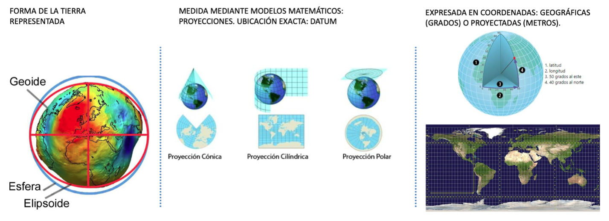
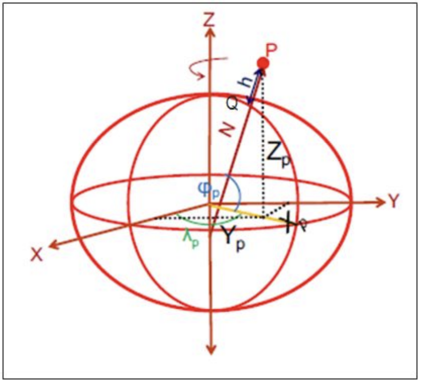

# CRS en R {#sec-crs .unnumbered}


## Sistema de Referencias de Coordenadas




Los sistemas de coordenadas forman la base de cálculo para describir la posición de un punto a partir de mediciones geodésicas: distancias, proporciones de distancias (sin escala) y ángulos. Las coordenadas nunca pueden medirse, solamente se calculan con referencia un sistema de coordenadas bien definido. Los tipos de sistemas de coordenadas principales
que existen son:

Coordenadas elipsoidales
: son la representación de las coordenadas sobre la superficie de un elipsoide determinado, se representan por  [φ, λ, h] siendo respectivamente, la latitud, longitud y altura elipsoidal. 

{width=60%}

Coordenadas proyectadas o cartográficas
: Según la proyección empleada las coordenadas elipsoidales pueden representarse en un plano, en el caso de Chile continental, se emplea la proyección Universal Transversal de Mercator (UTM), huso 19 y huso 18. 

{width=60%}


Para hacer reproyecciones en R, se le tiene que asignar el Sistema de Referencia de Coordenadas de dos formas, uno como cadena de texto (`"+proj=longlat +datum=WGS84 +no_defs"`) o como número que corresponde a EPSG ([EPSG es el acrónimo de European Petroleum Survey Group](https://mappinggis.com/2016/04/los-codigos-epsg-srid-vinculacion-postgis/)) que representan sistema de referencia de coordenadas también.


Para el caso de Chile usamos dos sistemas de referencias de coordenadas:

Coordenadas elipsoidales (geodésicas):
: 4326 o `"+proj=longlat +datum=WGS84 +no_defs"`

Coordenadas proyectadas (métricas):
: 32719 o `"+proj=utm +zone=19 +south +datum=WGS84 +units=m +no_defs"` 

### Reproyectar Vectores

```{r}

library(sf) # manipulación de datos vectoriales
library(mapview) # visualización de mapas dinámicos
library(dplyr)
library(ggplot2) # gráficos
library(RColorBrewer) #paleta de colores
```

Lectura de Vectores
```{r}
las_condes_mz <- st_read("data/shape/icv_las_condes.shp", quiet=T) 
```


```{r}

LC_mz_32719 <- las_condes_mz %>% st_transform(32719)
st_crs(LC_mz_32719)

```


### Reproyectar Raster

El archivo ráster ya tiene definido su sistema de referencia de origen (UTM 19S, EPSG:32719). Con `terra::project()` lo transformamos a coordenadas geográficas WGS 84 (EPSG:4326), conservando sus ocho bandas.

```{r}
library(terra)

las_condes_raster <- rast("data/raster/OLI_LC.tif")
names(las_condes_raster) <- c("aerosol", "blue", "green", "red" , "nir", "swir1", "swir2", "tirs1")

las_condes_raster
```


```{r}
crs_latlon <- "EPSG:4326" # coordenadas geográficas o elipsoidales
las_condes_raster2 <- terra::project(las_condes_raster, crs_latlon)
las_condes_raster2
```


## Referencias:

[Geodesia en Chile, teoría y aplicación
del Sistema de Referencia
Geocéntrico para las Américas
(SIRGAS) - 2018](https://www.ide.cl/descargas/Geodesia-en-Chile.pdf)
