```{r setup, include=FALSE}
knitr::opts_chunk$set(echo = TRUE)
suppressPackageStartupMessages(library(dplyr))
suppressPackageStartupMessages(library(sf))
suppressPackageStartupMessages(library(terra))
suppressPackageStartupMessages(library(mapview))
```

## Objetivos del Módulo


La presente Sesión tiene como objetivo principal introducir conceptos generales y manipulación básica de datos de tipo vectorial (punto, lineas, polígonos) y Raster, ambos con casos prácticos.


## Definición General de Datos Espaciales

La representación de un territorio requiere datos geográficos compuestos por información espacial (geometrías asociadas a una ubicación real en el mundo) e información de atributos (características y variables asociadas a estas geometrías). Los tipos de datos espaciales principalmente los vectores y raster.

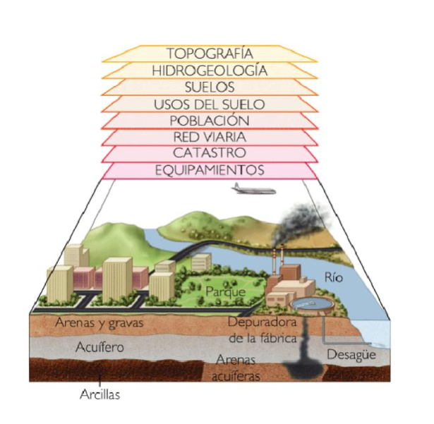{width=50%}


## Datos Vectoriales 

Datos Vectoriales
: Representación mediante coordenadas que se pueden unir espacialmente o no. Corresponde a 3 tipos de geometrías: puntos, líneas y  polígonos.

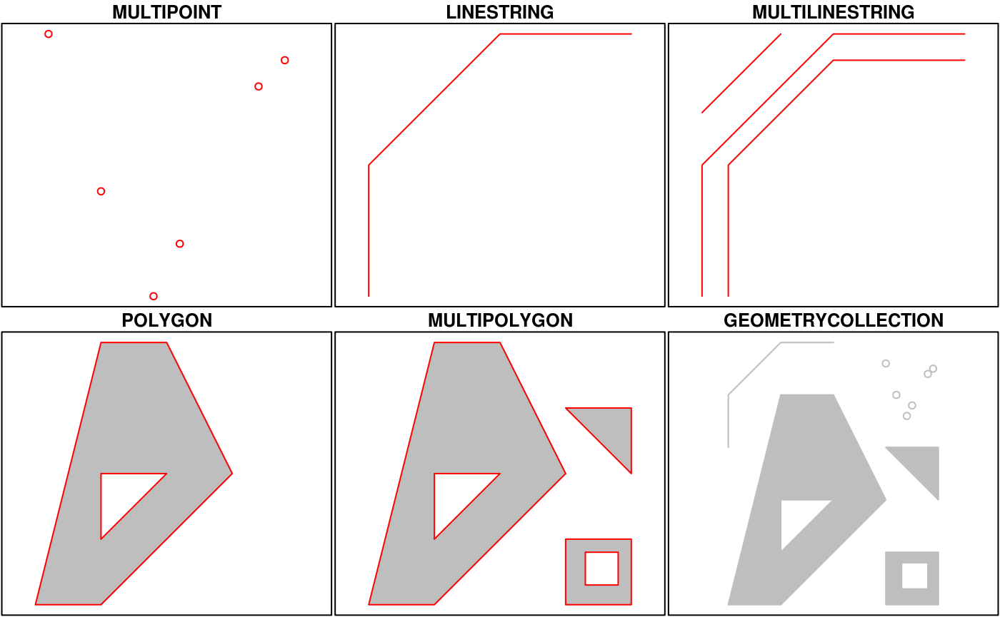
 


Fuente: [https://r-spatial.github.io/sf/articles/sf1.html](https://r-spatial.github.io/sf/articles/sf1.html)


Puntos
: Tiene un par de coordenadas "x" e "y". Es utilizado para información de tipo puntual, como por ejemplo equipamiento urbano, postes, árboles, entre otros.


Cargar librerías
```{r}
# install.packages("sf") 
library(sf) # manipulación de datos vectoriales
library(mapview) # visualización de mapas dinámicos
library(ggplot2) # gráficos
library(RColorBrewer) #paleta de colores

```

### Lectura de archivos tipo puntos
```{r}
sii_LC <- st_read("data/sii/sii_urbe_LC.shp")
```

### Visualización de los puntos

```{r}
# Visualización ggplot y sf
ggplot() +
  geom_sf(data = sii_LC, col = "orange", alpha=0.8,  size= 0.5)+
  ggtitle("Datos del SII en Las Condes" ) +
  theme_bw() +
  theme(legend.position="none")+
  theme(panel.grid.major = element_line(colour = "gray80"), 
        panel.grid.minor = element_line(colour = "gray80"))
# mapview(sii_LC, zcol = "atractor", cex =2)
```


Líneas
: Tiene tantas coordenadas como vértices. La información que representa es de tipo lineal, como por ejemplo calles, ríos, redes energéticas, entre otros. Existen las líneas cerradas, las cuales se pueden entender como el perímetro de una superficie (sin relleno).

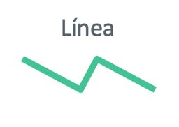

### Lectura de líneas
```{r}
las_condes_red <- readRDS("data/redes/RED_LAS_CONDES.rds") 
# las_condes_red

```

### visualización Líneas
```{r}

ggplot() +
  geom_sf(data = las_condes_red, col = "gray70", alpha=0.8,  size= 0.5)+
  ggtitle("Red víal de la comuna Las Condes" ) +
  theme_bw() +
  theme(legend.position="none")+
  theme(panel.grid.major = element_line(colour = "gray80"), 
        panel.grid.minor = element_line(colour = "gray80"))
# mapview(las_condes_red)
```


Polígonos
: Tiene tantas coordenadas como vértices. La información que representa es de tipo área, como por ejemplo división política administrativa, manzanas, construcciones, entre otras.

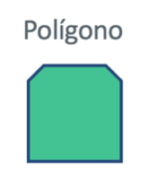


### Lectura de polígonos

```{r}

las_condes_mz <- st_read("data/shape/icv_las_condes.shp", quiet=T) 
# las_condes_ptos

```

### Visualización polígonos

```{r}

ggplot() +
  geom_sf(data = las_condes_mz, aes(fill = veg_cob), color ="gray80", 
          alpha=0.8,  size= 0.1)+
  scale_fill_distiller(palette="Greens", direction = 1)+
  ggtitle("Cobertura Vegetal de la comuna Las Condes" ) +
  theme_bw() +
  theme(panel.grid.major = element_line(colour = "gray80"), 
        panel.grid.minor = element_line(colour = "gray80"))
# mapview(las_condes_mz, zcol = "veg_cob")
```


**Tabla General de tipo de Datos Vectoriales**

| type | description |
|-|-|
| POINT | zero-dimensional geometry containing a single point |
| LINESTRING | sequence of points connected by straight, non-self intersecting line pieces; one-dimensional geometry |
| POLYGON | geometry with a positive area (two-dimensional); sequence of points form a closed, non-self intersecting ring; the first ring denotes the exterior ring, zero or more subsequent rings denote holes in this exterior ring |
| MULTIPOINT | set of points; a MULTIPOINT is simple if no two Points in the MULTIPOINT are equal |
| MULTILINESTRING | set of linestrings |
| MULTIPOLYGON | set of polygons |
| GEOMETRYCOLLECTION | set of geometries of any type except GEOMETRYCOLLECTION |

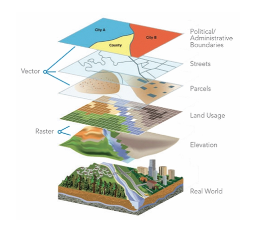{width=70%}

## Datos Raster

Raster
: Representación del espacio mediante una matriz de celdas organizada  en filas y columnas, donde cada celda tiene un valor que representa información. 


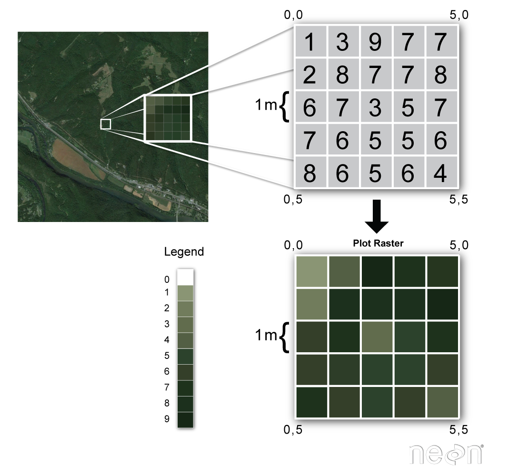{width=60%}

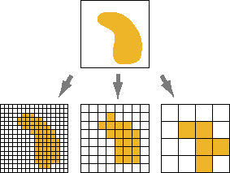


Para ejemplificar el uso y ver características de Raster vamos a utilizar una imágenes satelital del [Satelite Landsat 8](https://eos.com/es/find-satellite/landsat-8/).


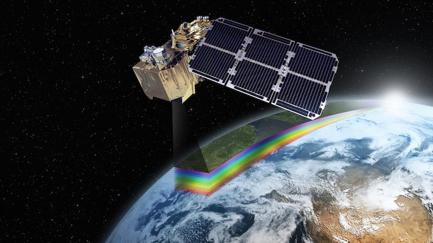

Este tipo de imágenes satelitales generalmente contiene una serie de bandas que corresponden a capas de información ráster. En `terra`, las bandas se almacenan juntas en un objeto `SpatRaster` de varias capas.

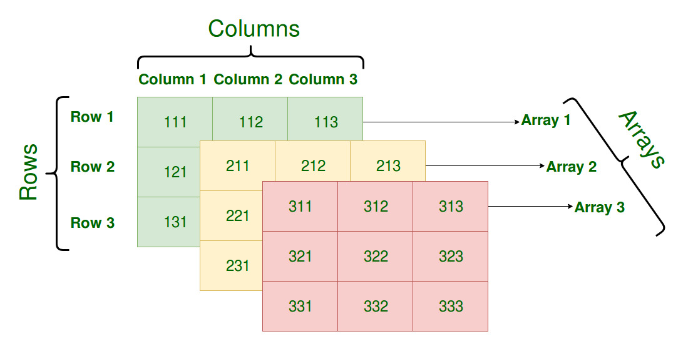


Para este ejemplo de visualización necesitamos conocer las bandas satelitales que componen nuestra imagen satelital.


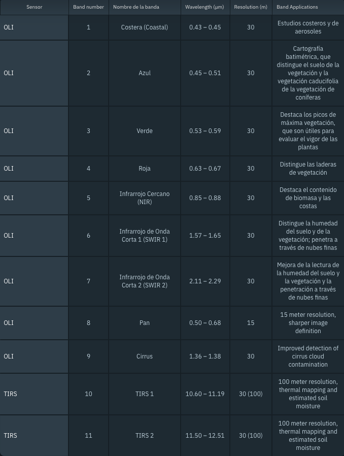


### lectura de imagen Raster.

```{r}
library(terra)
las_condes_raster <- rast("data/raster/OLI_LC.tif")
names(las_condes_raster) <- c("aerosol", "blue", "green", "red" , "nir", "swir1", "swir2", "tirs1")
las_condes_raster

```

### Visualización Raster
```{r}
# Visualización de imagen recortada de Las Condes en Color Natural
terra::plotRGB(las_condes_raster, r = 4, g = 3, b = 2, stretch = "lin")
```


<!-- ## Actividades Prácticas -->


<!-- 1. Seleccione una comuna de las manzanas del INE, visualiza con ggplot. Además genere una tabla resumen de suma de personas, hombres, mujeres viviendas por Zona Censal. -->

<!-- :::{.callout-tip} -->

<!-- Leer Archivo: -->
<!-- ```{r eval=FALSE} -->
<!-- mz_ine <- readRDS("../data/censo/manz_INE_2017_sf.rds") -->
<!-- ``` -->

<!-- Seleccionar Comuna con `dplyr::filter()` -->

<!-- Eliminar geometrías `sf::st_drop_geometry()` ya que no es necesaria para realizar tabla resumen. -->

<!-- ::: -->


<!-- 2. Visualización de Combinación de Bandas Satelitales -->

<!-- :::{.callout-tip} -->
<!-- 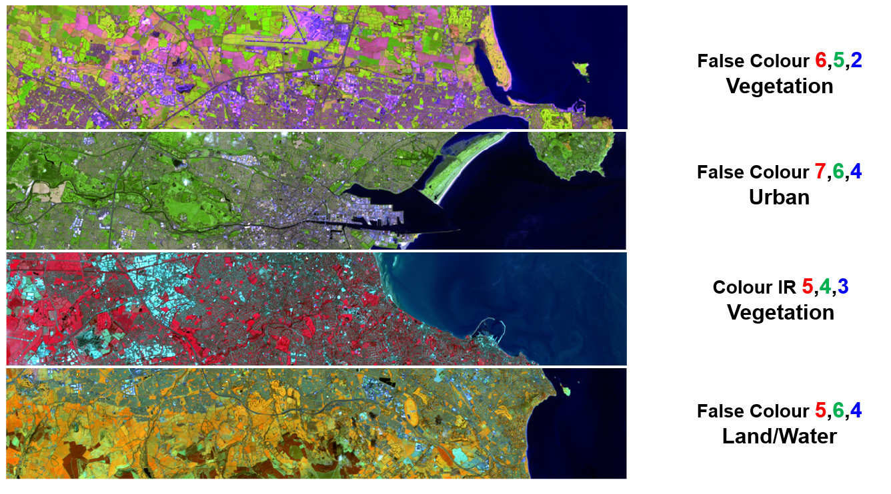 -->
<!-- Referencias: [https://mappinggis.com/2019/05/combinaciones-de-bandas-en-imagenes-de-satelite-landsat-y-sentinel/](https://mappinggis.com/2019/05/combinaciones-de-bandas-en-imagenes-de-satelite-landsat-y-sentinel/) -->


<!-- ```{r eval=FALSE} -->
<!-- plotRGB(las_condes_raster, r = 7, g = 6, b = 4, stretch = "lin") -->
<!-- ``` -->

<!-- ::: -->


## Referencias


[Simple Features for R](https://r-spatial.github.io/sf/)
