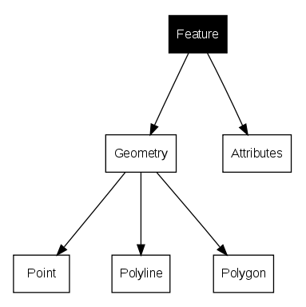
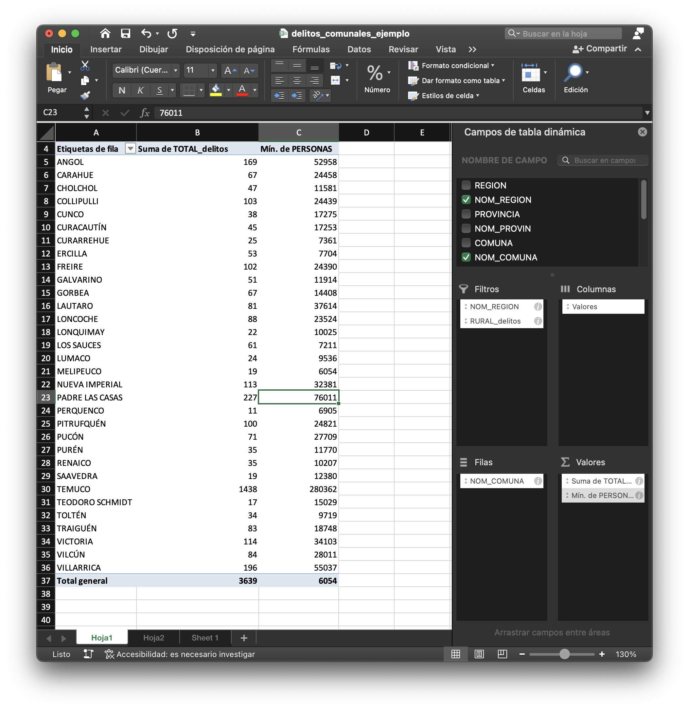
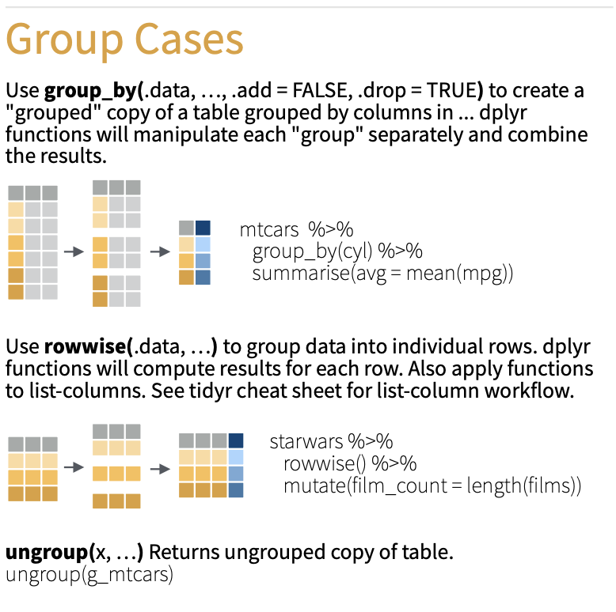
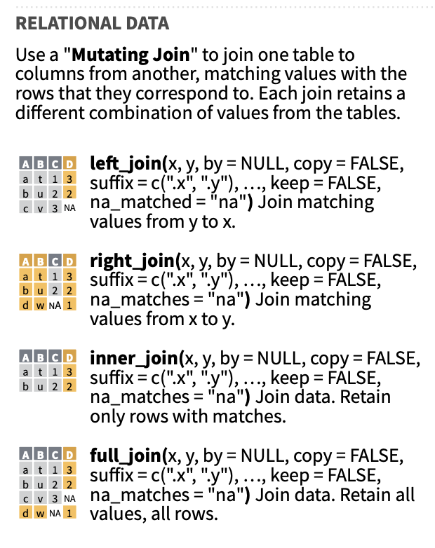

```{r setup, include=FALSE}
knitr::opts_chunk$set(echo = TRUE)
suppressPackageStartupMessages(library(dplyr))
suppressPackageStartupMessages(library(sf))
suppressPackageStartupMessages(library(mapview))
suppressPackageStartupMessages(library(kableExtra))
suppressPackageStartupMessages(library(ggplot2))
suppressPackageStartupMessages(require(knitr))
suppressPackageStartupMessages(library(viridis))
suppressPackageStartupMessages(library(openxlsx))
suppressPackageStartupMessages(library(plotly))
```

## Introducción

Los datos vectoriales son uno de los tipos fundamentales en los que se representa la información espacial. Este formato se caracteriza por describir los elementos del espacio a través de puntos, líneas y polígonos. Cada uno de estos objetos puede tener atributos asociados que describen características adicionales como el uso del suelo, la densidad poblacional, o cualquier otra variable relevante para el análisis.

En políticas públicas, los datos vectoriales juegan un rol clave en la toma de decisiones, ya que permiten analizar la distribución espacial de fenómenos, desde la localización de infraestructuras hasta la incidencia de eventos sociales y delictivos. A través de las herramientas de análisis vectorial, es posible identificar patrones, relaciones espaciales y tomar decisiones fundamentadas sobre la planificación y gestión del territorio.

En el capítulo anterior se presentaron los puntos, las líneas y los polígonos. Aquí utilizaremos [sf](https://r-spatial.github.io/sf/index.html) para leer, manipular y analizar esos datos en R. Un objeto `sf` reúne una tabla de atributos y una columna de geometría; por eso puede combinarse con `dplyr`.


**Tipos de geometría que encontraremos**

| Tipo | Descripción |
|------------------------------------|------------------------------------|
| `POINT` | Un punto, de dimensión cero. |
| `LINESTRING` | Una secuencia de vértices conectados que representa una línea. |
| `POLYGON` | Una superficie delimitada por un anillo exterior cerrado; puede tener anillos interiores que forman huecos. |
| `MULTIPOINT` | Un conjunto de puntos en una misma entidad. |
| `MULTILINESTRING` | Un conjunto de líneas en una misma entidad. |
| `MULTIPOLYGON` | Un conjunto de polígonos en una misma entidad. |
| `GEOMETRYCOLLECTION` | Una colección que reúne geometrías de distintos tipos. |

```{r echo=FALSE}
par(mfrow = c(2,4))
par(mar = c(1,1,1.2,1))

# 1
p <- st_point(0:1)
plot(p, pch = 16)
title("point")
box(col = 'grey')

# 2
mp <- st_multipoint(rbind(c(1,1), c(2, 2), c(4, 1), c(2, 3), c(1,4)))
plot(mp, pch = 16)
title("multipoint")
box(col = 'grey')

# 3
ls <- st_linestring(rbind(c(1,1), c(5,5), c(5, 6), c(4, 6), c(3, 4), c(2, 3)))
plot(ls, lwd = 2)
title("linestring")
box(col = 'grey')

# 4
mls <- st_multilinestring(list(
  rbind(c(1,1), c(5,5), c(5, 6), c(4, 6), c(3, 4), c(2, 3)),
  rbind(c(3,0), c(4,1), c(2,1))))
plot(mls, lwd = 2)
title("multilinestring")
box(col = 'grey')

# 5 polygon
po <- st_polygon(list(rbind(c(2,1), c(3,1), c(5,2), c(6,3), c(5,3), c(4,4), c(3,4), c(1,3), c(2,1)),
    rbind(c(2,2), c(3,3), c(4,3), c(4,2), c(2,2))))
plot(po, border = 'black', col = '#ff8888', lwd = 2)
title("polygon")
box(col = 'grey')

# 6 multipolygon
mpo <- st_multipolygon(list(
    list(rbind(c(2,1), c(3,1), c(5,2), c(6,3), c(5,3), c(4,4), c(3,4), c(1,3), c(2,1)),
        rbind(c(2,2), c(3,3), c(4,3), c(4,2), c(2,2))),
    list(rbind(c(3,7), c(4,7), c(5,8), c(3,9), c(2,8), c(3,7)))))
plot(mpo, border = 'black', col = '#ff8888', lwd = 2)
title("multipolygon")
box(col = 'grey')

# 7 geometrycollection
gc <- st_geometrycollection(list(po, ls + c(0,5), st_point(c(2,5)), st_point(c(5,4))))
plot(gc, border = 'black', col = '#ff6666', pch = 16, lwd = 2)
title("geometrycollection")
box(col = 'grey')


```

**Al terminar este capítulo podrás:**

-   Leer un archivo vectorial y distinguir su geometría de sus atributos.
-   Filtrar, resumir y unir atributos sin perder la geometría.
-   Elegir un sistema de referencia apropiado para medir áreas y distancias.
-   Aplicar una unión, un buffer y un predicado espacial, y comprobar sus resultados.
-   Construir e interpretar un mapa comunal a partir de una tabla de indicadores.

## Manipulación de Datos Vectoriales

Además de las geometrías espaciales, los datos vectoriales incluyen una tabla de atributos que contiene información adicional sobre cada objeto espacial. Esta tabla de atributos es esencial para realizar análisis más profundos, ya que nos permite filtrar, seleccionar, crear columnas nuevas y resumir los datos según diferentes criterios.

Manipularemos los atributos con `dplyr`, como en una tabla de datos, mientras `sf` conserva la columna de geometría.

### Lectura de Insumos



Para leer un archivo vectorial como Shapefile o GeoJSON se usa `st_read()`. En cambio, `readRDS()` recupera un objeto de R previamente guardado. El primer ejemplo muestra ambas formas de lectura; el análisis posterior usa un objeto `sf` de zonas censales urbanas guardado en RDS.

**Lectura de un Shapefile y de un objeto `sf` guardado en RDS**

```{r}
comunas_ejemplo <- st_read("data/shape/Comunas_Chile.shp", quiet = TRUE)
class(comunas_ejemplo)
st_geometry_type(comunas_ejemplo) |> head()
```

```{r}
zonas_censales <- readRDS("data/censo/zonas_urb_consolidadas.rds")
stopifnot(inherits(zonas_censales, "sf"), !is.na(st_crs(zonas_censales)))
st_is_longlat(zonas_censales)
```

```{r echo=FALSE}
#| label: tbl-censo-zonas
#| tbl-cap: Registros de Zonas Censales del Censo 2017

zonas_censales  %>%
  head(6) %>% 
  kbl() %>%
   kable_styling(bootstrap_options = c("striped", "hover", "condensed"), 
                 font_size = 10,full_width = F)
```

### Filtros y selección de columnas

Filtrar filas y seleccionar columnas permite concentrarnos en un territorio y sus variables. Trabajaremos con las zonas urbanas de dos localidades de la provincia de Valparaíso. El filtro por `URBANO` excluye otras localidades de la comuna de Valparaíso, como Placilla de Peñuelas y Laguna Verde: estos resultados describen las **zonas seleccionadas**, no toda la comuna.

**Filtrar**

```{r echo = FALSE}
op_logicos <- tibble::tribble(
    ~Operador,                   ~Comparación,       ~Ejemplo, ~Resultado,
      "x | y",           "x Ó y es verdadero", "TRUE | FALSE",     "TRUE",
      "x & y",         "x Y y son verdaderos", "TRUE & FALSE",    "FALSE",
         "!x", "x no es verdadero (negación)",        "!TRUE",    "FALSE",
  "isTRUE(x)",  "x es verdadero (afirmación)", "isTRUE(TRUE)",     "TRUE"
  )

require(knitr)
kable(op_logicos, digits = 3, row.names = FALSE, align = "c",
              caption = NULL)

```

```{r}

 # zonas_censales$NOM_PROVIN %>% unique() %>% sort()
zonas <- zonas_censales %>%
  filter(NOM_PROVIN == "VALPARAÍSO",
         URBANO %in% c("VIÑA DEL MAR", "VALPARAÍSO"))

# mapview::mapview(zonas, zcol = "PERS")
```

```{r}
#| label: fig-zonas-censales
#| fig-cap: Zonas Censales de comunas de Valparaíso y Viña del Mar - Urbano


ggplot() +
  geom_sf(data = zonas, aes(fill = PERS), color =NA, 
          alpha=0.8,  size= 0.1)+
  scale_fill_distiller(palette= "YlGnBu", direction = 1)+
  ggtitle("Población Zonas Censales - Urbano" ) +
  theme_bw() +
  theme(panel.grid.major = element_line(colour = "gray80"), 
        panel.grid.minor = element_line(colour = "gray80"))
```

**Selección de columnas**

```{r}
zonas <-  zonas %>% 
  dplyr::select(GEOCODIGO, REGION, COMUNA, NOM_REGION, NOM_PROVIN,
                NOM_COMUNA, PERS, URBANO, ESC_JH)

```

**Mutate**

Cálculo de superficie por polígono. `st_area()` devuelve valores con unidades; los convertimos explícitamente a hectáreas y solo entonces quitamos la unidad para crear una columna numérica. La densidad resultante se expresa en personas por hectárea.

```{r}
zonas <- zonas %>%
  mutate(AREA_HA = as.numeric(units::set_units(st_area(.), ha)),
         DENS_PERS_HA = if_else(AREA_HA > 0, round(PERS / AREA_HA, 1), NA_real_))

# zonas
```

```{r}
#| layout-ncol: 2

ggplot() +
  geom_sf(data = zonas, aes(fill = PERS), color =NA, 
          alpha=0.8,  size= 0.1)+
  scale_fill_distiller(palette= "YlGnBu", direction = 1)+
  ggtitle("Población Zonas Censales - Urbano" ) +
  theme_bw() +
  theme(panel.grid.major = element_line(colour = "gray80"), 
        panel.grid.minor = element_line(colour = "gray80"))

ggplot() +
  geom_sf(data = zonas, aes(fill = DENS_PERS_HA), color = NA,
          alpha=0.8,  size= 0.1)+
  scale_fill_distiller(palette= "YlGnBu", direction = 1)+
  ggtitle("Densidad de población (personas/ha)" ) +
  theme_bw() +
  theme(panel.grid.major = element_line(colour = "gray80"), 
        panel.grid.minor = element_line(colour = "gray80"))
```

### Resúmenes estadísticos {#sec-groupby}

También podemos resumir los atributos de una base espacial. Sumaremos la población de las zonas disponibles y calcularemos el promedio simple del indicador zonal `ESC_JH` para cada comuna. Como cada zona pesa lo mismo, **este promedio de zonas no equivale necesariamente al promedio de todos los jefes de hogar de la comuna**; para ese cálculo haría falta el número de jefes de hogar por zona.

Como la salida es una tabla, eliminamos la geometría antes del resumen. Incluimos el código regional y comunal en la clave de agrupación para identificar cada comuna sin depender solo de su nombre.

```{r}
tab_com <- zonas_censales %>%
  st_drop_geometry() %>%
  group_by(REGION, COMUNA, NOM_COMUNA) %>%
  summarise(POB_ZONAS = sum(PERS, na.rm = TRUE),
            ESC_JH_PROM_ZONAS = round(mean(ESC_JH, na.rm = TRUE), 1),
            .groups = "drop")

```

```{r echo=FALSE}
#| label: tbl-censo-comunas
#| tbl-cap: Población de las zonas disponibles y promedio simple del indicador zonal de escolaridad

tab_com  %>%
  head(10) %>% 
  kbl() %>%
   kable_styling(bootstrap_options = c("striped", "hover", "condensed"), 
                 font_size = 16,full_width = F)
```

### Unión de atributos

Agregaremos a cada zona los resúmenes correspondientes a su comuna mediante `left_join()`. La unión conserva la geometría de las zonas. Comprobamos que no haya cambiado el número de filas y que todas hayan encontrado correspondencia.

```{r}

n_zonas <- nrow(zonas)
zonas <- zonas %>%
  left_join(tab_com, by = c("REGION", "COMUNA", "NOM_COMUNA")) %>%
  mutate(DIF_EJH_PROM_ZONAS = round(ESC_JH - ESC_JH_PROM_ZONAS, 2))
stopifnot(nrow(zonas) == n_zonas, all(!is.na(zonas$POB_ZONAS)))
```

```{r}
#| label: fig-zonas-dif-ejh
#| fig-cap: Diferencia entre el indicador zonal y el promedio simple de zonas de su comuna


ggplot() +
  geom_sf(data = zonas, aes(fill = DIF_EJH_PROM_ZONAS), color = NA,
          alpha=0.8,  size= 0.1)+
  scale_fill_gradient2(low = "#762a83", mid = "white", high = "#1b7837",
                       midpoint = 0, name = "Diferencia") +
  ggtitle("Indicador zonal menos promedio simple de zonas" ) +
  theme_bw() +
  theme(panel.grid.major = element_line(colour = "gray80"), 
        panel.grid.minor = element_line(colour = "gray80"))
```

## Operaciones espaciales con `sf`

Antes de elegir una función, formulemos la pregunta territorial. Una **medida** devuelve una cantidad (`st_area()`), un **predicado** responde una pregunta lógica (`st_intersects()`) y una **transformación** produce otra geometría (`st_buffer()`). Una operación puede actuar sobre una geometría o relacionar dos conjuntos de geometrías.

| Pregunta | Función | Resultado |
|---|---|---|
| ¿Cuánta superficie tiene cada zona? | `st_area(zonas)` | Área con unidades. |
| ¿Son válidas las geometrías? | `st_is_valid(zonas)` | Un valor lógico por zona. |
| ¿Qué zonas tocan un área de interés? | `st_intersects(zonas, area)` | Índices de las zonas que se intersectan. |
| ¿Qué superficie queda dentro de otra? | `st_intersection(x, y)` | Nuevas geometrías recortadas. |

El cálculo de densidad anterior ya utilizó `st_area()`. Comprobemos ahora la validez de las geometrías antes de efectuar uniones y buffers:

```{r}
stopifnot(all(st_is_valid(zonas)), !any(st_is_empty(zonas)))
table(st_is_valid(zonas))
```

### Entender los predicados espaciales

El orden de los argumentos importa: `st_contains(A, B)` pregunta si **A contiene B**; `st_within(A, B)` pregunta si **A está dentro de B**. `st_covers(A, B)` también admite que B esté en la frontera de A. Veámoslo con un ejemplo sencillo.

```{r}
cuadrado <- st_sfc(st_polygon(list(rbind(
  c(0, 0), c(2, 0), c(2, 2), c(0, 2), c(0, 0)
))))
punto_interior <- st_sfc(st_point(c(1, 1)))
punto_borde <- st_sfc(st_point(c(0, 1)))
```

El primer bloque dibuja un cuadrado de lado 2: `(0, 0)` se repite al final para cerrarlo. Crea además un punto **interior** en `(1, 1)` y otro **sobre el borde izquierdo** en `(0, 1)`. `st_sfc()` guarda cada figura como una geometría de `sf`.

```{r}
mapview(cuadrado)+
  mapview(punto_interior)+
  mapview(punto_borde)
```

El mapa muestra las tres figuras juntas. Estas coordenadas son inventadas y sirven solo para ver la diferencia entre **estar dentro** y **estar en el borde**.

```{r}
st_contains(cuadrado, punto_interior, sparse = FALSE)[1, 1]
```

Devuelve `TRUE`: el cuadrado contiene al punto interior. `sparse = FALSE` pide una matriz de respuestas y `[1, 1]` muestra la comparación entre estas dos figuras.

```{r}
st_within(punto_interior, cuadrado, sparse = FALSE)[1, 1]
```

Devuelve `TRUE`: visto desde el punto, este está dentro del cuadrado. Aquí se invirtió el orden de los argumentos.

```{r}
st_contains(cuadrado, punto_borde, sparse = FALSE)[1, 1]
```

Devuelve `FALSE`: en este ejemplo, `st_contains()` no considera contenido al punto que está exactamente sobre el borde.

```{r}
st_covers(cuadrado, punto_borde, sparse = FALSE)[1, 1]
```

Devuelve `TRUE`: `st_covers()` incluye el borde del cuadrado.

Las reglas exactas de frontera pueden variar según el motor geométrico y el tipo de CRS. Para profundizar, véase la [documentación de predicados de `sf`](https://r-spatial.github.io/sf/reference/geos_binary_pred.html).

### Elegir el CRS antes de medir distancias

Las zonas censales están en coordenadas geográficas. Para este ejercicio local en Valparaíso las transformamos a **WGS 84 / UTM zona 19 sur (EPSG:32719)**, cuyas coordenadas se expresan en metros. `st_transform()` cambia las coordenadas; asignar un código con `st_set_crs()` sin transformar no haría lo mismo. El [anexo sobre sistemas de referencia](crs.qmd) desarrolla este tema; para otros territorios hay que elegir una proyección adecuada.

```{r}
zonas_utm <- st_transform(zonas, 32719)
st_crs(zonas_utm)$units_gdal
stopifnot(!st_is_longlat(zonas_utm))
```

### Unir zonas y crear un buffer

La unión siguiente representa **solo las zonas urbanas seleccionadas** de Valparaíso. No debe confundirse con el límite oficial de toda la comuna. `st_union()` elimina los límites interiores de ese conjunto; `st_buffer()` crea una franja exterior o interior según el signo de `dist`.

```{r}
valpo_seleccionado <- zonas_utm %>%
  filter(NOM_COMUNA == "VALPARAÍSO") %>%
  st_union()

buffer_exterior <- st_buffer(valpo_seleccionado, dist = 1000)
buffer_interior <- st_buffer(valpo_seleccionado, dist = -500)
stopifnot(!st_is_empty(valpo_seleccionado),
          !st_is_empty(buffer_exterior),
          !st_is_empty(buffer_interior))
```

```{r}
#| label: fig-buffer-vlp
#| fig-cap: Unión de las zonas seleccionadas de Valparaíso y buffers exterior de 1.000 m e interior de 500 m

ggplot() +
  geom_sf(data = valpo_seleccionado, fill = "#d8b4d8", colour = "#7f3c8d") +
  geom_sf(data = buffer_exterior, fill = NA, colour = "#e69f00", linewidth = 0.7) +
  geom_sf(data = buffer_interior, fill = NA, colour = "#b2182b", linewidth = 0.7) +
  labs(title = "Distancias desde las zonas seleccionadas de Valparaíso",
       subtitle = "Naranja: 1.000 m exteriores; rojo: 500 m interiores") +
  theme_bw()
```

### Relacionar dos capas con un predicado

¿Qué zonas seleccionadas de Viña del Mar se intersectan con el buffer exterior? `st_intersects()` devuelve las coincidencias espaciales. El buffer incluye también la superficie original; por eso filtramos primero las zonas de Viña del Mar y contamos únicamente esas coincidencias.

```{r}
zonas_vina <- zonas_utm %>% filter(NOM_COMUNA == "VIÑA DEL MAR")
coincidencias <- st_intersects(zonas_vina, buffer_exterior)
zonas_vina_cerca <- zonas_vina[lengths(coincidencias) > 0, ]

nrow(zonas_vina_cerca)
stopifnot(nrow(zonas_vina_cerca) <= nrow(zonas_vina))
```

```{r}
#| label: fig-zonas-vina-buffer
#| fig-cap: Zonas seleccionadas de Viña del Mar que se intersectan con el buffer de 1.000 m

ggplot() +
  geom_sf(data = zonas_vina, fill = "#e6e6e6", colour = NA) +
  geom_sf(data = zonas_vina_cerca, fill = "#2b8cbe", colour = "white", linewidth = 0.1) +
  geom_sf(data = valpo_seleccionado, fill = NA, colour = "#7f3c8d") +
  geom_sf(data = buffer_exterior, fill = NA, colour = "#e69f00") +
  labs(title = "Zonas de Viña del Mar intersectadas por el buffer") +
  theme_bw()
```

Una zona completa se marca como seleccionada aunque solo una pequeña parte cruce el buffer. La intersección tampoco demuestra accesibilidad por la red vial ni identifica población expuesta: solo indica coincidencia geométrica con la distancia elegida. Si necesitamos **recortar** las zonas al buffer, usaríamos `st_intersection(zonas_vina_cerca, buffer_exterior)`, que produciría nuevas geometrías.

> **Practica:** cambia el buffer a 500 m y vuelve a contar las zonas de Viña del Mar. Explica por qué cambia el resultado. Comprueba también qué ocurre si intentas calcular el buffer interior sobre las coordenadas geográficas originales.

### Otras operaciones geométricas: tablas de consulta

Los ejemplos anteriores muestran una ruta de trabajo completa. Las tablas siguientes recuperan las demás operaciones como **referencia para elegir una función**, con sus nombres reales en `sf`. No todas son necesarias para el ejercicio de Valparaíso. Antes de aplicarlas, comprueba el tipo de geometría, el CRS y las unidades de sus parámetros.

#### Medidas y comprobaciones por geometría

| Función | ¿Qué devuelve o comprueba? |
|---|---|
| `st_dimension(x)` | Dimensión topológica: 0 en puntos, 1 en líneas y 2 en superficies; puede devolver `NA` para geometrías vacías. |
| `st_area(x)` | Superficie de cada geometría, con unidades cuando el CRS está definido. |
| `st_length(x)` | Longitud de cada línea; para el contorno de un polígono usa `st_perimeter(x)`. |
| `st_is_simple(x)` | Si una geometría es simple, por ejemplo, sin autointersección en una línea. |
| `st_is_valid(x)` | Si cumple las reglas de validez de su tipo geométrico. |
| `st_is_empty(x)` | Si carece de coordenadas o superficie. |
| `st_is_longlat(x)` | Si el CRS contiene coordenadas geográficas. |
| `st_geometry_type(x)` | Tipo de geometría (`POINT`, `POLYGON`, etc.). |

Consulta: [mediciones](https://r-spatial.github.io/sf/reference/geos_measures.html), [dimensión, simplicidad y geometrías vacías](https://r-spatial.github.io/sf/reference/geos_query.html) y [validez](https://r-spatial.github.io/sf/reference/valid.html).

#### Predicados entre dos conjuntos de geometrías

En esta tabla, **A es el primer argumento** y **B el segundo**. Estas funciones devuelven coincidencias lógicas o sus índices; no recortan geometrías.

| Función | Pregunta que responde sobre A y B |
|---|---|
| `st_intersects(A, B)` | ¿Comparten al menos un punto? |
| `st_disjoint(A, B)` | ¿No comparten ningún punto? |
| `st_contains(A, B)` | ¿A contiene B? El tratamiento de la frontera depende del modelo geométrico. |
| `st_within(A, B)` | ¿A está dentro de B? Es la relación inversa de `st_contains(B, A)`. |
| `st_covers(A, B)` | ¿Ningún punto de B queda fuera de A? Incluye su frontera en el modelo cerrado. |
| `st_covered_by(A, B)` | ¿A está cubierto por B? Es la relación inversa de `st_covers(B, A)`. |
| `st_contains_properly(A, B)` | ¿A contiene B sin que B toque la frontera de A? |
| `st_touches(A, B)` | ¿Se tocan sus fronteras sin compartir interiores? |
| `st_crosses(A, B)` | ¿Se cruzan de modo que la intersección tiene menor dimensión que alguna entrada? |
| `st_overlaps(A, B)` | ¿Se superponen parcialmente siendo geometrías de la misma dimensión? |
| `st_equals(A, B)` | ¿Representan la misma geometría de forma topológica? |
| `st_equals_exact(A, B, par = 0)` | ¿Coinciden los vértices en el mismo orden dentro de la tolerancia `par`? |
| `st_is_within_distance(A, B, dist = ...)` | ¿Están a una distancia menor o igual que `dist`? |
| `st_relate(A, B, pattern = ...)` | ¿Cumplen un patrón topológico DE-9IM específico? |

Para comparar `contains`, `covers` y `within`, usa primero el ejemplo del punto interior y el punto en el borde. Los detalles y argumentos están en la [referencia de predicados de `sf`](https://r-spatial.github.io/sf/reference/geos_binary_pred.html).

#### Transformaciones de una geometría o de una entidad

| Función | Resultado o uso habitual |
|---|---|
| `st_centroid(x)` | Centroide; en un polígono cóncavo puede quedar fuera de él. |
| `st_point_on_surface(x)` | Punto situado sobre la superficie del polígono. |
| `st_buffer(x, dist = ...)` | Área a una distancia dada; revisa las unidades del CRS. |
| `st_boundary(x)` | Frontera de la geometría. |
| `st_convex_hull(x)` | Envolvente convexa. |
| `st_voronoi(x)` | Celdas de Voronoi a partir de puntos. |
| `st_triangulate(x)` | Triangulación de Delaunay. |
| `st_simplify(x, dTolerance = ...)` | Geometría con menos vértices, según una tolerancia. |
| `st_segmentize(x, dfMaxLength = ...)` | Añade vértices para limitar la longitud de los segmentos. |
| `st_line_merge(x)` | Une tramos conectados de una geometría `MULTILINESTRING`. |
| `st_node(x)` | Añade nodos en intersecciones de líneas. |
| `st_polygonize(x)` | Construye polígonos a partir de líneas que forman anillos. |
| `st_make_valid(x)` | Repara geometrías inválidas cuando es posible. |
| `st_transform(x, crs = ...)` | Convierte las coordenadas a otro CRS. |
| `st_cast(x, to = ...)` | Convierte entre tipos geométricos compatibles. |
| `st_collection_extract(x, type = ...)` | Extrae un tipo de geometría de una colección. |
| `st_zm(x)` | Elimina o ajusta dimensiones Z y M. |

Algunas funciones requieren una geometría de entrada particular o una versión compatible de GEOS. Véanse las [transformaciones unarias](https://r-spatial.github.io/sf/reference/geos_unary.html), la [reparación de geometrías](https://r-spatial.github.io/sf/reference/valid.html) y el [índice de funciones de `sf`](https://r-spatial.github.io/sf/reference/index.html).

```{r}
#| label: fig-envolventes-vectoriales
#| fig-cap: "Sobre los mismos puntos: envolvente convexa, celdas de Voronoi y triangulación de Delaunay"
#| echo: false
#| out-width: 80%

op <- par(mar = rep(0, 4), mfrow = c(1, 3))
set.seed(133331)
puntos_ejemplo <- st_multipoint(matrix(runif(20), ncol = 2))
plot(puntos_ejemplo, cex = 2)
plot(st_convex_hull(puntos_ejemplo), add = TRUE, col = NA, border = "red")
box()
plot(puntos_ejemplo, cex = 2)
plot(st_voronoi(puntos_ejemplo), add = TRUE, col = NA, border = "red")
box()
plot(puntos_ejemplo, cex = 2)
plot(st_triangulate(puntos_ejemplo), add = TRUE, col = NA, border = "darkgreen")
box()
par(op)
```

#### Operaciones entre dos geometrías o capas

| Función | Resultado |
|---|---|
| `st_intersection(A, B)` | Parte común de A y B; genera geometrías recortadas. |
| `st_union(A, B)` | Unión geométrica de A y B; `st_union(A)` disuelve un conjunto de geometrías. |
| `st_difference(A, B)` | Parte de A que queda después de quitar B; el orden importa. |
| `st_sym_difference(A, B)` | Partes exclusivas de A y B, sin la intersección. |

En objetos de geometría `sfg` o `sfc`, los operadores abreviados `&`, `|`, `/` y `%/%` corresponden, respectivamente, a intersección, unión, diferencia y diferencia simétrica. Para aprender, suele ser más claro escribir los nombres completos de las funciones. Consulta las [operaciones binarias](https://r-spatial.github.io/sf/reference/geos_binary_ops.html), la [unión](https://r-spatial.github.io/sf/reference/geos_combine.html) y los [operadores geométricos](https://r-spatial.github.io/sf/reference/Ops.html).

## Caso aplicado: tabla de delitos y mapa comunal {#sec-delitos-vectoriales}

Aplicaremos la unión de atributos para representar un indicador comunal. El archivo de ejemplo no documenta en sus columnas el período de los delitos, el año de la población ni la fuente original. Por ello, los resultados sirven para practicar el procedimiento, pero no para comparar períodos ni fundamentar decisiones públicas sin verificar esos metadatos y la compatibilidad de las fuentes.

### Lectura de una tabla

Leemos la tabla comunal. A diferencia de las capas anteriores, este archivo no contiene geometría.

```{r}
delitos_tbl <- read.xlsx("data/excel/delitos_comunales.xlsx")
stopifnot(all(c("NOM_REGION", "NOM_COMUNA", "PERSONAS", "Tipo.Participante",
                "Subgrupo", "TOTAL_delitos") %in% names(delitos_tbl)))
```

Veamos los primeros seis registros.

```{r}
head(delitos_tbl)
```

### Selección de subgrupos

Primero revisamos los valores de `Subgrupo`:

```{r}
head(sort(unique(delitos_tbl$Subgrupo)))
```

La lista es ilustrativa y mezcla lesiones, homicidios, robos y delitos de drogas. **No es una clasificación oficial de «delitos violentos»**; la llamaremos «subgrupos seleccionados». Antes de usarla como indicador sustantivo habría que definir y justificar un criterio de inclusión.

**Crear una categoría de delitos**

Puede cambiar esta selección para responder otra pregunta.

```{r}
subgrupos_seleccionados <- c("Lesiones graves o gravísimas", "Lesiones menos graves",
                  "Microtráfico de sustancias", "Otros homicidios",
                  "Robo con homicidio", "Robo violento de vehículo motorizado",
                  "Robos con violencia o intimidación", "Tráfico de sustancias")
stopifnot(all(subgrupos_seleccionados %in% delitos_tbl$Subgrupo))
```

**Marcar los subgrupos seleccionados**

Para esto crearemos una nueva columna con la función `mutate()`

```{r}
delitos_tbl <- delitos_tbl %>%
  mutate(grupo = Subgrupo %in% subgrupos_seleccionados)

count(delitos_tbl, grupo)
dim(delitos_tbl)
```

### Filtros

**Filtrar por Tipo de Participante**

```{r}
delitos_filtered <- delitos_tbl %>% 
  filter(Tipo.Participante == "VICTIMA")
```

**Filtrar por Región**

```{r}

# * Pueden cambiar la región
delitos_filtered <- delitos_filtered %>% 
  filter(NOM_REGION == "REGIÓN DE LA ARAUCANÍA")


```

**Filtrar por selección de subgrupos**

```{r}
delitos_filtered <- delitos_filtered %>% 
  filter(grupo)
```

### Resumen comunal y tasa por población

{fig-align="center" width="300"}

{fig-align="center" width="200"}

```{r}

consistencia_poblacion <- delitos_filtered %>%
  group_by(NOM_REGION, NOM_COMUNA) %>%
  summarise(n_poblaciones = n_distinct(PERSONAS), .groups = "drop")
stopifnot(all(consistencia_poblacion$n_poblaciones == 1))

tabla_resumen <- delitos_filtered %>%
  group_by(NOM_REGION, NOM_COMUNA) %>%
  summarise(total_delitos = sum(TOTAL_delitos, na.rm = TRUE),
            pob = first(PERSONAS), .groups = "drop")
stopifnot(all(!is.na(tabla_resumen$pob) & tabla_resumen$pob > 0))
  
tabla_resumen
```

Calculamos el número de delitos registrados por cada 10.000 habitantes. La comprobación anterior asegura que la población sea única por comuna en esta tabla; aun así, falta verificar externamente el año y la procedencia de ese denominador.

```{r}
tabla_resumen <- tabla_resumen %>% 
  mutate(del_10000_hab = round(total_delitos / pob * 10000, 2))

head(tabla_resumen)
```

### Visualización gráfica

```{r}
g_barra <- ggplot(tabla_resumen, aes(x = NOM_COMUNA, y = del_10000_hab)) +
  geom_bar(fill = "#6a51a3", color =  "gray90", stat = "identity", width = 0.7)+
  coord_flip()+
  theme_bw()+
  labs(title="Subgrupos seleccionados en La Araucanía",
       y ="Registros por 10.000 habitantes", x = "Comuna")+
  theme(plot.title = element_text(face = "bold",colour= "gray20", size=12)) 
  
g_barra


```

Guardar el gráfico de barras como imagen

```{r eval=FALSE}
ggsave(plot = g_barra, filename = "images/subgrupos_seleccionados_R09.png", width = 8, height = 7)
```

Generar gráfico dinámico

```{r}
ggplotly(g_barra)

```

### Visualización espacial

Unimos el resumen con la capa comunal del proyecto. Esta es una **unión por atributos** (`left_join()`), distinta de una unión espacial (`st_join()`). Comprobamos que haya un solo polígono por comuna y que todas las filas encuentren su indicador.

**Leer Shapefile de comunas**

```{r}
comunas_r09 <- comunas_ejemplo %>%
  filter(NOM_REGION == "REGIÓN DE LA ARAUCANÍA")

head(comunas_r09)
```

**Unir la capa con la tabla resumen**

Usamos región y comuna como clave compuesta.

{fig-align="center" width="200"}

```{r}

n_comunas <- nrow(comunas_r09)
stopifnot(n_distinct(comunas_r09$NOM_COMUNA) == n_comunas)
comunas_r09 <- comunas_r09 %>%
  left_join(tabla_resumen, by = c("NOM_REGION", "NOM_COMUNA"))
stopifnot(nrow(comunas_r09) == n_comunas,
          all(!is.na(comunas_r09$del_10000_hab)))

head(comunas_r09)
```

```{r}
del_r09_m <- ggplot() +
  geom_sf(data = comunas_r09, aes(fill = del_10000_hab), alpha=0.8,  size= 0.5)+
  scale_fill_viridis_c()+
  labs(title = "Subgrupos seleccionados en La Araucanía",
       fill = "Registros por\n10.000 hab.") +
  theme_bw() +
  # theme(legend.position="none")+
  theme(panel.grid.major = element_line(colour = "gray80"), 
        panel.grid.minor = element_line(colour = "gray80"))

del_r09_m
```

Guardar el Mapa como imagen

```{r eval=FALSE}
ggsave(plot = del_r09_m, filename = "images/map_subgrupos_seleccionados_R09.png", width = 8, height = 7)
```

**Mapa Dinámico**

```{r}
mapview(comunas_r09, zcol = "del_10000_hab", alpha.regions = 0.9)
```

### Pregunta espacial: comunas vecinas

Identifiquemos la comuna con la tasa más alta de este ejemplo y las comunas que se tocan con ella en su frontera, aunque sea en un punto. Esta pregunta requiere un predicado espacial: `st_touches()`. La contigüidad no demuestra que exista relación causal entre los valores de las comunas.

```{r}
comuna_max <- comunas_r09 %>% slice_max(del_10000_hab, n = 1, with_ties = FALSE)
vecinas <- comunas_r09[lengths(st_touches(comunas_r09, comuna_max)) > 0, ]

data.frame(comuna_referencia = comuna_max$NOM_COMUNA,
           cantidad_vecinas = nrow(vecinas))
stopifnot(!comuna_max$NOM_COMUNA %in% vecinas$NOM_COMUNA)
```

> **Practica:** compara la tasa de la comuna de referencia con las de sus vecinas. Indica qué información adicional necesitarías para interpretar una diferencia entre ellas y qué limitación impone el período desconocido del archivo.

### Guardar resultados

```{r eval=FALSE}

# Excel
write.xlsx(tabla_resumen, file = "data/excel/R09_subgrupos_seleccionados.xlsx")

# GeoPackage: conserva nombres de campos y es más apropiado para nuevos archivos
st_write(comunas_r09, "data/shape/R09_subgrupos_seleccionados.gpkg", delete_dsn = TRUE)

# rds
saveRDS(object = comunas_r09, file = "data/rds/R09_subgrupos_seleccionados.rds")

```

## Referencias

-   [Simple Features for R](https://r-spatial.github.io/sf/articles/sf1.html)
-   [Predicados geométricos de `sf`](https://r-spatial.github.io/sf/reference/geos_binary_pred.html)
-   [Operaciones geométricas unarias y unidades de `st_buffer()`](https://r-spatial.github.io/sf/reference/geos_unary.html)
-   [Manipulación de geometrías con `sf`: ejemplos de operaciones](https://r-spatial.github.io/sf/articles/sf3.html)
-   [Operaciones geométricas binarias de `sf`](https://r-spatial.github.io/sf/reference/geos_binary_ops.html)
-   [Geographic Data Science with R: Chapter 5 Vector Geospatial Data](https://bookdown.org/mcwimberly/gdswr-book/vector-geospatial-data.html#importing-geospatial-data)
-   [Colores en Ggplot2](https://ggplot2-book.org/scale-colour.html)
