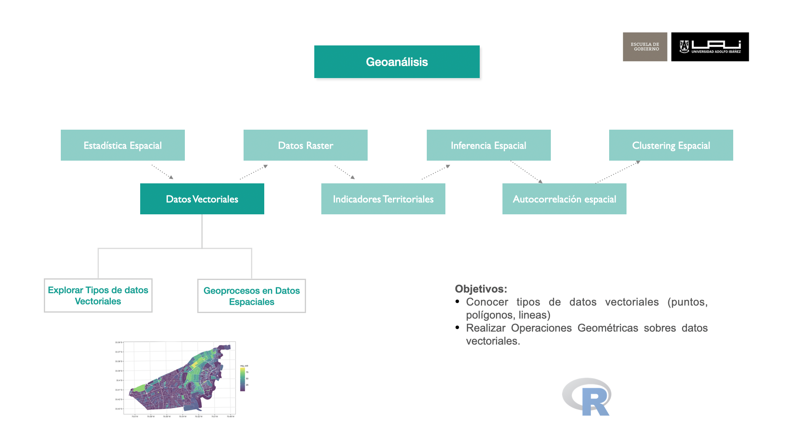
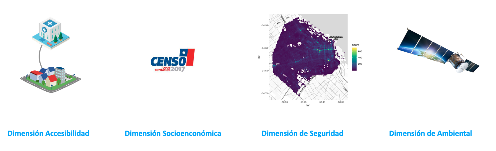

```{r setup, include=FALSE}
knitr::opts_chunk$set(echo = TRUE)
suppressPackageStartupMessages(library(dplyr))
suppressPackageStartupMessages(library(sf))
suppressPackageStartupMessages(library(raster))
suppressPackageStartupMessages(library(mapview))
suppressPackageStartupMessages(library(kableExtra))
suppressPackageStartupMessages(library(ggplot2))
suppressPackageStartupMessages(require(knitr))
suppressPackageStartupMessages(library(viridis))
suppressPackageStartupMessages(library(tidyr))
```



## Objetivos del Módulo

-   Manipulación de Datos Vectoriales
-   Definición de Indicadores Territoriales
-   Construcción de Indicadores Socioeconómicos

## Manipulación de Datos Vectoriales

- Lectura de Insumos
- Filtros y selección
- Resumen Estadísticos
- Joining
- Buffer Espacial

### Lectura de Insumos

Para los efectos prácticos de esta etapa se utilizará la base de datos del censo a nivel zonal a nivel nacional.

```{r}
zonas_censales <-  readRDS("data/censo/zonas_urb_consolidadas.rds")

```

```{r echo=FALSE}
#| label: tbl-censo-zonas
#| tbl-cap: Registros de Zonas Censales del Censo 2017

zonas_censales  %>%
  head(6) %>% 
  kbl() %>%
   kable_styling(bootstrap_options = c("striped", "hover", "condensed"), 
                 font_size = 10,full_width = F)
```


### Filtros y selección de columnas

Para efectos de practicar la manipulación de datos espaciales se creará un subset de la base de zonas censales de alguna provincia de Chile y se realizarán cálculos sencillos de densidad.

Filtrar

```{r}

 # zonas_censales$NOM_PROVIN %>% unique() %>% sort()
zonas <-  zonas_censales %>% 
  filter(NOM_PROVIN == "VALPARAÍSO") %>% 
  filter(URBANO %in% c("VIÑA DEL MAR", "VALPARAÍSO") )

# mapview::mapview(zonas, zcol = "PERS")
```


```{r}
#| label: fig-zonas-censales
#| fig-cap: Zonas Censales de comunas de Valparaíso y Viña del Mar - Urbano


ggplot() +
  geom_sf(data = zonas, aes(fill = PERS), color =NA, 
          alpha=0.8,  size= 0.1)+
  scale_fill_distiller(palette= "YlGnBu", direction = 1)+
  ggtitle("Población Zonas Censales - Urbano" ) +
  theme_bw() +
  theme(panel.grid.major = element_line(colour = "gray80"), 
        panel.grid.minor = element_line(colour = "gray80"))
```

Selección de columnas

```{r}
zonas <-  zonas %>% 
  dplyr::select(GEOCODIGO,NOM_REGION, NOM_PROVIN, NOM_COMUNA, PERS, URBANO, ESC_JH)
```

### Operaciones Espaciales

Cálculo de superficie por polígono

```{r}
zonas <- zonas %>% 
  mutate(AREA = as.numeric(st_area(.))) %>% # en metros cuadrados
  mutate(AREA = AREA/10000) %>% # en hectárea cuadrada
  mutate(DENS_PERS= round(PERS/AREA, 1))

zonas
```


```{r}
#| layout-ncol: 2
#| label: fig-dif-personas
#| fig-cap: Diferencias de un valor absoluto y densidad de Personas en Zonas Censales

ggplot() +
  geom_sf(data = zonas, aes(fill = PERS), color =NA, 
          alpha=0.8,  size= 0.1)+
  scale_fill_distiller(palette= "YlGnBu", direction = 1)+
  ggtitle("Población Zonas Censales - Urbano" ) +
  theme_bw() +
  theme(panel.grid.major = element_line(colour = "gray80"), 
        panel.grid.minor = element_line(colour = "gray80"))
ggplot() +
  geom_sf(data = zonas, aes(fill = DENS_PERS), color =NA, 
          alpha=0.8,  size= 0.1)+
  scale_fill_distiller(palette= "YlGnBu", direction = 1)+
  ggtitle("Densidad de Población Zonas Censales - Urbano" ) +
  theme_bw() +
  theme(panel.grid.major = element_line(colour = "gray80"), 
        panel.grid.minor = element_line(colour = "gray80"))
```

### Resumen Estadísticos

El objetivo de este punto es que con bases de datos espaciales también se pueden hacer resúmenes estadísticos, como se hacen normalmente con bases de datos. Ahora, se creará tabla con las poblaciones  y promedio de años de estudio del Jefe de Hogar en todas las comunas de Chile.


Un punto importante para generar esta tabla es eficiente eliminar la geometría para los cálculos ya que la salida será una tabla.


```{r}
tab_com <- zonas_censales %>% 
  st_drop_geometry() %>% # eliminar geometría.
  group_by(NOM_COMUNA) %>% 
  summarise(POB_COM = sum(PERS),
            ESC_JH_COM = round(mean(ESC_JH, na.rm= T), 1))

```


```{r echo=FALSE}
#| label: tbl-censo-comunas
#| tbl-cap: Registros de Población y Escolaridad por Comuna

tab_com  %>%
  head(10) %>% 
  kbl() %>%
   kable_styling(bootstrap_options = c("striped", "hover", "condensed"), 
                 font_size = 16,full_width = F)
```


### Joining

En este caso agregaremos a la tabla de resultados comunales antes creada, a la base de la comuna de Viña del Mar y Valparaíso, utilizaremos la función  `left_join`.


```{r}

zonas <-  zonas %>% 
  left_join(tab_com, by = "NOM_COMUNA") %>% # Ojo con las veces que se hace esta operación
  mutate(DIF_EJH_COM = round(( ESC_JH-ESC_JH_COM), 2))
```

```{r}
#| label: fig-zonas-dif-ejh
#| fig-cap: Diferencias Esc. Jefe Hogar respecto comuna - Urbano


ggplot() +
  geom_sf(data = zonas, aes(fill = DIF_EJH_COM), color =NA, 
          alpha=0.8,  size= 0.1)+
  scale_fill_distiller(palette= "PRGn", direction = 1)+
  ggtitle("Diferencias Esc. Jefe Hogar Zona/Comuna - Urbano" ) +
  theme_bw() +
  theme(panel.grid.major = element_line(colour = "gray80"), 
        panel.grid.minor = element_line(colour = "gray80"))
```


### Buffer 

Primeramente se creará una geometría comunal basándose en las zonas censales

```{r}
valpo_com <-  zonas %>% filter(NOM_COMUNA == "VALPARAÍSO") %>% 
  st_union()

```


```{r}
#| label: fig-zonas-comu-vlp
#| fig-cap: Resaltar la comuna de Valparaíso

ggplot() +
  geom_sf(data = zonas, aes(fill = DIF_EJH_COM), color =NA, 
          alpha=0.3,  size= 0.1)+
  scale_fill_distiller(palette= "PRGn", direction = 1)+
  geom_sf(data = valpo_com,  color ="magenta", alpha=1,  size= 1, fill = NA)+
  ggtitle("Resaltar la comuna de Valparaíso" ) +
  theme_bw() +
  theme(panel.grid.major = element_line(colour = "gray80"), 
        panel.grid.minor = element_line(colour = "gray80"))
```

Aplicación de Buffer con la función de `st_buffer`.

```{r}
valpo_com_buffer <-  valpo_com %>% 
  st_buffer(dist = 1000) # %>% st_simplify(dTolerance = 100) 

```


```{r}
#| label: fig-buffer-vlp
#| fig-cap: Buffer de la comuna de Valparaíso - 1000 mts.


ggplot() +
  geom_sf(data = valpo_com_buffer,  color ="orange", alpha=1,  size= 1, fill = NA)+
  geom_sf(data = valpo_com,  color ="magenta", alpha=0.3,  size= 1, fill = "magenta")+
  ggtitle("Buffer de la comuna de Valparaíso - 1000 mts." ) +
  theme_bw() +
  theme(panel.grid.major = element_line(colour = "gray80"), 
        panel.grid.minor = element_line(colour = "gray80"))
```


## Indicadores Territoriales

### Definición de Indicadores

¿Qué es un Indicador?:

:   Un indicador es un instrumento que provee información de una determinada condición, situación, actividad o resultado. Este instrumento nos permite definir un punto de comparación para establecer diferencias entre individuos o respecto a sí mismo en diferentes tiempos. Son construidos a través de análisis y operaciones técnicas y nos entregan una medida cuantitativa (valor) o una descripción cualitativa (caracterización) de la magnitud o criterio que se pretende medir u observar.

### Indicadores Territoriales

El Centro de Inteligencia Territorial de la Universidad Adolfo Ibáñez, bajo proyecto denominado **Matriz de Bienestar Humano Territorial (MBHT)** construyó una serie indicadores territoriales, que buscan comprender las condiciones de los entornos urbanos y rurales, para construir soluciones que impacten positivamente en el bienestar de las personas y su hábitat.


::: {#fig-cit}

{fig-align="center" width="30%"}{fig-align="center" width="18%"}

Centro de Inteligencia Territorial - UAI
:::


El sistema MBHT consiste en 18 indicadores territoriales agrupados en 4 dimensiones, que corresponde a las dimensiones de Accesibilidad, Ambiental, Seguridad y Socoeconómicas, siendo esta última a la se replicará.

::: {#fig-mbht}


{fig-align="center"}

Dimensiones de la Matriz de Bienestar Humano Territorial
:::


## Construcción de Indicadores Socioconómicos {#sec-indsoc}

Las ciudades de Chile presentan altos índices de segregación (Sabatini, 2002), que reflejan la separación espacial de distintos grupos sociales (Ruiz-Tagle, 2014). La intensidad de este fenómeno hace imperativo el considerar la condición social como una dimensión estructurante en la evaluación de Políticas Públicas.

::: {#fig-soc-mbht }

{fig-align="center" width=40%}

Indicadores Socioconómicos
:::


### Insumos Censo 2017

Para la construcción de los indicadores territoriales que componen la dimensión seocioeconómica, se utiliza íntegramente información del Censo 2017.

**¿Que es Censo 2017?:**

El censo de población y vivienda es la operación estadística más importante que realiza el INE y en la cual participan todos los habitantes del país, ya que este es un insumo esencial para elaborar estimaciones y proyecciones de población tanto para el país, las regiones y las comunas. 

El censo permite contar con información esencial para el adecuado diseño de políticas públicas y toma de decisiones privadas y públicas. El último censo de población y vivienda realizado fue en 2017. Sus resultados indican que la población efectivamente censada llegó a un total de 17.574.003 personas. 

De ellas, 8.601.989 (48,9%) son hombres y 8.972.014 (51,1%), mujeres. El número de viviendas, en tanto, fue 6.499.355, de las cuales 6.486.533 (99,8%) corresponden a viviendas particulares y 12.822 (0,2%) a colectivas.


Para estos fines, se utilizaremos información censal agregada a nivel de **manzanas** obtenidos del Censo 2017, a continuación se explorará los insumos utilizados.


::: {#fig-logo-censo }

{width="20%" fig-align="center"}

Censo 2017 - Instituto Nacional de Estadísticas de Chile
:::


###  Insumos del Censo

Para los indicadores que se crearán a continuación se utilizará una base proveniente de la consolidación de las bases del censo, denominadas microdatos de Personas, Viviendas y Hogares provenientes de los resultados de la Encuesta del Censo 2017 del Instituto Nacional de Estadísticas, Chile.

```{r}
library(sf)
library(dplyr)

# ruta de insumos
path_insumos <- "data/socioeconomicos/insumos/"
```

Lectura de Insumos y selección de región de estudio, en este caso seleccionará la [Región de Coquimbo](https://es.wikipedia.org/wiki/Región_de_Coquimbo) compuesta por las provincias de Elqui, Limarí y Choapa. Sus principales centros urbanos son la Conurbación La Serena-Coquimbo con 506 391 habitantes, seguida de Ovalle con 121.269 habitantes según el Censo chileno de 2017.


```{r}
# selección de región
reg <-  "R04"

# Lectura de insumo espacial
path_file <- paste0(path_insumos, reg, "_INSUMO_SOCIOECONOMICO.shp")
censo <- st_read(path_file, quiet = T)
```


**Visualización de Tabla de Información `head()`**

```{r echo=FALSE}
#| label: tbl-censo
#| tbl-cap: Visualización de registros de insumos del Censo 2017 para indicadores socioeconómicos

censo  %>%
  head(6) %>% 
  kbl() %>%
   kable_styling(bootstrap_options = c("striped", "hover", "condensed"), 
                 font_size = 8,full_width = F)
```

## Indicador de Escolaridad del jefe de hogar (IEJ) 

Para la construcción de este indicador se utilizó el promedio de años de estudio de jefes de hogar (EJH), que es una variable censal numérica (“ESCOLARIDAD”, en tabla de personas del censo 2017) que registra el nivel del curso más alto aprobado, medida en años sucesivos desde la enseñanza básica hasta estudios de postgrado.

Se calcula el promedio de esta variable para todos los jefes de hogar en cada manzana. Esta variable es representativa del capital cultural de cada hogar y está altamente correlacionada con el nivel de ingresos en Chile (Agostini et al, 2016). 


**Cálculo Indicador de Escolaridad del jefe de hogar (IEJ)**

```{r}
censo <- censo %>% mutate( IEJ = ifelse(PERSONAS ==0, NA, ESCOLAR))
```

Para efectos de visualización se enfocará los resultados en las zonas urbanas de la comuna de La Serena en todos los indicadores que se presentarán.

```{r}
la_serena_urb <- censo %>% filter(COD_COM == 4101 & MANZ_EN == "URBANO")
```


**Visualizar la Variable de `IEJ` comuna de La Serena `URBANO`**:

```{r}
#| label: fig-iej-urbano
#| fig-cap: Indicador de Escolaridad del jefe de hogar (IEJ) - Urbano


ggplot() +
  geom_sf(data = la_serena_urb, aes(fill = IEJ), color =NA, 
          alpha=0.8,  size= 0.1)+
  scale_fill_distiller(palette= "YlGnBu", direction = 1)+
  ggtitle("Indicador de Escolaridad del jefe de hogar (IEJ) - Urbano" ) +
  theme_bw() +
  theme(panel.grid.major = element_line(colour = "gray80"), 
        panel.grid.minor = element_line(colour = "gray80"))
```

```{r}
# mapview::mapview(censo %>% filter(COD_COM == 4101 & MANZ_EN == "URBANO"),
                 # zcol = "IEJ", layer.name = "IEJ")
```


**Visualizar la Variable de `IEJ` comuna de La Serena `RURAL`**:

```{r echo=TRUE}
#| label: fig-iej-rural
#| fig-cap: Indicador de Escolaridad del jefe de hogar (IEJ) - Rural

la_serena_rural <- censo %>% filter(COD_COM == 4101 & MANZ_EN == "RURAL")

ggplot() +
  geom_sf(data = la_serena_rural, aes(fill = IEJ), color =NA, 
          alpha=0.8,  size= 0.1)+
  scale_fill_distiller(palette= "YlGnBu", direction = 1)+
  ggtitle("Indicador de Escolaridad del jefe de hogar (IEJ) - Rural" ) +
  theme_bw() +
  theme(panel.grid.major = element_line(colour = "gray80"), 
        panel.grid.minor = element_line(colour = "gray80"))
# mapview::mapview(censo %>% filter(COD_COM == 4101 & MANZ_EN == "RURAL"),
                 # zcol = "IEJ", layer.name = "IEJ")
```


## Indicador de Empleo (IEM) 

Para este indicador se usó la proporción de población activa sin empleo que es la fracción de las personas que no tienen empleo y están buscando uno, respecto al total de personas en condiciones y con deseo de trabajar en cada manzana. 

Esta variable es similar al cálculo de desempleo, pero calculada a escala de manzanas y en un tiempo específico, por lo que representa las brechas potenciales que existen para acceder al empleo en barrios específicos (MDS, 2019). 


**Cálculo Indicador de Empleo (IEM) **

**P17_4**: Trabajo la semana pasada, *opción 4*: "Se encontraba buscando empleo"  
**P17_ACT**: Total de Actividades Remuneradas (no es pregunta del Censo)


```{r}

# P17: Trabajo la semana pasada
# opción `4`: "Se encontraba buscando empleo"
# P17_ACT: Total de Actividades Remuneradas

censo <- censo %>% mutate( CESA_DENS = P17_4 / P17_ACT)

# Invertir el valor de indicador 1
censo <- censo %>% mutate( IEM = 1 - CESA_DENS )
```

De aquí continuación se realizarán cartografías solo a zonas urbanas a efecto de limitar la extensión del presente documento, pero el cálculo urbano se puede efectuar perfectamente aplicando un filtro como se ejemplifico en el indicador anterior. Ahora, se procede a filtrar por zonas urbanas


```{r}
la_serena_urb <- censo %>% filter(COD_COM == 4101 & MANZ_EN == "URBANO")
```


**Visualizar la Variable de `IEM` comuna de La Serena `URBANO`**:

```{r}
#| label: fig-iem-urbano
#| fig-cap: Indicador de Empleo (IEM) - Urbano


ggplot() +
  geom_sf(data = la_serena_urb, aes(fill = IEM), color =NA, 
          alpha=0.8,  size= 0.1)+
  scale_fill_distiller(palette= "PuBu", direction = 1)+
  ggtitle("Indicador de Empleo (IEM) - Urbano" ) +
  theme_bw() +
  theme(panel.grid.major = element_line(colour = "gray80"), 
        panel.grid.minor = element_line(colour = "gray80"))
```

```{r}
# mapview::mapview(la_serena_urb, 
#                  zcol = "IEM", layer.name = "IEM")
```


## Indicador de Participación Juvenil en empleo y estudio (IPJ) 

Para la construcción de este indicador se utilizó la proporción de jóvenes entre 14 y 24 años que no trabajan ni estudian: es la fracción de jóvenes en este rango edad que no trabajan ni estudian, respecto al total de este segmento etario en cada manzana. 

Esta variable representa un riesgo de exclusión socioeconómica en el período de transición entre el ambiente educativo y el laboral, siendo característico de trayectorias de deserción escolar que conducen al desempleo y que podrían incrementar el riesgo de adopción de comportamientos delictivos (MDS, 2019). 

Luego, el indicador se normalizó con su inverso aditivo, para asegurar que el valor máximo, sea lo más deseable y el 0 lo menos deseable, convirtiéndose así en un indicador de empleo. 


**Cálculo Indicador de Participación Juvenil en empleo y estudio (IPJ) **

**J_NINI**: Jóvenes que no trabajan ni estudian P17
**E15A24**: Jóvenes entre 15 y 24 años de edad

```{r}
censo <- censo %>% mutate( NINI_DENS = J_NINI / E15A24)  
censo <- censo %>% mutate( NINI_DENS = ifelse(NINI_DENS > 1, 1, NINI_DENS))  
censo <- censo %>% mutate( IPJ = 1 - NINI_DENS )
```


```{r}
la_serena_urb <- censo %>% filter(COD_COM == 4101 & MANZ_EN == "URBANO")
```


**Visualizar la Variable de `IPJ` comuna de La Serena `URBANO`**:

```{r}
#| label: fig-ipj-urbano
#| fig-cap: Indicador de Participación Juvenil enempleo y estudio (IPJ) - Urbano

ggplot() +
  geom_sf(data = la_serena_urb, aes(fill = IPJ), color =NA, 
          alpha=0.8,  size= 0.1)+
  scale_fill_distiller(palette= "Purples", direction = 1)+
  ggtitle("Indicador de Participación Juvenil en empleo y estudio (IPJ) - Urbano" ) +
  theme_bw() +
  theme(panel.grid.major = element_line(colour = "gray80"), 
        panel.grid.minor = element_line(colour = "gray80"))
```

```{r}
# mapview::mapview(la_serena_urb, 
#                  zcol = "IPJ", layer.name = "IPJ")
```


## Indicador de Resiliencia de Hogares (IRH) 

En particular, la monoparentalidad es ampliamente reconocida en la literatura internacional como una situación familiar frágil, que puede afectar las trayectorias de vida de los hijos, en términos de un mayor riesgo de mortalidad (Amato & Patterson, 2017), inestabilidad psicológica (Theodoritsi, Daliana & Antoniou, 2018), problemas de salud (Duriancik & Goff, 2019) y otros. 

En suma, el Indicador de Resiliencia de Hogares (en base a la monoparentalidad), en complemento a otras variables, es conceptualmente relevante para evaluar riesgos no monetarios de condiciones sociales. 

Este indicador es el inverso aditivo de la proporción de hogares monoparentales dentro de una manzana. 
Los hogares monoparentales son aquellos con hijos que viven con un solo progenitor, lo que se asocia en diversas formas a la condición social, que abarcan desde un menor ingreso, problemas de salud y delincuencia, entre otros (MDS, 2019). 

Al contrario, los hogares biparentales permiten el apoyo entre progenitores y los hogares sin hijos tienen menores exigencias de gasto y tiempo relacionadas con la paternidad, por lo que se considera que en general son más resilientes. 


**Cálculo de Indicador de Resiliencia de Hogares (IRH) **

**MONOPAR**: Hogares Monoparentales  
**HOG_N**: Número de Hogares

```{r}
censo <- censo %>% mutate( MONO_DENS = MONOPAR / HOG_N)
censo <- censo %>% mutate( MONO_DENS = ifelse(MONO_DENS > 1, 1, MONO_DENS))  
censo <- censo %>% mutate( IRH = 1 - MONO_DENS)
```


```{r}
la_serena_urb <- censo %>% filter(COD_COM == 4101 & MANZ_EN == "URBANO")
```


**Visualizar la Variable de `IRH` comuna de La Serena `URBANO`**:

```{r}
#| label: fig-irh-urbano
#| fig-cap: Indicador de Resiliencia de Hogares (IRH) - Urbano

ggplot() +
  geom_sf(data = la_serena_urb, aes(fill = IRH), color =NA, 
          alpha=0.8,  size= 0.1)+
  scale_fill_distiller(palette= "PuRd", direction = 1)+
  ggtitle("Indicador de Resiliencia de Hogares (IRH) - Urbano") +
  theme_bw() +
  theme(panel.grid.major = element_line(colour = "gray80"), 
        panel.grid.minor = element_line(colour = "gray80"))
```

```{r}
# mapview::mapview(la_serena_urb, 
#                  zcol = "IRH", layer.name = "IRH")
```


## Indicador de Calidad de la Vivienda (IVI) 

El indicador de calidad de vivienda es una variable sintética de todas las materialidades de la vivienda. Inicialmente, se construyó como un indicador de mala calidad, tomando un valor más alto cuando la calidad de la vivienda es peor y es más bajo cuando es mejor. Fue elaborado como un promedio lineal del 3 sub-indicadores de paredes, suelo y techo. Cada uno de estos sub-indicadores registra el porcentaje de viviendas de la manzana que tienen paredes, suelo o techo considerado insuficiente. Las construcciones consideradas insuficientes son las siguientes: 

**Paredes**: Material de los muros exteriores  

* P03A_4: Tabique sin forro interior (madera u otro)
* P03A_5: Adobe, barro, quincha, pirca u otro artesanal tradicional
* P03A_6: Materiales precarios (lata, cartón, plástico, etc.)

**Techo**: Material en la cubierta del techo   

* P03B_4: Fonolita o plancha de fieltro embreado
* P03B_6: Materiales precarios (lata, cartón, plásticos, etc.)
* P03B_7: Sin cubierta sólida de techo

**Suelo**: Material de construcción del piso   

* P03C_4: Capa de cemento sobre tierra
* P03C_5: Tierra


**Cálculo Indicador de Calidad de la Vivienda (IVI) **

```{r}
censo <- censo %>%
  mutate(paredes = (P03A_4 + P03A_5 + P03A_6)/TOTAL_V,
         techo = (P03B_4 + P03B_6 + P03B_7)/TOTAL_V,
         suelo = (P03C_4 +  P03C_5)/TOTAL_V)

# eliminar valores infinitos de la división anterior
censo <- censo %>%
  mutate(paredes = ifelse(paredes > 1, 1, paredes), 
         techo = ifelse(techo > 1, 1, techo), 
         suelo = ifelse(suelo > 1, 1, suelo))

censo <- censo %>%  mutate(IVI = (paredes+ suelo+ techo)/3)
censo <- censo %>%  mutate(IVI =  1 - IVI) # invertir sentido
```


```{r}
la_serena_urb <- censo %>% filter(COD_COM == 4101 & MANZ_EN == "URBANO")
```


**Visualizar la Variable de `IVI` comuna de La Serena `URBANO`**:

```{r}
#| label: fig-ivi-urbano
#| fig-cap: Indicador de Calidad de la Vivienda (IVI) - Urbano


ggplot() +
  geom_sf(data = la_serena_urb, aes(fill = IVI), color =NA, 
          alpha=0.8,  size= 0.1)+
  scale_fill_distiller(palette= "YlOrRd", direction = 1)+
  ggtitle("Indicador de Calidad de la Vivienda (IVI) - Urbano") +
  theme_bw() +
  theme(panel.grid.major = element_line(colour = "gray80"), 
        panel.grid.minor = element_line(colour = "gray80"))
```

```{r}
# mapview::mapview(la_serena_urb, 
#                  zcol = "IVI", layer.name = "IVI")
```


## Indicador de Suficiencia de Viviendas (ISV) 


El indicador de Suficiencia de Viviendas se construyó inicialmente como un indicador de hacinamiento. Se realizó a partir de 2 variables que indican el número de viviendas que se encuentran en situación de hacinamiento y el número de viviendas que se encuentran en situación de hacinamiento severo. El indicador corresponde a la suma de 2 veces las viviendas en situación de hacinamiento severo con las viviendas en situación de hacinamiento normal, dividido por el total de viviendas. 

Luego, el indicador se normalizó con su inverso aditivo, para asegurar que el valor máximo, sea lo más deseable y el 0 lo menos deseable. Con esto se obtuvo el indicador de suficiencia de viviendas.  

**Cálculo de Indicador de Suficiencia de Viviendas (ISV) **

**NIV_HAC2**: >= 2.5 personas por habitación    
**NIV_HAC3**: >= 5 personas por habitación

```{r}
censo <- censo %>% mutate(ISV = NIV_HAC2 + (2 * NIV_HAC3))

# función de normalización
minmax <- function(x) {
  x <- (x - min(x, na.rm = TRUE)) / 
    (max(x, na.rm = TRUE) - min(x, na.rm = TRUE))
  return(x)
}

censo <- censo %>% mutate(ISV = 1 - minmax(ISV))
```


```{r}
la_serena_urb <- censo %>% filter(COD_COM == 4101 & MANZ_EN == "URBANO")
```


**Visualizar la Variable de `ISV` comuna de La Serena `URBANO`**:

```{r}
#| label: fig-isv-urbano
#| fig-cap: Indicador de Suficiencia de Viviendas (ISV) - Urbano

ggplot() +
  geom_sf(data = la_serena_urb, aes(fill = ISV), color =NA, 
          alpha=0.8,  size= 0.1)+
  scale_fill_distiller(palette= "YlOrRd", direction = 1)+
  ggtitle(" Indicador de Suficiencia de Viviendas (ISV) - Urbano") +
  theme_bw() +
  theme(panel.grid.major = element_line(colour = "gray80"), 
        panel.grid.minor = element_line(colour = "gray80"))
```

```{r}
# mapview::mapview(la_serena_urb, 
#                  zcol = "ISV", layer.name = "ISV")
```


## Consolidación de Dimensión Socioeconómica


**Selección de Variables de Interés**

```{r}
# names(censo)
soc <- censo %>% 
  dplyr::select(ID_MANZ:PERSONAS, IEJ, IEM, IPJ, IRH, IVI, ISV)
```

**Visualización de los Indicadores**

```{r eval=FALSE}
comuna <- soc %>% filter(COD_COM == 4101 & MANZ_EN == "URBANO")
mapview(comuna, zcol = "IEJ") + mapview(comuna, zcol = "IEM")+
  mapview(comuna, zcol = "IPJ") + mapview(comuna, zcol = "IRH")+
  mapview(comuna, zcol = "IVI") + mapview(comuna, zcol = "ISV")
  
```


**Guardar Resultados**

```{r eval=FALSE}
# guardar shapefile
path_file_out <- paste0("../data/socioeconomicos/resultados/",
                    reg, "_ind_socioeconomicos.shp")
st_write(soc, path_file_out)

#guardar en RDS
path_file_out_rds <- paste0("../data/socioeconomicos/resultados/",
                    reg, "_ind_socioeconomicos.rds")
saveRDS(soc, path_file_out_rds)  
```


## Referencias

* [R para Ciencia de Datos](https://es.r4ds.hadley.nz)
* [RStudio para Estadística Descriptiva en Ciencias Sociales](https://bookdown.org/gboccardo/manual-ED-UCH/)
* [R para Principiantes4/](https://bookdown.org/jboscomendoza/r-principiantes4/)
* [Colores en Ggplot2](https://ggplot2-book.org/scale-colour.html)


