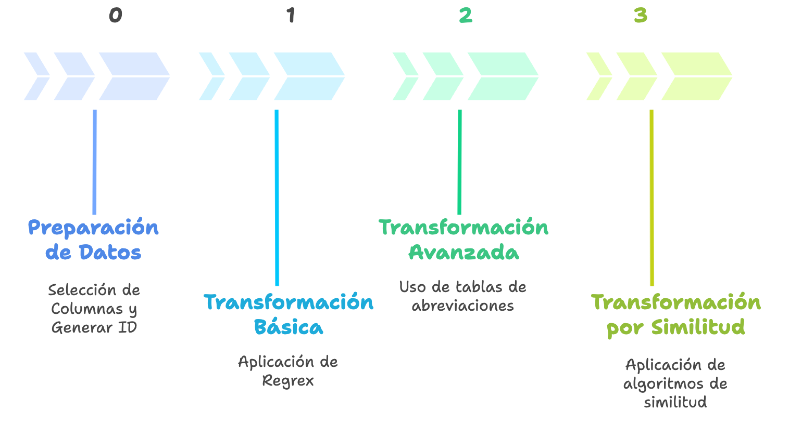
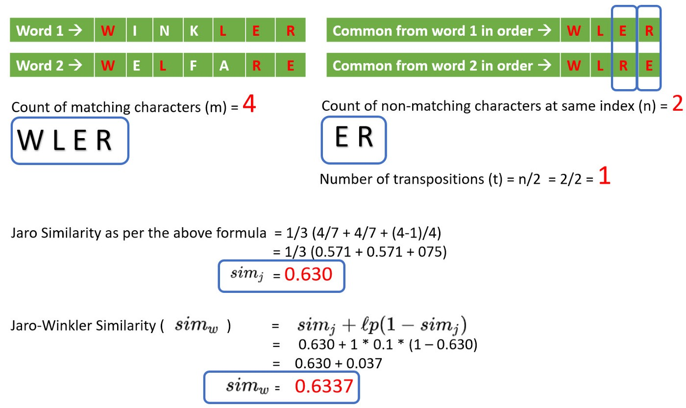
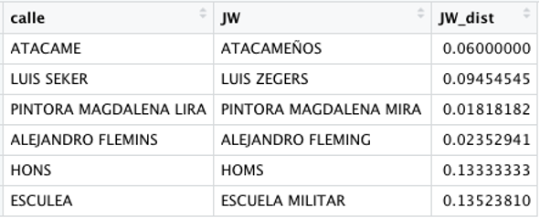

# Geocoding {.unnumbered}

```{r setup, include=FALSE}
# parámetros
font_size = 2
n_head = 10
# librerías
suppressPackageStartupMessages(library(sf))
suppressPackageStartupMessages(library(dplyr))
suppressPackageStartupMessages(library(purrr))
suppressPackageStartupMessages(library(readr))
suppressPackageStartupMessages(library(kableExtra))
suppressPackageStartupMessages(require(knitr))
suppressPackageStartupMessages(library(tidygeocoder))
suppressPackageStartupMessages(library(tidyr))
suppressPackageStartupMessages(library(stringdist))

```


## Introducción

En el capítulo anterior trabajamos con información que ya estaba asociada a una comuna . Para representarla espacialmente bastaba con unir nuestra tabla de indicadores con una capa que contenía las geometrías comunales y en el mejor de los casos ya venía con las coordenadas por defecto.

Sin embargo, muchos registros administrativos no contienen coordenadas ni identificadores territoriales. En cambio, contienen información como:

>_"Presidente Errázuriz 3485, Las Condes"_

Sabemos qué dirección fue registrada, pero todavía no sabemos exactamente dónde se encuentra en el espacio.

Aquí aparece un nuevo problema:

>¿Cómo podemos transformar una dirección escrita como texto en una ubicación que pueda ser utilizada en un análisis espacial?


La respuesta es la [geocodificación]{.verde}.


{fig-align="center" width="500"}


En contextos hispanos, la amplia variabilidad en los formatos de escritura de direcciones —abreviaciones, uso de diacríticos, numeraciones, referencias a kilómetros o parcelas, y complementos adicionales— exige un pipeline estructurado. Este debe integrar [normalización determinística, diccionarios de abreviaciones y métodos de similitud]{.verde}, antes de consultar motores de geocodificación externos.

El proceso de geocodificación debe ser [flexible y adaptable]{.verde} a los diferentes tipos y estructuras de direcciones. Por ello, resulta fundamental contar con un flujo de trabajo que permita transformar las direcciones en etapas sucesivas, mejorando gradualmente la calidad de los resultados. Esta organización facilita la trazabilidad, el control de calidad y la incorporación de ajustes o transformaciones adicionales cuando sea necesario. A continuación, se presenta una visión resumida del pipeline básico que trabajaremos en esta clase.

::: {.callout-important}

## Geocodificar no es solamente obtener coordenadas

Un motor puede devolver una latitud y longitud y, aun así, entregar una ubicación incorrecta.

Por ejemplo, una dirección declarada en Temuco podría coincidir con una calle del mismo nombre localizada en Santiago.

Por ello, nuestro objetivo no será simplemente:

`Dirección → Coordenadas`

sino:

`Dirección → Preparación → Coordenadas → Validación → Ubicación confiable`

La calidad de un proceso de geocodificación depende tanto de la capacidad de encontrar coordenadas como de nuestra capacidad para verificar que esas coordenadas son coherentes con la información original.
:::


**Visión del Pipeline Básico**


```
Dirección cruda
  │
  ├─▶ [0] Preparación
  │
  ├─▶ [1] Básica 
  │      ├─▶ Transformación por Regex Funciones
  │      ├─▶ Geocodificación 
  │      ├─▶ Validación Espacial → ✔️ fin | ✖️ pasa a [2]
  │      └─▶ Registro de Avance por Etapa
  │
  ├─▶ [2] Avanzada
  │      ├─▶ Transformación por Tablas de Abreviaturas
  │      ├─▶ Geocodificación #2
  │      ├─▶ Validación Espacial → ✔️ fin | ✖️ pasa a [3]
  │      └─▶ Registro de Avance por Etapa 
  │
  └─▶ [3] Similitud
         ├─▶ Transformación por Similitud de Palabras
         ├─▶ Score de Diferencias < τ → ✔️ Geocoding | ✖️ Rezagados
         ├─▶ Geocodificación #3 
         ├─▶ Validación Espacial → ✔️ fin | ✖️ Rezagados
         └─▶ Registro de Avance por Etapa y Final
```

---

## Pasos

Cada etapa del pipeline sigue la misma secuencia de pasos: [transformación de la dirección, geocodificación, validación espacial]{.verde} de los resultados y, finalmente, [Registro de Avances]{.verde}. A continuación, se describen en detalle estos pasos comunes a todas las etapas.


### Transformación (varía según etapa)

Estandariza la cadena de entrada (**corrección, normalización, limpieza**), enriqueciendo con reglas y diccionarios según la etapa.

### Geocodificación

Para realizar el proceso de geocodificación de direcciones es necesario contar con un **motor de geocodificación** que es un servicio o sistema que convierte direcciones físicas en coordenadas geográficas (latitud y longitud), o viceversa, un proceso conocido como “reverse geocoding”. Estos motores son esenciales para analizar datos espaciales cuando la información disponible está en formato de texto (como direcciones postales). 

Los motores de geocodificación utilizan bases de datos geográficas y algoritmos de correspondencia para ubicar puntos específicos en un mapa a partir de descripciones textuales. Dependiendo del motor, pueden ofrecer características adicionales, como filtrado por región, cálculos de rutas, o integración con sistemas de tráfico en tiempo real. La siguiente tabla compara varios motores de geocodificación en cuanto a características, cobertura, precisión y si son gratuitos o de pago.

| Motor | Modelo | Cobertura | Consideraciones principales |
|---|---|---|---|
| **Nominatim / OpenStreetMap** | Abierto / gratuito | Global | Basado en OpenStreetMap. Requiere respetar políticas de uso y límites de consultas. Para procesos masivos puede ser conveniente utilizar una instancia propia. |
| **Google Geocoding API** | Comercial | Global | Alta cobertura y precisión. Requiere API y un plan de facturación vigente. |
| **HERE Geocoding API** | Comercial | Global | Permite geocodificación y búsqueda estructurada. Requiere API y está sujeto a cuotas de uso. |
| **Mapbox Geocoding API** | Comercial | Global | Integración con el ecosistema Mapbox y soporte para búsquedas geográficas. Requiere API y está sujeto a cuotas. |
| **TomTom Geocoding API** | Comercial | Global | Orientado también a aplicaciones de navegación y movilidad. Requiere API y está sujeto a cuotas de uso. |


> Las cuotas, precios y condiciones de uso cambian con el tiempo. Siempre deben revisarse en la documentación oficial del proveedor antes de implementar un proceso masivo.

Para este curso no necesitas que memoricen límites de APIs; necesitas que comprendan que un geocoder es un servicio con una base de referencia, reglas de búsqueda y restricciones operacionales.


**Variables clave al momento de geocodificar**

- Cadena de consulta: dirección completa o tokens estructurados.
- País / región: restringen la búsqueda.
- Bounding box / viewbox: acota la búsqueda espacial.
- Nivel de detalle (addressdetails): define si devuelve calle, comuna, provincia, país.
- Número de resultados (limit): controla cuántas coincidencias se devuelven.
- Formato de salida (format): JSON, XML, etc.
- User-Agent / Email: requerido en OSM para trazabilidad.
- Rate limiting: número máximo de consultas permitido.

En la práctica se utilizarán motores libres basados en OpenStreetMap (OSM), principalmente [Nominatim](https://nominatim.openstreetmap.org/ui/search.html), respetando sus términos de uso y buenas prácticas.


### Validación Espacial

Obtener coordenadas no garantiza que el resultado sea correcto. Después de cada intento de geocodificación debemos comprobar si la ubicación obtenida es consistente con la información territorial declarada originalmente.

En este ejercicio utilizaremos una validación Point-in-Polygon:

1. el motor devuelve una coordenada;
2. transformamos esa coordenada en un punto espacial;
3. intersectamos el punto con los polígonos comunales;
4. identificamos en qué comuna cayó;
5. comparamos esa comuna con la declarada en el registro original.

Por ejemplo:

Dirección declarada: Temuco
Punto geocodificado: Santiago

El motor logró encontrar una coordenada, pero el resultado no supera nuestra validación espacial.

Por esta razón distinguiremos entre:

* geocodificado: el motor devolvió coordenadas;
* validado: además, las coordenadas son territorialmente consistentes;
* rezagado: requiere un nuevo tratamiento o revisión.

Esta distinción será fundamental para medir la calidad del pipeline.


### Registros de Avances

>¿Cómo sabremos si el proceso está funcionando?

El proceso de geocodificación no se evaluará únicamente observando algunos puntos en un mapa. Utilizaremos métricas que permitan cuantificar su desempeño.

**Total inicial**

Número de registros que intentaremos geocodificar.

**Aporte de una etapa**

Porcentaje de la base original que logró ser correctamente validado durante esa etapa.

$$Aporte_k =
\frac{\text{registros validados en etapa } k}
{\text{registros originales}}
\times 100$$

**Cobertura acumulada**

Porcentaje de registros originales que han sido correctamente resueltos después de todas las etapas ejecutadas hasta ese momento.

$$Cobertura =
\frac{\sum \text{registros validados}}
{\text{registros originales}}
\times100$$

La comparación de estas métricas permitirá saber cuánto valor aporta cada transformación adicional al pipeline.


## Etapas



### Etapa 0. Preparación de Datos {.unnumbered}

- Seleccionar columnas necesarias y nombres estándar (p. ej., `id`, `direccion_raw`, `comuna`/`municipio`, `region`, `pais`).
- Crear **id único** (UUID/Hash) para trazabilidad.


### Etapa 1. Transformación Básica: Regex y funciones {.unnumbered}


- Normalización mínima: mayúsculas, quitar diacríticos, compactar espacios, estandarizar símbolos (`#`, `Nº`, `NUM`).
- Extracción de **tokens**: `tipo_via`, `nombre_via`, `numero`, `km`, `complementos`.
- Primer intento de geocodificación con cadena limpia.

### Etapa 2. Transformación Avanzada: Tablas de abreviaciones {.unnumbered}

- Aplicar [diccionarios]{.verde} muchos→uno (AV/AVDA/AVENIDA → AVENIDA; PJE/PSJE → PASAJE; O'HIGGINS ↔ OHIGGINS).
- Reintentar geocodificación con dirección estandarizada.

### Etapa 3. Transformación por Similitud {.unnumbered}

- Generar **candidatos** desde un maestro de calles.
- Puntuar con [Jaro–Winkler]{.verde}, Levenshtein/Damerau, Token Sort/Set, TF–IDF trigramas.
- Reintentar geocodificación con dirección ajustada por similitud.


## Pipeline Completo


```{mermaid}
%%{init: {
  "theme": "base",
  "themeVariables": {
    "fontFamily": "Inter, Segoe UI, Roboto, sans-serif",
    "primaryTextColor": "#0f172a",
    "lineColor": "#94a3b8",
    "tertiaryColor": "#f8fafc"
  },
  "flowchart": { "htmlLabels": false, "curve": "basis" }
}}%%

flowchart TB
  %% ====== Definición de estilos ======
  classDef input fill:#E8F1FF,stroke:#3B82F6,stroke-width:1px,color:#0b3d91;
  classDef s0 fill:#F8FAFC,stroke:#64748B,stroke-width:1px,color:#0f172a;
  classDef s1 fill:#FFFFFF,stroke:#3B82F6,stroke-width:1.5px,color:#0f172a;
  classDef s2 fill:#FFFFFF,stroke:#10B981,stroke-width:1.5px,color:#0f172a;
  classDef s3 fill:#FFFFFF,stroke:#A3BE00,stroke-width:1.5px,color:#0f172a;
  classDef decision fill:#FEF3C7,stroke:#F59E0B,stroke-width:1px,color:#713f12;
  classDef qa fill:#F0F9FF,stroke:#0EA5E9,stroke-width:1px,color:#0c4a6e;
  classDef finish fill:#ECFDF5,stroke:#16A34A,stroke-width:1.5px,color:#065f46;
  classDef backlog fill:#FFF1F2,stroke:#FB7185,stroke-width:1px,color:#7f1d1d;

  %% ====== Entrada ======
  IN["Base con Direcciones Raw"]:::input

  %% ====== [0] Preparación ======
  subgraph S0 ["[0] Preparación"]
    direction TB
    s0b["Generación de ID"]:::s0
    s0c["Selección de Columnas necesarias"]:::s0
  end

  %% ====== [1] Básica ======
  subgraph S1 ["[1] Básica"]
    direction TB
    s1a["Transformación por Regex / funciones"]:::s1
    s1b["Geocodificación #1"]:::s1
    s1c{"Validación Espacial"}:::decision
    s1d["Registro de Avance"]:::qa
  end

  %% ====== [2] Avanzada ======
  subgraph S2 ["[2] Avanzada"]
    direction TB
    s2a["Transformación por tablas de abreviaturas"]:::s2
    s2b["Geocodificación #2"]:::s2
    s2c{"Validación Espacial"}:::decision
    s2d["Registro de Avance"]:::qa
  end

  %% ====== [3] Similitud ======
  subgraph S3 ["[3] Similitud"]
    direction TB
    s3a["Transformación por similitud de palabras"]:::s3
    s3t{"¿score ≥ τ?"}:::decision
    s3b["Geocodificación #3"]:::s3
    REZ["Rezagados"]:::backlog
    s3c{"Validación Espacial"}:::decision
    s3d["Registro de Avance"]:::qa
  end

  %% ====== Salidas ======
  OUT["Dirección geocodificada"]:::finish
  REZ["Rezagados"]:::backlog

  %% ====== Flujo ======
  IN --> S0 --> S1
  s1a --> s1b --> s1c
  s1c -- "✔ válido" --> OUT
  s1c -- "✖ → [2]" --> s1d --> S2

  s2a --> s2b --> s2c
  s2c -- "✔ válido" --> OUT
  s2c -- "✖ → [3]" --> s2d --> S3


  s3c -- "✔ válido" --> OUT
  s3c -- "✖ inválido" --> s3d --> REZ
  s3a --> s3t
  s3t -- "Sí" --> s3b --> s3c
  s3t -- "No" --> REZ

  %% ====== Estilos de subgrupos ======
  style S0 stroke:#64748B,stroke-width:1.5px,fill:#F8FAFC
  style S1 stroke:#3B82F6,stroke-width:2px,fill:#F8FBFF
  style S2 stroke:#10B981,stroke-width:2px,fill:#F6FFFB
  style S3 stroke:#A3BE00,stroke-width:2px,fill:#F9FFE6

```


---

## Geocodificación en R

### Recursos Previos

#### Librerías que se utilizarán 

```{r}
library(sf)
library(dplyr)
library(tidygeocoder)
library(tidyr)
library(stringdist)
library(openxlsx)
library(janitor)
library(mapview)
library(stringr)
```


#### Funciones Auxiliares

```{r}

# Función Si no existe directorio lo crea
make_dir <- function(path){
  if (!dir.exists(path)) dir.create(path, recursive = TRUE)
}

```


### E0: Preparación de Datos


```{mermaid}
%%{init: {
  "theme": "base",
  "themeVariables": {
    "fontFamily": "Inter, Segoe UI, Roboto, sans-serif",
    "primaryTextColor": "#0f172a",
    "lineColor": "#94a3b8",
    "tertiaryColor": "#f8fafc"
  },
  "flowchart": { "htmlLabels": false, "curve": "basis" }
}}%%

flowchart TB
  %% ====== Definición de estilos ======
  classDef input fill:#E8F1FF,stroke:#3B82F6,stroke-width:1px,color:#0b3d91;
  classDef s0 fill:#F8FAFC,stroke:#64748B,stroke-width:1px,color:#0f172a;
  classDef s1 fill:#FFFFFF,stroke:#3B82F6,stroke-width:1.5px,color:#0f172a;
  classDef s2 fill:#FFFFFF,stroke:#10B981,stroke-width:1.5px,color:#0f172a;
  classDef s3 fill:#FFFFFF,stroke:#A3BE00,stroke-width:1.5px,color:#0f172a;
  classDef decision fill:#FEF3C7,stroke:#F59E0B,stroke-width:1px,color:#713f12;
  classDef qa fill:#F0F9FF,stroke:#0EA5E9,stroke-width:1px,color:#0c4a6e;
  classDef finish fill:#ECFDF5,stroke:#16A34A,stroke-width:1.5px,color:#065f46;
  classDef backlog fill:#FFF1F2,stroke:#FB7185,stroke-width:1px,color:#7f1d1d;

  %% ====== Entrada ======
  IN["Base con Direcciones Raw"]:::input

  %% ====== [0] Preparación ======
  subgraph S0 ["[0] Preparación"]
    direction TB
    s0b["Generación de ID"]:::s0
    s0c["Selección de Columnas necesarias"]:::s0
  end

 


  %% ====== Flujo ======
  IN --> S0 --> E1


  %% ====== Estilos de subgrupos ======
  style S0 stroke:#64748B,stroke-width:1.5px,fill:#F8FAFC
  style E1 stroke:#3B82F6,stroke-width:2px,fill:#F8FBFF


```

**Objetivo**: asegurar insumos limpios, trazables y reproducibles.


#### Crear Directorios y Variables

Definir Directorio de trabajo
```{r eval=FALSE}
setwd("geocoding")
```

Crear Directorios por etapas
```{r eval= FALSE}
# crear un vector con rutas
path_etapas <- c(0:3) %>% 
  paste0("etapa_", .) 

# Crear directorio en la tuta correspondiente
for (etapa in path_etapas) {
  print(paste0("Creando carpeta en ", etapa))
  make_dir(etapa)
}  

# lo mismo anterior (programción funcional)
# purrr::map(.x = path_etapas, .f = make_dir) 
```

Crear Directorios para resultados finales
```{r eval=FALSE}
make_dir("resultados")
```

Variable auxiliar para agregar los métricas
```{r}
# sumaran aportes de geocificación por etapa mas adelante
aportes_etapas <- list()

```


#### Lectura de Insumos


Polígonos de las Comunas de Chile para la validación espacial

```{r eval=FALSE}
comunas_polygonos <- readRDS("bases/shapes/Comunas_Chile.rds") %>% 
  select(COD_COMUNA_INE = COMUNA, NOM_COMUNA_INE = NOM_COMUNA, 
         COD_REGION_INE = REGION, NOM_REGION_INE = NOM_REGION) %>% 
  st_transform(4326) # transformar a coordenadas geográficas

```


```{r echo=FALSE}
comunas_polygonos <- readRDS("geocoding/bases/shapes/Comunas_Chile.rds") %>% 
  select(COD_COMUNA_INE = COMUNA, NOM_COMUNA_INE = NOM_COMUNA, 
         COD_REGION_INE = REGION, NOM_REGION_INE = NOM_REGION) %>% 
  st_transform(4326) # transformar a coordenadas geográficas

```


Base de establecimientos de salud de Chile, para geocodificar.

```{r eval=FALSE}
est_salud_raw <- read.xlsx("bases/original/Establecimientos_DEIS_MINSAL_22-07-2025.xlsx") 
head(est_salud_raw, 3)

```

```{r echo=FALSE}

est_salud_raw <- read.xlsx("geocoding/bases/original/Establecimientos_DEIS_MINSAL_22-07-2025.xlsx") 
head(est_salud_raw, 3 ) %>% 
  kbl() %>%
  kable_styling(bootstrap_options = c("striped", "hover", "condensed"), 
                 font_size =font_size)

```


#### Agregar ID Secuencial

Función para crear ID
```{r}
# Función para Crear ID
make_id <- function(base, iniciales, digitos = 6, separador = "_"){
  # base: data frame al que se le agregará id
  # iniciales: letras que comenzará ID (sugiere 2)
  # digitos: cantidad de digitos 0 antes del número
  # separador: Separador entre iniciales y los numeros consecutivos
  
  ceros <-  paste0("%0", digitos, "d")
  base_res <- base %>%
    dplyr::mutate(ID =paste0(iniciales, separador , sprintf(ceros, 1:nrow(base))))
  
  return(base_res)
}
```


Aplicación de la función
```{r}
# aplicar función crea una columna de ID correlativo
est_salud <- make_id(est_salud_raw, iniciales = "ES", digitos = 7)
head(est_salud$ID)
```


Guardar Base Original con ID creado para trazabilidad, lo guardaremos en dos formatos `rds` y `xlsx`.

```{r eval=FALSE}
saveRDS(est_salud, "bases/original/original_id.rds")
write.xlsx(est_salud, "bases/original/original_id.xlsx")

```


#### Selección de Columnas

Selecciona la columna esenciales para el proceso de Geocodificón, además aprovecha para corregir los nombres de columnas mediante la función `clean_names()` de la librería [janitor](https://cran.r-project.org/web/packages/janitor/vignettes/janitor.html).

```{r eval=FALSE}
  # Selección de Columnas ---------------------------------------------------
est_salud_cols <- est_salud %>% 
  janitor::clean_names() %>% # limpiar nombres de columnas
  select(id, codigo_vigente, tipo_establecimiento_unidad,
         codigo_region, nombre_region, codigo_comuna, nombre_comuna,
         via, numero, direccion)


```

Para este ejemplo académicos utilizaremos un filtro de la para la región de Tarapacá, que tiene el código regional = `1`. Lo anterior considerando que el proceso geocodificación puede tomar mucho tiempo dependiente de la cantidad registro que se necesita procesar.


```{r eval=FALSE}
# Filtro por Región -------------------------------------------------------
# esto se hace con fines didácticos y poder terminar 
est_salud_reg <- est_salud_cols %>% 
  filter(codigo_region == 1) 

total_0 = nrow(est_salud_reg)
head(est_salud_reg)
```

```{r echo=FALSE}
est_salud_reg <-  readRDS( "geocoding/etapa_0/base_r1_e0.rds")


head(est_salud_reg, 3 ) %>% 
  kbl() %>%
  kable_styling(bootstrap_options = c("striped", "hover", "condensed"), 
                 font_size =font_size)
```


Variable auxiliar para saber con cuantos registros comenzaremos
```{r}
total_0 = nrow(est_salud_reg)
total_0
```

### E1: Transformación Básica


```{mermaid}
%%{init: {
  "theme": "base",
  "themeVariables": {
    "fontFamily": "Inter, Segoe UI, Roboto, sans-serif",
    "primaryTextColor": "#0f172a",
    "lineColor": "#94a3b8",
    "tertiaryColor": "#f8fafc"
  },
  "flowchart": { "htmlLabels": false, "curve": "basis" }
}}%%

flowchart TB
  %% ====== Definición de estilos ======
  classDef input fill:#E8F1FF,stroke:#3B82F6,stroke-width:1px,color:#0b3d91;
  classDef s0 fill:#F8FAFC,stroke:#64748B,stroke-width:1px,color:#0f172a;
  classDef s1 fill:#FFFFFF,stroke:#3B82F6,stroke-width:1.5px,color:#0f172a;
  classDef s2 fill:#FFFFFF,stroke:#10B981,stroke-width:1.5px,color:#0f172a;
  classDef s3 fill:#FFFFFF,stroke:#A3BE00,stroke-width:1.5px,color:#0f172a;
  classDef decision fill:#FEF3C7,stroke:#F59E0B,stroke-width:1px,color:#713f12;
  classDef qa fill:#F0F9FF,stroke:#0EA5E9,stroke-width:1px,color:#0c4a6e;
  classDef finish fill:#ECFDF5,stroke:#16A34A,stroke-width:1.5px,color:#065f46;
  classDef backlog fill:#FFF1F2,stroke:#FB7185,stroke-width:1px,color:#7f1d1d;


  %% ====== [1] Básica ======
  subgraph S1 ["[1] Básica"]
    direction TB
    s1a["Transformación por Regex / funciones"]:::s1
    s1b["Geocodificación #1"]:::s1
    s1c{"Validación Espacial"}:::decision
    s1d["Registro de Avance"]:::qa
  end

 
  %% ====== Salidas ======
  OUT["Dirección geocodificada"]:::finish

  %% ====== Flujo ======
  E0 --> S1
  s1a --> s1b --> s1c
  s1c -- "✔ válido" --> OUT
  s1c -- "✖ → [2]" --> s1d --> E2


  %% ====== Estilos de subgrupos ======
  style E0 stroke:#64748B,stroke-width:1.5px,fill:#F8FAFC
  style S1 stroke:#3B82F6,stroke-width:2px,fill:#F8FBFF
  style E2 stroke:#10B981,stroke-width:2px,fill:#F6FFFB

```


#### E1: Lectura de Etapa Anterior

Antes de iniciar la transformación básica, es importante heredar el estado de la etapa previa. Esto asegura trazabilidad y consistencia entre etapas. La estrategia es parametrizar el etapa_actual y etapa_anterior para que el mismo código sea reutilizable en todo el pipeline. Se añade una columna ETAPA que documenta el progreso y facilita trazabilidad posteriores.


```{r eval =FALSE}
nombre_base = "base_r1"
etapa_actual = 1
etapa_anterior = etapa_actual - 1

base <- readRDS(paste0("etapa_", etapa_anterior, "/",
                       nombre_base, "_e", etapa_anterior, ".rds"))%>% 
  mutate(ETAPA = etapa_actual)
```

```{r echo=FALSE}
nombre_base = "base_r1"
etapa_actual = 1
etapa_anterior = etapa_actual - 1

base <- readRDS(paste0("geocoding/etapa_", etapa_anterior, "/",
                       nombre_base, "_e", etapa_anterior, ".rds"))%>% 
  mutate(ETAPA = etapa_actual)
```

#### E1: Funciones de Limpieza Básica


Para el proceso de limpieza inicial, se puede escribir cualquier función que se considere adecuada según la naturaleza de las direcciones, teniendo siempre en cuenta el **motor de geocodificación** que se utilizará. Estos motores son sensibles al formato del texto, por lo que es crucial que las direcciones estén bien formateadas para mejorar la precisión del proceso de geocodificación. A continuación, presentamos un ejemplo de función. 

La función `limpieza()` es útil cuando necesitamos estandarizar cadenas de texto eliminando tildes, convirtiendo todo a mayúsculas y limpiando ciertos caracteres no deseados. Su funcionamiento es el siguiente:

1.  Conversión a mayúsculas: Utiliza la función `stringr::str_to_upper` para convertir todas las letras en mayúsculas.
2.  Eliminación de tildes: Mediante `chartr`, las vocales con tilde (ÁÉÍÓÚ) son reemplazadas por sus equivalentes sin tilde (AEIOU), normalizando las vocales.
3.  Eliminación de puntuación: Se eliminan todos los signos de puntuación excepto el apóstrofe (esto es útil para nombres como “O’Higgins”).
4.  Limpieza de caracteres no deseados: Elimina símbolos específicos, como el carácter º.
5.  Espacios: Usa `str_squish` para eliminar espacios innecesarios, como los que se encuentran al inicio o los que están repetidos entre palabras.

Esta función es muy útil para preparar texto en análisis de datos o cuando queremos asegurarnos de que las entradas de texto sean uniformes y fáciles de comparar.


Complementariamente, `separar_num_letra()` evita que “123A” sea interpretado como una sola palabra, y `eliminar_sn()``` previene confusión en direcciones “S/N”. Estas funciones incrementan la tasa de coincidencia en motores OSM.


```{r}
# Función para dejar todo en mayúscula y sin tildes
limpieza <- function(x) {
  x <- stringr::str_to_upper(x) # mayúsculas
  x <- chartr("ÁÉÍÓÚ", "AEIOU", x)# eliminar tildes
  x <- gsub("(?!')[[:punct:]]", "", x, perl=TRUE) #Excepción apostrofe de o'higgins
  x <- gsub(pattern = 'º', "", x)
  x <- stringr::str_squish(x) # eliminar espacios al comienzo y espacios repetidos
  x <- ifelse(is.na(x), "", x)
  x  
}
# Separa números con letras unidos
separar_num_letra <- function(texto) {
  texto %>%
    str_replace_all("([0-9])([[:alpha:]])", "\\1 \\2") %>%
    str_replace_all("([[:alpha:]])([0-9])", "\\1 \\2")
}


# Detectar y eliminar "SN", "S/N", " S/N " u otras variantes
eliminar_sn <- function(texto) {
  str_replace_all(texto, "\\bS\\s*/?\\s*N\\b", "")
}

```


#### E1: Aplicar Limpieza Básica

Con las funciones listas, se aplican a los campos de la dirección (`CALLE`, `NUM`, `COMUNA`, `REGION`). Luego se crea una columna `CONSULTA`, que concatena todo en un formato estándar. Esto es esencial porque motores como Nominatim requieren una cadena única, ordenada y jerárquica (número + calle + comuna + región + país).

::: {.callout-note}
## Recomendación para nombres territoriales de Chile

Antes de construir la cadena de consulta, conviene revisar y estandarizar los nombres de las divisiones administrativas. El paquete de R  incorpora una tabla de referencia con los nombres y códigos únicos territoriales de las comunas, provincias y regiones de Chile. Permite validar comunas y regiones con `validar_comunas()` y `validar_regiones()`, corregir nombres comunales con errores ortográficos mediante `limpiar_comunas()` y completar la jerarquía territorial —incluida la provincia— con `contextualizar()`. Aplicar estas verificaciones antes de formar `CONSULTA` ayuda a reducir ambigüedades y mejora la consistencia territorial de la geocodificación.
:::

```{r}

base_e1 <- base %>% 
  mutate(
    TIPO = limpieza(via),
    CALLE = limpieza(direccion),
    NUM = limpieza(numero),
    COMUNA = limpieza(nombre_comuna),
    REGION = limpieza(nombre_region)
  ) %>% 
  mutate(CALLE = separar_num_letra(CALLE)) %>% 
  mutate(CALLE = eliminar_sn(CALLE))

```

Generar columna de `CONSULTA`


El siguiente código crea dos nuevas columnas en el marco de datos direcciones. La columna `CONSULTA` concatena el número, la calle, la comuna y la región en un solo campo. Esto es necesario para la geocodificación, ya que los motores de geocodificación requieren una dirección completa en un formato estándar para poder convertirla en coordenadas geográficas. (Ejemplo ver parámetros de [búsqueda en nominatim](https://nominatim.org/release-docs/latest/api/Search/))


```{r}
base_e1 <- base_e1 %>% 
  mutate(CONSULTA = paste0(CALLE, " ", NUM, ", ", 
                           COMUNA, ", ", REGION, ", CHILE")) 
```


```{r echo=FALSE}
head(base_e1, 3) %>% 
  kbl() %>%
  kable_styling(bootstrap_options = c("striped", "hover", "condensed"), 
                 font_size =font_size)
```


#### E1: Geocodificación:


Se utilizará una librería llamada [tidygeocoder](https://jessecambon.github.io/tidygeocoder/) que da acceso a los servicios de geocodificación en este caso Nominatim online. El procedimiento que se realizó en el proyecto difiere ya que se utilizó el motor de geocodificación local que ofrece mayor performance.

La función `geocode()` transforma la columna `CONSULTA` en coordenadas (latitude, longitude). Este paso es el primero en que podemos medir cobertura real: cuántas direcciones logran ser interpretadas directamente sin reglas adicionales.

```{r eval =FALSE}

library(tidygeocoder)

geocoding_e1 <- base_e1 %>%
  geocode(CONSULTA, method = 'osm', lat = latitude , long = longitude)

```


#### E1: Validación Espacial

Los resultados crudos del motor no son suficientes: es necesario verificar si el punto cae dentro de la comuna declarada. La función `df2sf()` convierte las coordenadas en objetos espaciales y `st_join()` las intersecta con polígonos comunales. Este paso actúa como filtro de calidad: si la dirección se geocodificó en una comuna distinta, debe pasar a la siguiente etapa del pipeline.


```{r}
# convertir de Dataframe (con lat, lon) en objeto
df2sf <- function(df, lon ="lon", lat ="lat", crs_base = 4326) {
  sf_object <- df %>%
    dplyr::filter(!is.na(.data[[lon]])|!is.na(.data[[lat]])) %>%
    sf::st_as_sf(coords = c(x = lon, y = lat),
                 crs = crs_base, agr = "constant")
  return(sf_object)
}
```


```{r eval = FALSE}
geocoding_sf_e1 <- df2sf(geocoding_e1, lon = "longitude", lat = "latitude")
```


```{r eval = FALSE}
geocoding_sf_e1_val <- st_join(
  x    = geocoding_sf_e1, 
  y    = comunas_polygonos, 
  join = st_within,     # predicado binario
  left = TRUE           # conserva todos los puntos
)

```

```{r eval = FALSE}
validados_e1 <-  geocoding_sf_e1_val %>%
  mutate(VALIDACION_COM = ifelse(COMUNA == NOM_COMUNA_INE, 1, 0)) %>% 
  filter(VALIDACION_COM == 1) %>% 
  select(!ends_with("INE"))
```


```{r echo=FALSE}
validados_e1 <- readRDS(paste0("geocoding/etapa_", etapa_actual, "/base_r1_e", etapa_actual, ".rds"))

head(validados_e1, 3) %>% 
  kbl() %>%
  kable_styling(bootstrap_options = c("striped", "hover", "condensed"), 
                 font_size =font_size)
```


#### E1: Evaluación y Registros de avances

Para mantener un control riguroso, cada etapa registra:

- Cantidad de direcciones procesadas.
- Cobertura de la etapa (porcentaje sobre la base original).
- Cobertura acumulada hasta la etapa actual.

```{r}
make_register <- function(registro, base, etapa) {
  registro[[paste0("etapa_", etapa)]] <- nrow(base)
  return(registro)
}
```


```{r}
aportes_etapas <-  make_register(registro = aportes_etapas,
                                 base = validados_e1, 
                                 etapa = etapa_actual)
aportes_etapas


total_act <- aportes_etapas[[paste0("etapa_", etapa_actual)]]

# Suma acumulada de filas desde etapa_1 hasta etapa_actual
totales_acumulados <- sum(unlist(aportes_etapas))

cobertura_global <- round(totales_acumulados / total_0 * 100, 2)
aporte_actual    <- round(total_act / total_0 * 100, 2)
```


```{r}
texto_reporte_e1 <- paste0(
  sprintf("📌 REPORTE DE CALIDAD — ETAPA %d\n", etapa_actual),
  sprintf("🔹 Total base original:          %d\n", total_0),
  sprintf("🔹 Total etapa actual:           %d\n", total_act),
  sprintf("🧮 Aporte actual (%% original):   %.2f%%\n", aporte_actual),
  sprintf("📊 Cobertura acumulada global:  %.2f%% (%d registros acumulados)\n",
          cobertura_global, totales_acumulados)
)

cat(texto_reporte_e1)
```


#### E1: Guardar los resultados

Se guardan resultados en formatos .rds y .shp para asegurar reproducibilidad y compatibilidad SIG.

```{r eval = FALSE}
# Guardar los Resultados ---------------------------------------------------
path_rds <- paste0("etapa_", etapa_actual, "/base_r1_e", etapa_actual, ".rds")
path_shape <- paste0("etapa_", etapa_actual, "/base_r1_e", etapa_actual, ".shp")

saveRDS(validados_e1,file = path_rds)
st_write(validados_e1, dsn = path_shape, delete_dsn = T)
```


### E2: Transformación Avanzada


```{mermaid fig.width=2}
%%{init: {
  "theme": "base",
  "themeVariables": {
    "fontFamily": "Inter, Segoe UI, Roboto, sans-serif",
    "primaryTextColor": "#0f172a",
    "lineColor": "#94a3b8",
    "tertiaryColor": "#f8fafc"
  },
  "flowchart": { "htmlLabels": false, "curve": "basis" }
}}%%

flowchart TB
  %% ====== Definición de estilos ======
  classDef input fill:#E8F1FF,stroke:#3B82F6,stroke-width:1px,color:#0b3d91;
  classDef s0 fill:#F8FAFC,stroke:#64748B,stroke-width:1px,color:#0f172a;
  classDef s1 fill:#FFFFFF,stroke:#3B82F6,stroke-width:1.5px,color:#0f172a;
  classDef s2 fill:#FFFFFF,stroke:#10B981,stroke-width:1.5px,color:#0f172a;
  classDef s3 fill:#FFFFFF,stroke:#A3BE00,stroke-width:1.5px,color:#0f172a;
  classDef decision fill:#FEF3C7,stroke:#F59E0B,stroke-width:1px,color:#713f12;
  classDef qa fill:#F0F9FF,stroke:#0EA5E9,stroke-width:1px,color:#0c4a6e;
  classDef finish fill:#ECFDF5,stroke:#16A34A,stroke-width:1.5px,color:#065f46;
  classDef backlog fill:#FFF1F2,stroke:#FB7185,stroke-width:1px,color:#7f1d1d;


  %% ====== [2] Avanzada ======
  subgraph S2 ["[2] Avanzada"]
    direction TB
    s2a["Transformación por tablas de abreviaturas"]:::s2
    s2b["Geocodificación #2"]:::s2
    s2c{"Validación Espacial"}:::decision
    s2d["Registro de Avance"]:::qa
  end


  %% ====== Salidas ======
  OUT["Dirección geocodificada"]:::finish

  %% ====== Flujo ======
  E1 --> S2
  s2a --> s2b --> s2c
  s2c -- "✔ válido" --> OUT
  s2c -- "✖ → [3]" --> s2d --> E3


  %% ====== Estilos de subgrupos ======
  style E1 stroke:#3B82F6,stroke-width:2px,fill:#F8FBFF
  style S2 stroke:#10B981,stroke-width:2px,fill:#F6FFFB
  style E3 stroke:#A3BE00,stroke-width:2px,fill:#F9FFE6

```


#### E2: Lectura de Etapa Anterior

En esta etapa retomamos únicamente los registros rezagados que no lograron validarse en E1. Esto asegura eficiencia en el pipeline (evitamos reprocesar direcciones correctas) y permite llevar un histórico de avance. Se añade la columna `ETAPA` = 2 para documentar el progreso.

```{r}
etapa_actual = 2

# Rezagados etapa anterior ------------------------------------------------
  
id_rezagados <-  validados_e1$id
base_e2 <- base_e1 %>% 
  filter(!id  %in% id_rezagados)  %>% 
  mutate(ETAPA = etapa_actual)
```

#### E2: Lectura de Tablas de Correcciones

Las direcciones contienen abreviaturas y errores comunes (“AVDA”, “PSJE”, “CASERIO DE”, etc.). En vez de codificar reglas fijas, utilizamos una tabla de referencia (CSV) con dos columnas: error y correcto. Esto permite actualizar y versionar las reglas fácilmente sin modificar el código.

```{r eval=FALSE}
  # Lectura de Tabla de Correcciones ----------------------------------------
patrones_correccion <- read.csv("bases/correcciones/correccion-abreviaturas.csv",
                                header = T, sep = ";")
patrones_correccion
```

```{r echo=FALSE}
patrones_correccion <- read.csv("geocoding/bases/correcciones/correccion-abreviaturas.csv",
                                header = T, sep = ";")
patrones_correccion %>% 
  kbl() %>%
  kable_styling(bootstrap_options = c("striped", "hover", "condensed"), 
                 font_size =font_size)
```


#### E2: Buscar y Reemplazar individualmente

Para depurar o analizar un caso específico, es útil probar reemplazos manuales con la función `find_replace()`. Así verificamos cómo se comporta la sustitución antes de aplicar el proceso masivo. En el ejemplo se fuerza un error intencional (“GENERAL” → “GRAL”) para ilustrar el efecto.

```{r}
# Encuentra y reemplaza
find_replace <-  function(patron, reemplazo, data_vector){
  data_vector <- gsub(pattern = patron, replacement = reemplazo, data_vector)
  return(data_vector)
}

```

```{r}
base_e2_replaced <- base_e2 %>% 
  mutate(
    CALLE = find_replace(patron = "ALDEA DE ", reemplazo = "", 
                         data_vector =  CALLE),
    CALLE = find_replace(patron = "CASERIO DE ", reemplazo = "", 
                         data_vector =  CALLE),
    CALLE = find_replace(patron = "GENERAL", reemplazo = "GRAL",
                         data_vector =  CALLE), #Error Forzado
    )

# *OJO:  find_replace(patron = "GENERAL", reemplazo = "GRAL"),
# se hace solo para analizar el reemplazo por tabla
  
```


#### E2: Buscar y Reemplazar forma masiva

Con `find_replace_table()` aplicamos todas las reglas de la tabla de abreviaciones a la columna `CALLE.` Esta aproximación sistemática garantiza uniformidad en la estandarización y evita depender de reemplazos aislados.

```{r}
find_replace_table <- function(data, col, ref_table) {
  col <- rlang::ensym(col)  # más limpio que enquo
  
  data %>%
    mutate(
      !!col := purrr::reduce2(
        .x = ref_table$error,
        .y = ref_table$correcto,
        .init = as.character(.[[rlang::as_string(col)]]),
        .f = function(acc, patron, reemplazo) {
          gsub(patron, reemplazo, acc, ignore.case = TRUE)
        }
      )
    )
}
```


```{r}
base_e2_mod_ab <- find_replace_table(data = base_e2_replaced, 
                                     col = "CALLE", 
                                     ref_table = patrones_correccion)
```

#### E2: Geocodificación

Una vez corregidas las direcciones, volvemos a formar la cadena `CONSULTA` y ejecutamos la geocodificación. La expectativa es que, gracias a las abreviaciones normalizadas, el motor OSM (Nominatim) reconozca más casos que en la etapa anterior.

```{r}

base_e2_mod_ab <-  base_e2_mod_ab %>% 
  mutate(CONSULTA = paste0(CALLE, " ", NUM, ", ", 
                         COMUNA, ", ", REGION, ", CHILE"))
```


```{r eval=FALSE}

# geocode the addresses
geocoding_e2 <- base_e2_mod_ab %>%
  geocode(CONSULTA, method = 'osm', lat = latitude , long = longitude)
```

#### E2: Validación Espacial 

Al igual que en E1, transformamos los resultados en puntos y verificamos su pertenencia a la comuna esperada con st_within. Esta consistencia metodológica permite comparar métricas entre etapas y medir el valor agregado de las correcciones.

```{r eval=FALSE}
geocoding_sf_e2 <- df2sf(geocoding_e2, lon = "longitude", lat = "latitude")

geocoding_sf_e2_val <- st_join(
  x    = geocoding_sf_e2, 
  y    = comunas_polygonos, 
  join = st_within,     # predicado binario
  left = TRUE           # conserva todos los puntos
)

validados_e2 <-  geocoding_sf_e2_val %>%
  mutate(VALIDACION_COM = ifelse(COMUNA == NOM_COMUNA_INE, 1, 0)) %>% 
  filter(VALIDACION_COM == 1) %>% 
  select(!ends_with("INE"))
# mapview(validados_e2)

validados_e2
```

```{r echo=FALSE}
path_rds <- paste0("geocoding/etapa_", etapa_actual, "/base_r1_e", etapa_actual, ".rds")
validados_e2 <- readRDS(path_rds)
validados_e2
```


#### E2: Evaluación y Registros de avances


Se genera un reporte automático que muestra la cobertura de esta etapa, su aporte relativo respecto a la base original y el acumulado global. En este punto es clave interpretar el salto en match rate respecto a E1 como evidencia de la efectividad de las correcciones.


```{r}
aportes_etapas <-  make_register(registro = aportes_etapas,
                                 base = validados_e2, 
                                 etapa = etapa_actual)
aportes_etapas
```


```{r}
total_act <- aportes_etapas[[paste0("etapa_", etapa_actual)]]

# Suma acumulada de filas desde etapa_1 hasta etapa_actual
totales_acumulados <- sum(unlist(aportes_etapas))

cobertura_global <- round(totales_acumulados / total_0 * 100, 2)
aporte_actual    <- round(total_act / total_0 * 100, 2)


texto_reporte_e2 <- paste0(
  sprintf("📌 REPORTE DE CALIDAD — ETAPA %d\n", etapa_actual),
  sprintf("🔹 Total base original:          %d\n", total_0),
  sprintf("🔹 Total etapa actual:           %d\n", total_act),
  sprintf("🧮 Aporte actual (%% original):   %.2f%%\n", aporte_actual),
  sprintf("📊 Cobertura acumulada global:  %.2f%% (%d registros acumulados)\n",
          cobertura_global, totales_acumulados)
)

cat(texto_reporte_e2)
```


#### E2: Guardar los resultados

Finalmente, guardamos la salida en dos formatos: .rds (para continuar el pipeline en R) y .shp (para integración con software SIG). Esto garantiza reproducibilidad y compatibilidad multiplataforma.

```{r eval=FALSE}
path_rds <- paste0("etapa_", etapa_actual, "/base_r1_e", etapa_actual, ".rds")
path_shape <- paste0("etapa_", etapa_actual, "/base_r1_e", etapa_actual, ".shp")

saveRDS(validados_e2,file = path_rds)
st_write(validados_e2, dsn = path_shape, delete_dsn = T)
```


### E3: Transformación por Similitud

```{mermaid}
%%{init: {
  "theme": "base",
  "themeVariables": {
    "fontFamily": "Inter, Segoe UI, Roboto, sans-serif",
    "primaryTextColor": "#0f172a",
    "lineColor": "#94a3b8",
    "tertiaryColor": "#f8fafc"
  },
  "flowchart": { "htmlLabels": false, "curve": "basis" }
}}%%

flowchart TB
  %% ====== Definición de estilos ======
  classDef input fill:#E8F1FF,stroke:#3B82F6,stroke-width:1px,color:#0b3d91;
  classDef s0 fill:#F8FAFC,stroke:#64748B,stroke-width:1px,color:#0f172a;
  classDef s1 fill:#FFFFFF,stroke:#3B82F6,stroke-width:1.5px,color:#0f172a;
  classDef s2 fill:#FFFFFF,stroke:#10B981,stroke-width:1.5px,color:#0f172a;
  classDef s3 fill:#FFFFFF,stroke:#A3BE00,stroke-width:1.5px,color:#0f172a;
  classDef decision fill:#FEF3C7,stroke:#F59E0B,stroke-width:1px,color:#713f12;
  classDef qa fill:#F0F9FF,stroke:#0EA5E9,stroke-width:1px,color:#0c4a6e;
  classDef finish fill:#ECFDF5,stroke:#16A34A,stroke-width:1.5px,color:#065f46;
  classDef backlog fill:#FFF1F2,stroke:#FB7185,stroke-width:1px,color:#7f1d1d;


  %% ====== [3] Similitud ======
  subgraph S3 ["[3] Similitud"]
    direction TB
    s3a["Transformación por similitud de palabras"]:::s3
    s3t{"¿score ≥ τ?"}:::decision
    s3b["Geocodificación #3"]:::s3
    REZ["Rezagados"]:::backlog
    s3c{"Validación Espacial"}:::decision
    s3d["Registro de Avance y FINAL"]:::qa
  end

  %% ====== Salidas ======
  OUT["Dirección geocodificada"]:::finish
  REZ["Rezagados"]:::backlog

  %% ====== Flujo ======
  E2 --> S3
  s3c -- "✔ válido" --> OUT
  s3c -- "✖ inválido" --> s3d --> REZ
  s3a --> s3t
  s3t -- "Sí" --> s3b --> s3c
  s3t -- "No" --> REZ

  %% ====== Estilos de subgrupos ======
  style E2 stroke:#10B981,stroke-width:2px,fill:#F6FFFB
  style S3 stroke:#A3BE00,stroke-width:2px,fill:#F9FFE6

```

En esta etapa de transformación de las direcciones, se compara cada dirección del conjunto de datos con un maestro de calles, que contiene un listado oficial o validado de nombres de calles. El objetivo es corregir posibles errores en la escritura de las direcciones, como faltas de ortografía o variaciones en los nombres de calles, que podrían afectar la precisión del proceso de geocodificación.

#### E3: Lectura de Etapa Anterior

Esta etapa trabaja exclusivamente con los rezagados de E2. La idea es concentrar el esfuerzo computacional en los casos más difíciles: direcciones que ni la limpieza básica ni las abreviaciones lograron resolver.

```{r}
etapa_actual = 3


# Rezagados etapa anterior ------------------------------------------------

id_rezagados <-  validados_e2$id
base_e3 <- base_e2 %>% 
  filter(!id  %in% id_rezagados) 

```


#### E3: Lectura de Maestro de Calles Nacional

Para comparar las direcciones problemáticas, se requiere un maestro oficial de calles. Aquí utilizamos un extracto de OSM procesado y normalizado con la misma función de limpieza, lo que asegura que ambas bases estén en un formato comparable.

```{r eval=FALSE}
master_calles_osm <- readRDS("bases/osm/master_calles_osm_procesado.rds") %>% 
  select(CALLE = name,COMUNA, REGION) %>% 
  mutate(CALLE = limpieza(CALLE)) %>% 
  mutate(COMUNA = limpieza(COMUNA)) %>% 
  mutate(REGION = limpieza(REGION)) %>% 
  st_drop_geometry()
```

```{r echo=FALSE}
master_calles_osm <- readRDS("geocoding/bases/osm/master_calles_osm_procesado.rds") %>% 
  select(CALLE = name,COMUNA, REGION) %>% 
  mutate(CALLE = limpieza(CALLE)) %>% 
  mutate(COMUNA = limpieza(COMUNA)) %>% 
  mutate(REGION = limpieza(REGION)) %>% 
  st_drop_geometry()
```


#### E3: Función de reemplazar por similitud

Para realizar esta comparación y corrección, se utiliza la métrica de distancia [Jaro-Winkler](https://en.wikipedia.org/wiki/Jaro–Winkler_distance), un algoritmo que mide la similitud entre dos cadenas de texto. Este método asigna un valor de similitud que varía entre 0 y 1, donde 1 significa una coincidencia exacta. A diferencia de otros métodos de comparación, Jaro-Winkler favorece las coincidencias al principio de las cadenas, lo que es útil para corregir nombres de calles, ya que las primeras letras suelen ser más importantes en la coincidencia.



Mediante esta técnica, las direcciones incorrectas o mal escritas pueden ser ajustadas automáticamente para coincidir con los nombres oficiales, mejorando significativamente la precisión de la geocodificación posterior. 

{fig-align="center" width="70%"}


Referencias de algoritmos de distancias de textos ([link](https://search.r-project.org/CRAN/refmans/stringdist/html/stringdist-metrics.html))


Usamos el algoritmo Jaro-Winkler, que devuelve una medida de similitud entre 0 y 1. Este algoritmo da mayor peso a coincidencias en los primeros caracteres, lo que es especialmente útil en nombres de calles. Para nuestro caso realizaremos una función que busque candidatos en la misma comuna para acelerar el proceso, y para analizar la proximidad entre la calle original y candidato utilizaremos la función `stringdist` con el método = "jw", donde la métrica que devuelve está entre 0 y 1, donde 0 es la coincidencia máxima significa sin diferencias. Referencias de la librería [stringdist](https://github.com/markvanderloo/stringdist)


```{r}
# Función matcher con Jaro-Winkler
match_calle_jw <- function(data, maestro, col_calle = "CALLE", 
                           col_comuna = "COMUNA", umbral = 0.1) {
  
  # Asegurar nombres estándar
  col_calle <- rlang::ensym(col_calle)
  col_comuna <- rlang::ensym(col_comuna)
  
  data %>%
    rowwise() %>%
    mutate(
      # Filtra maestro por comuna
      candidatos = list(
        maestro %>%
          filter(!!col_comuna == !!col_comuna) %>%
          pull(!!col_calle)
      ),
      # Calcula distancia con cada candidato
      distancias = list(
        stringdist(!!col_calle, candidatos, method = "jw")
      ),
      # Encuentra índice del mejor candidato
      idx_min = which.min(distancias),
      JW       = ifelse(length(idx_min) > 0, candidatos[[idx_min]], NA_character_),
      JW_DIST  = ifelse(length(idx_min) > 0, distancias[[idx_min]], NA_real_),
      MATCH_OK = !is.na(JW_DIST) & JW_DIST <= umbral,
      # Crea columna final reemplazada si supera umbral
      CALLE_MATCH = ifelse(!is.na(JW_DIST) & JW_DIST <= umbral, JW, !!col_calle)
    ) %>%
    ungroup() %>%
    select(-c(candidatos, distancias, idx_min))
}

```


*	Si la distancia es menor o igual al umbral (p. ej. `0.15`), consideramos que la calle fue corregida con éxito.
*	Si no, se conserva el valor original para auditoría o trazabilidad general.
El objetivo es maximizar la recuperación de casos válidos sin introducir errores sistemáticos.


```{r}

base_e3_mod_jw <- match_calle_jw(base_e3, master_calles_osm, umbral = 0.15)

base_e3_mod_jw %>% select(CALLE, JW:CALLE_MATCH)
```


#### E3: Geocodificación
Con la nueva columna `CALLE_MATCH`, que contiene la calle corregida por similitud, se construye la cadena `CONSULTA` y se reintenta la geocodificación. De esta forma, cada dirección usa su mejor versión posible antes de considerarse “no geocodificable”.

```{r}
base_e3_mod_jw <-  base_e3_mod_jw %>% 
  mutate(CONSULTA = paste0(CALLE_MATCH, " ", NUM, ", ", 
                           COMUNA, ", ", REGION, ", CHILE"))
```


```{r eval=F}
# geocode the addresses
geocoding_e3 <- base_e3_mod_jw %>%
  geocode(CONSULTA, method = 'osm', lat = latitude , long = longitude)
```

#### E3: Validación Espacial 


Al igual que en las etapas anteriores, se convierte el resultado a puntos y se verifica si pertenecen a la comuna esperada. Este paso es crítico porque la similitud puede generar falsos positivos: direcciones que se parecen mucho pero están en otra comuna.

```{r eval=F}
geocoding_sf_e3 <- df2sf(geocoding_e3, lon = "longitude", lat = "latitude")
mapview::mapview(geocoding_sf_e3)


geocoding_sf_e3_val <- st_join(
  x    = geocoding_sf_e3, 
  y    = comunas_polygonos, 
  join = st_within,     # predicado binario
  left = TRUE           # conserva todos los puntos
)


validados_e3 <-  geocoding_sf_e3_val %>%
  mutate(VALIDACION_COM = ifelse(COMUNA == NOM_COMUNA_INE, 1, 0)) %>% 
  filter(VALIDACION_COM == 1) %>% 
  select(!ends_with("INE"))


validados_e3
```

```{r echo=FALSE}
path_rds <- paste0("geocoding/etapa_", etapa_actual, "/base_r1_e", etapa_actual, ".rds")
validados_e3 <- readRDS(path_rds)

validados_e3
```


#### E3: Evaluación y Registros de avances

El reporte de calidad muestra el aporte marginal de E3 al match rate global. Lo importante aquí no es solo la cantidad de direcciones resueltas, sino también analizar los falsos positivos y decidir si el umbral debe ajustarse.

```{r}
# Genera un registro por etapa
aportes_etapas <-  make_register(registro = aportes_etapas,
                                 base = validados_e3, 
                                 etapa = etapa_actual)
aportes_etapas
```


```{r}
total_act <- aportes_etapas[[paste0("etapa_", etapa_actual)]]

# Suma acumulada de filas desde etapa_1 hasta etapa_actual
totales_acumulados <- sum(unlist(aportes_etapas))

cobertura_global <- round(totales_acumulados / total_0 * 100, 2)
aporte_actual    <- round(total_act / total_0 * 100, 2)


texto_reporte_e3 <- paste0(
  sprintf("📌 REPORTE DE CALIDAD — ETAPA %d\n", etapa_actual),
  sprintf("🔹 Total base original:          %d\n", total_0),
  sprintf("🔹 Total etapa actual:           %d\n", total_act),
  sprintf("🧮 Aporte actual (%% original):   %.2f%%\n", aporte_actual),
  sprintf("📊 Cobertura acumulada global:  %.2f%% (%d registros acumulados)\n",
          cobertura_global, totales_acumulados)
)

cat(texto_reporte_e3)

```


#### E3: Guardar los resultados

Finalmente, se almacenan los resultados en .rds y .shp. El shapefile es especialmente valioso porque permite abrir los puntos en un SIG y auditar manualmente los casos dudosos de similitud.

```{r eval=FALSE}
path_rds <- paste0("etapa_", etapa_actual, "/base_r1_e", etapa_actual, ".rds")
path_shape <- paste0("etapa_", etapa_actual, "/base_r1_e", etapa_actual, ".shp")

saveRDS(validados_e3,file = path_rds)
st_write(validados_e3, dsn = path_shape, delete_dsn = T)
```


### Consolidación y guardar los resultados resultados

Al finalizar el pipeline de geocodificación es necesario unificar los resultados de todas las etapas en un solo objeto. De esta manera, se obtiene una vista global que permite inspeccionar qué registros fueron resueltos en cada fase y disponer de un archivo final listo para análisis o visualización.

#### Consolidación con programación funcional

Para evitar cargar manualmente cada archivo, utilizamos programación funcional con `purrr::map()`. Primero definimos las rutas a los archivos .rds de cada etapa, luego los leemos en forma de lista y finalmente los unimos en un solo marco de datos. Esto permite mantener el proceso escalable y reproducible.


```{r eval=FALSE}
library(purrr) # programción funcional

paths_resultados <- 1:3 %>% 
  paste0("./etapa_", ., "/base_r1_e", . , ".rds")

# Leer los rds de forma independiente
archivos_rds_list <- paths_resultados %>% map(readRDS)
# archivos_rds_list

# Unir y seleccionar columnas de los Geocodficados Correctamente
resultados_sf <-  archivos_rds_list %>% 
  map_df(~select(., id, ETAPA, CONSULTA))

resultados_sf
```

```{r echo=FALSE}
library(purrr) # programación funcional

paths_resultados <- 1:3 %>% 
  paste0("./geocoding/etapa_", ., "/base_r1_e", . , ".rds")

# Leer los rds de forma independiente
archivos_rds_list <- paths_resultados %>% map(readRDS)
# archivos_rds_list

# Unir y seleccionar columnas de los Geocodficados Correctamente
resultados_sf <-  archivos_rds_list %>% 
  map_df(~select(., id, ETAPA, CONSULTA))

resultados_sf
```

#### Inspección Visual

Una vez consolidada la base, resulta útil explorar visualmente los resultados en un mapa dinámico. Esto permite identificar rápidamente errores de ubicación y verificar la distribución espacial de las direcciones resueltas en cada etapa.

```{r}
mapview(resultados_sf, zcol = "ETAPA")

```


#### Guardado de resultados finales
Para asegurar reproducibilidad y facilitar la interoperabilidad, guardamos la base final tanto en formato .rds (para continuar análisis en R) como en .shp (para visualización y trabajo en software SIG como QGIS o ArcGIS).

```{r eval=FALSE}
#geocodificados
saveRDS(resultados_sf,file = "resultados/geocododed_v1.rds")
st_write(resultados_sf, dsn = "resultados/geocododed_v1.shp")

```

## ¿Qué aprendimos?

Durante esta sesión desarrollamos un flujo reproducible para transformar direcciones administrativas en información espacial.

El proceso completo puede resumirse como:

```text
Dirección cruda
↓
Preparar y normalizar
↓
Geocodificar
↓
Validar espacialmente
↓
Reintentar los casos no resueltos
↓
Registrar cobertura y calidad
↓
Consolidar resultados
```


La principal idea de esta sesión es que:

Geocodificar no consiste solamente en encontrar coordenadas, sino en construir ubicaciones suficientemente confiables para ser utilizadas en análisis posteriores.

También aprendimos que diferentes problemas de calidad requieren diferentes estrategias. Las transformaciones simples permiten resolver una parte importante de los registros, mientras que los casos restantes pueden requerir reglas adicionales, diccionarios o técnicas de similitud.

::: {.callout-tip}

Para reflexionar

Si un sistema logra asignar coordenadas al 95 % de las direcciones, pero solamente el 70 % pasa la validación territorial, ¿diríamos que el geocoding tuvo un 95 % o un 70 % de éxito?

La respuesta depende de qué entendamos por un resultado útil. En análisis territorial, encontrar una coordenada no es suficiente: necesitamos confiar en su ubicación.
:::

## Del punto a la superficie

El resultado de este capítulo es una colección de ubicaciones puntuales cuya calidad ha sido evaluada. Con ellas ya podemos responder **dónde** ocurre cada registro y representarlo como un objeto vectorial. Sin embargo, no todos los fenómenos territoriales se comprenden como objetos aislados: la temperatura, la contaminación, la elevación o la intensidad de ciertos eventos varían a lo largo de todo el espacio.

Ese cambio de pregunta requiere otra forma de representar el territorio. En el [capítulo siguiente](datos_rasters.qmd) pasaremos de puntos y polígonos a una grilla de celdas. El modelo ráster nos permitirá describir coberturas continuas y, más adelante, servirá como soporte para estimar superficies a partir de observaciones puntuales.

```text
Direcciones
    ↓ geocodificación y validación
Puntos confiables
    ↓ representación del territorio en celdas
Datos ráster
    ↓ estimación de valores o intensidades
Superficies espaciales
```
