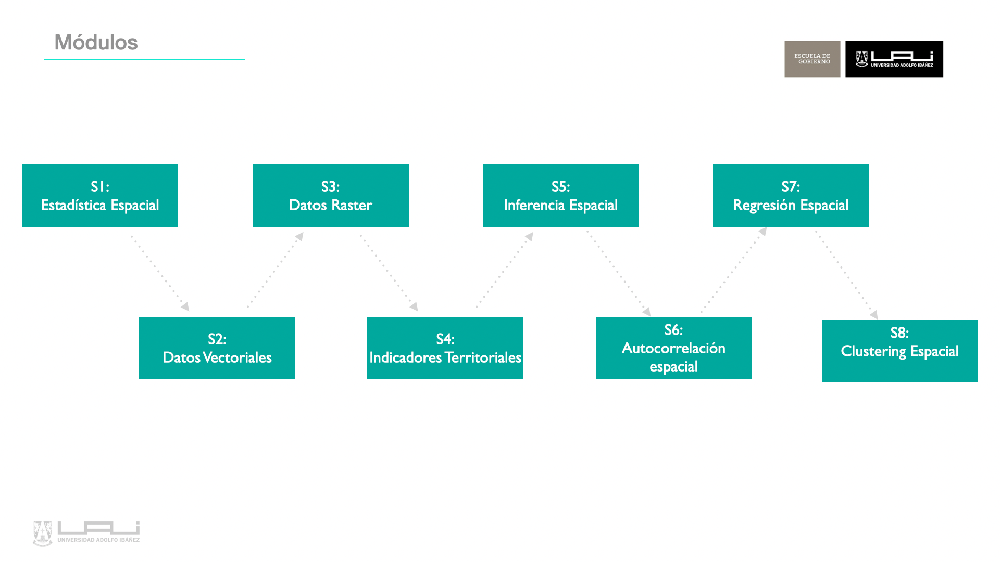

# Antecedentes {.unnumbered}

Este libro corresponde al material de estudio del curso de Geoanálisis del Diplomado en Ciencia de Datos para Políticas Públicas 2024, dictado por Escuela de Gobierno de la Universidad Adolfo Ibáñez.

## Introducción

Este curso está diseñado para proporcionar a los estudiantes una sólida base teórica y competencias técnicas para realizar análisis espacial de variables territoriales en múltiples áreas de aplicación. Se destaca el uso del lenguaje de programación R para implementar metodologías avanzadas y automatizadas, con un enfoque en resolver desafíos complejos en políticas públicas, facilitando la toma de decisiones informadas por evidencia territorial.

## Objetivos

El objetivo general es proporcionar a los estudiantes los fundamentos, técnicas y aspectos básicos para analizar, modelar y representar información espacial, para apoyar la toma de decisiones con evidencia territorial robusta.

Los objetivos específicos son:

- Conocer los conceptos básicos del geoanálisis.
- Manipular datos espaciales en R.
- Conocer técnicas de inferencia, autocorrelación, regresión espacial y Clustering.
- Aplicar las técnicas a problemas de interés público.

## Modulos

1.	Introducción a la Estadística Espacial y a Datos Espaciales
2.	Manejo y Representación de datos vectoriales, construcción de indicadores
3.	Manejo y Representación de datos raster, construcción de indicadores
4.	Inferencia Espacial: Interpolación y mapas de calor
5.	Relaciones de Vecindad y autocorrelación espacial
6.	Modelos de Regresión Espacial

## Docentes

Profesor:
: Denis Berroeta González (<denis.berroeta@uai.cl>)

- Coordinador de Investigación Centro de Inteligencia Territorial UAI
- Magister en Inteligencia Artificial FIC-UAI
- Doctorado y Master of Data Science FIC-UAI (cursando)
- Ingeniero en Prevención en Riesgos 

Ayudante:
: Eduardo Silva Gaete (<eduardo.silva.g@edu.uai.cl>)

- Estudiante de Ingeniería Civil Eléctrica UChile
- Estudiante de Magister en Ciecnia de Datos UCHile
