## Objetivos

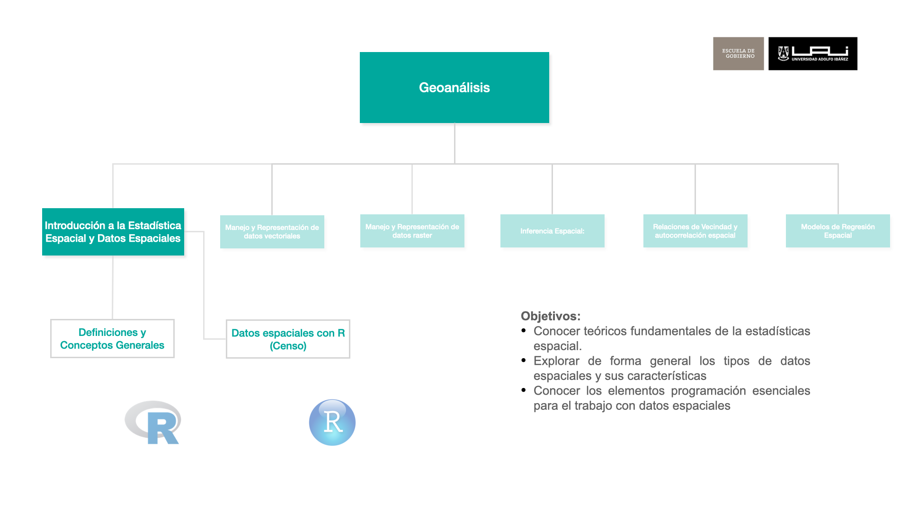

* Conocer teóricos fundamentales de la estadística espacial.

## Origen de la Estadística

Estadística deriva del italiano statista (hombre de Estado) y se desarrolla desde la antigüedad para facilitar la gestión tributaria y estimar la capacidad bélica de un reino. Ej: censos egipcios desde el 3050 a.C.

Durante la expansión de los imperios coloniales (siglos XVI - XIX) se desarrolla la estadística en estrecha relación con la cartografía, principalmente para la administración y dominio de territorios.

## Estadística vs Estadística Espacial

**Estadística:**

* Análisis de la estructura de datos representativos de una población (en áreas arbitrarias)
* Se basa en matemáticas relativamente complejas

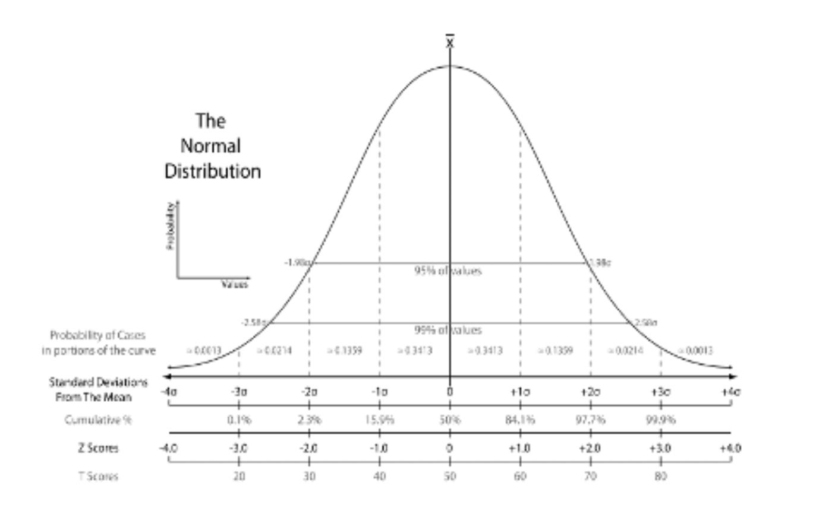
**Geoestadística**

* Análisis de relaciones de dependencia espacial entre datos georreferenciados
* Complejidad de cálculo que hacía inviable su uso masivo 

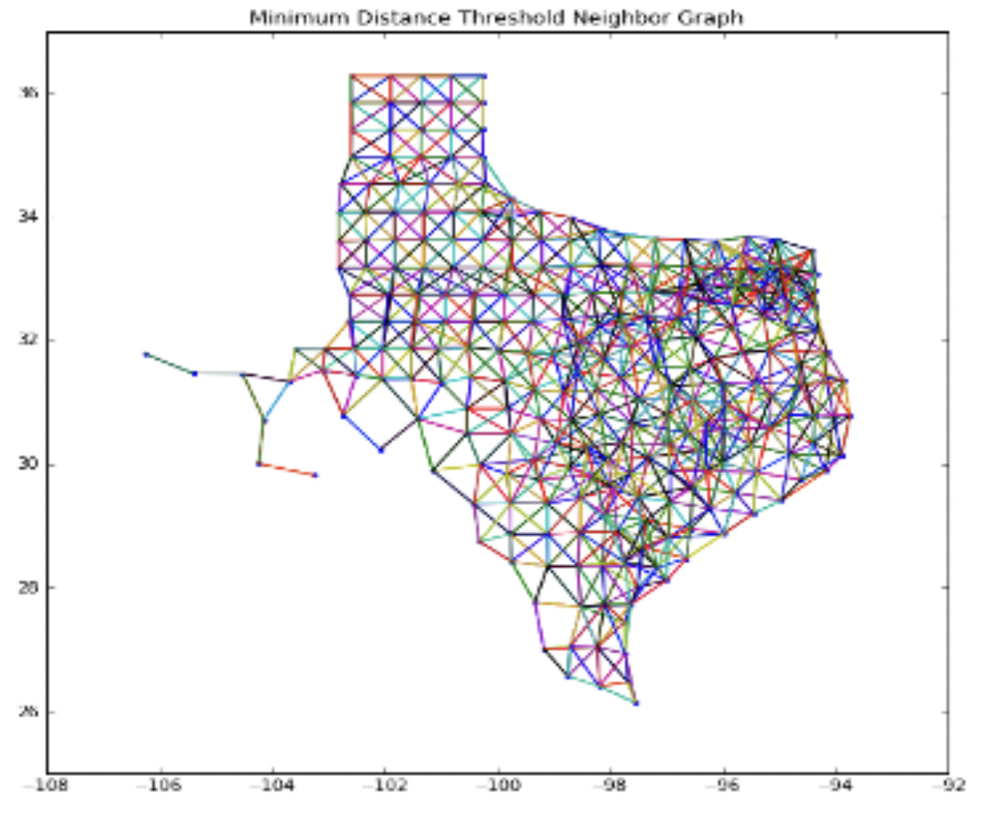

## Condideraciones generales

La inferencia estadística convencional se basa en dos supuestos fundamentales

* Los valores de una variable se distribuyen de forma aleatoria
* Los valores de una variable son independientes unos de otros

Pero ninguno de estos dos supuestos se cumple al utilizar datos espaciales, ya que:

* Los fenómenos más próximos en el espacio están más estrechamente relacionados entre sí (Ley de Tobler, 1970)
*La historia, el espacio y la sociedad se co-producen, por lo que el espacio tiene un rol activo en la reproducción y acumulación de fenómenos sociales (Lefebvre, 1974) 

Para resolver esta limitación existen dos enfoques principales

* La econometría espacial, que trata el efecto espacial como un error y lo elimina para generar estimaciones sin sesgo
* La geoestadística, que identifica y cuantifica el efecto que el espacio genera en la estructura de la información

## Ejemplos de Correlación Espacial

### Autoproducción: Tráfico de Drogas

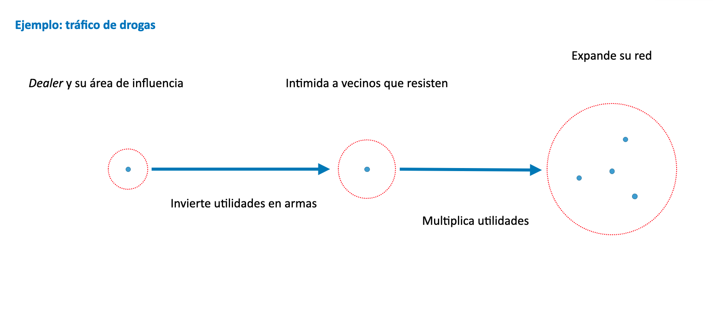

### Co-producción: Mercado inmobiliario local

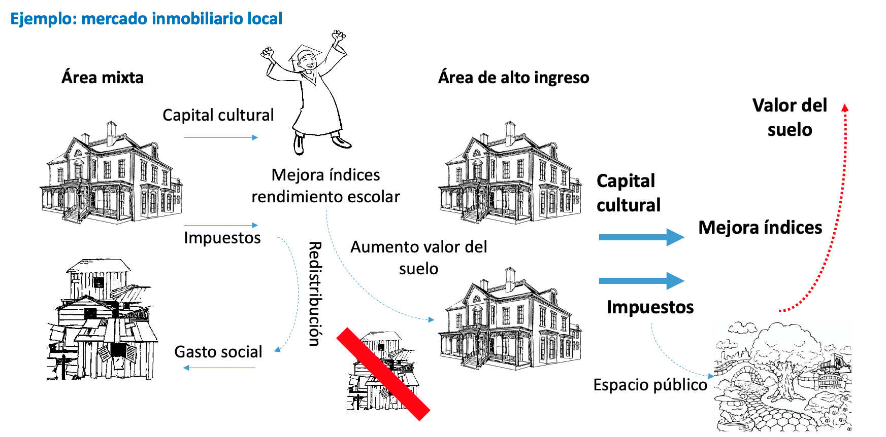

### Segregación y delincuencia

::: {layout-ncol=3}

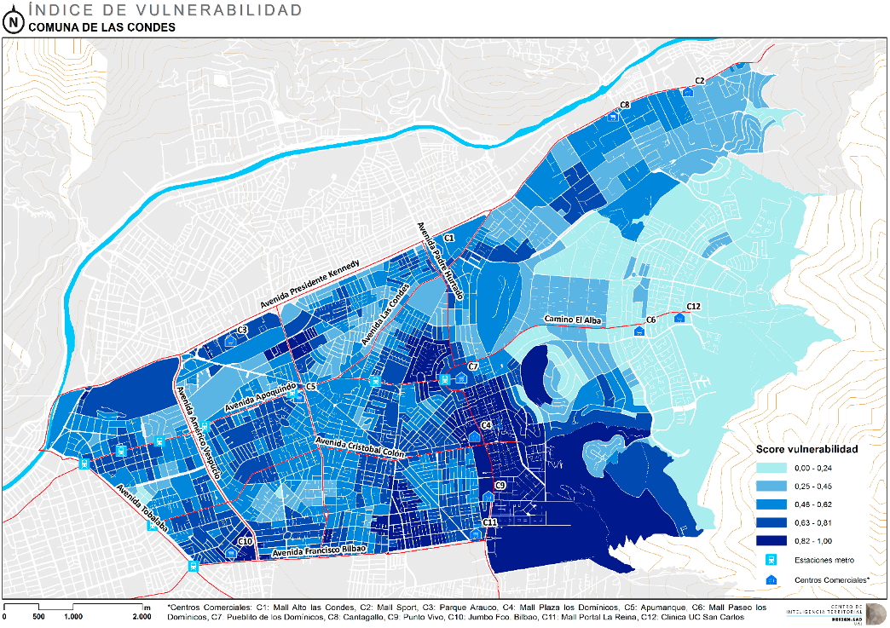

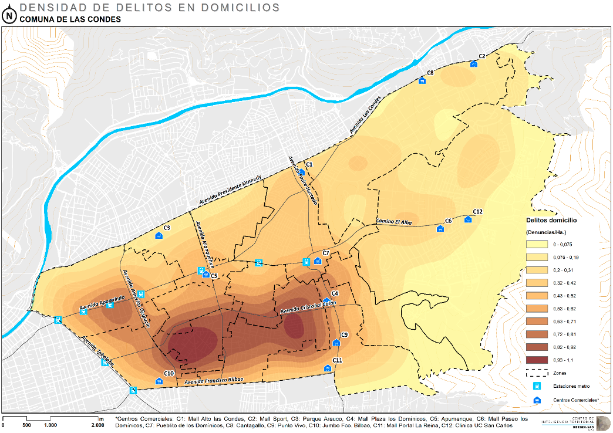

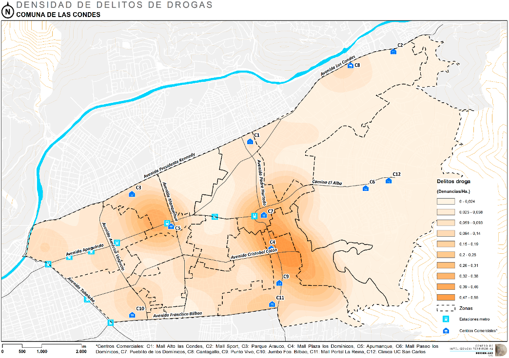

:::

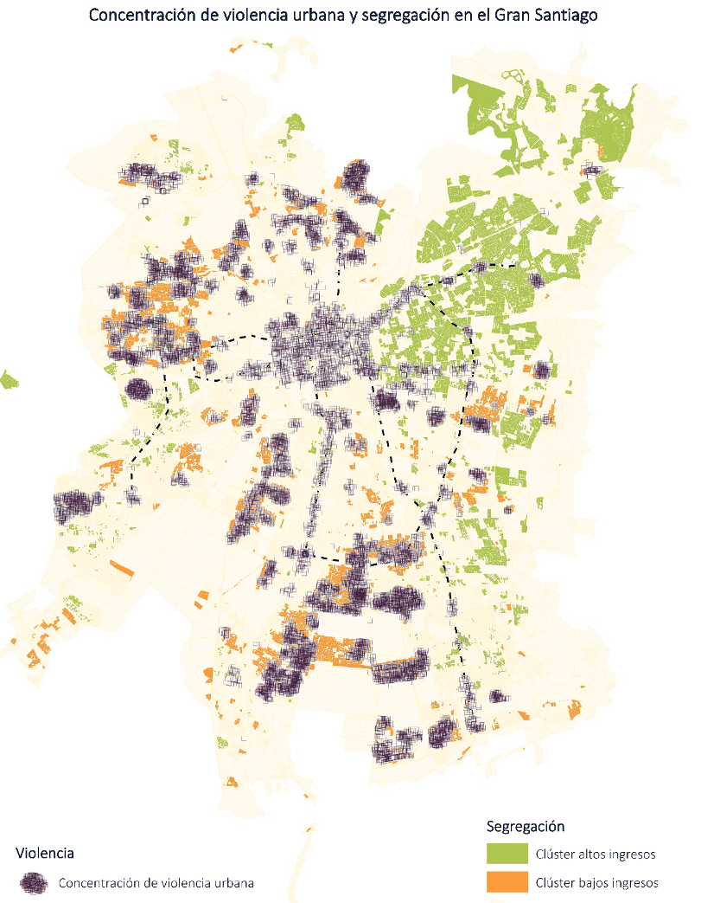{width=70%}

### Valores de Vivienda

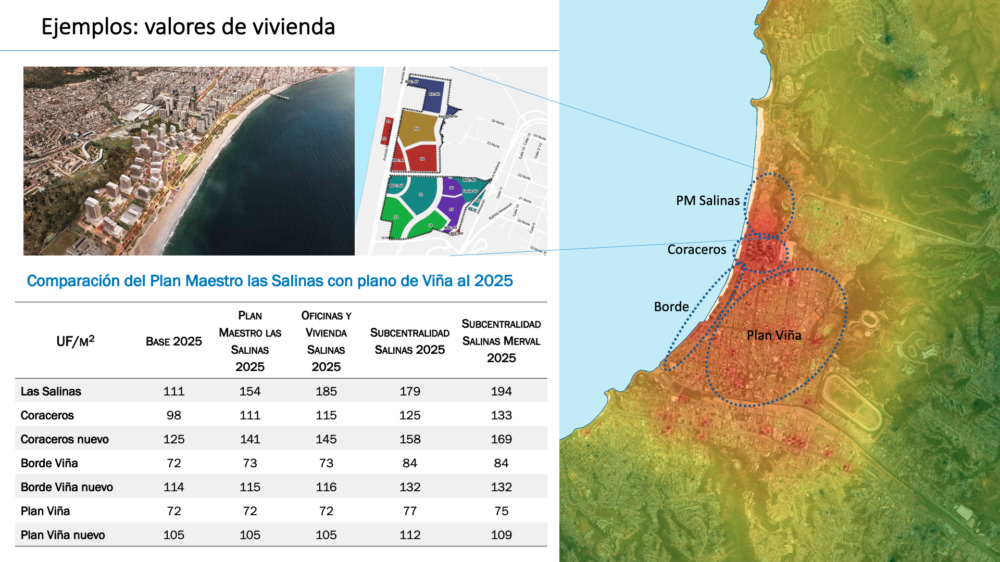

## Inconsistencia estadística de datos espaciales agregados: MAUP

**Modifiable Areal Unit Problem**: inconsistencia de indicadores estadísticos al modificar los perímetros de agregación (Gehlke & Biehl 1934, Openshaw & Taylor 1979)

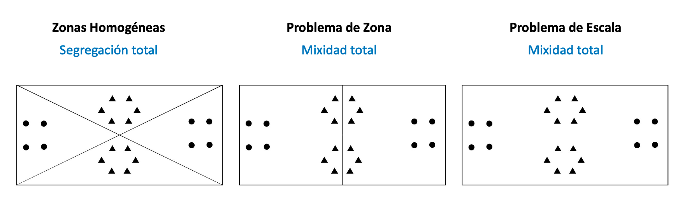

En general, es recomendable trabajar con datos a la menor escala posible, o agregarlos en zonas homogéneas

