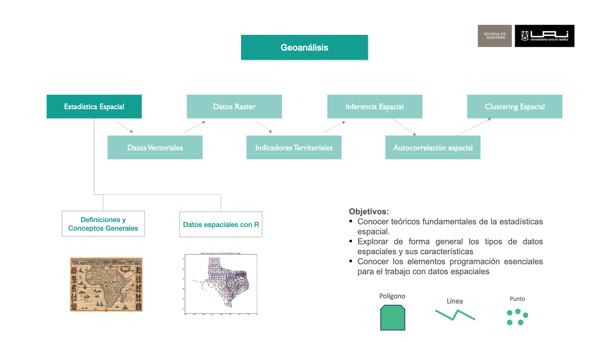

## Objetivos

* Conocer teóricos fundamentales de la estadística espacial.

## Origen de la Estadística

Estadística deriva del italiano statista (hombre de Estado) y se desarrolla desde la antigüedad para facilitar la gestión tributaria y estimar la capacidad bélica de un reino. Ej: censos egipcios desde el 3050 a.C.

Durante la expansión de los imperios coloniales (siglos XVI - XIX) se desarrolla la estadística en estrecha relación con la cartografía, principalmente para la administración y dominio de territorios.

## Definición General

La estadística es una herramienta fundamental en la ciencia de datos que nos permite comprender y analizar datos para obtener información significativa. En términos simples, es como un lenguaje que utilizamos para describir, resumir y tomar decisiones basadas en la información que los datos nos proporcionan. Al aplicar métodos estadísticos, podemos identificar patrones, tendencias y relaciones en los datos, lo que es esencial tanto para la investigación académica como para la toma de decisiones en el mundo real.

## Estadística vs Estadística Espacial

La estadística en general es una disciplina amplia que se aplica a diversos tipos de datos y problemas, utilizando métodos estadísticos convencionales. La estadística espacial, por otro lado, se enfoca en datos con ubicaciones geográficas explícitas y se especializa en el análisis de la dependencia espacial y la modelización de patrones espaciales.

**Estadística:**

* Análisis de la estructura de datos representativos de una población (en áreas arbitrarias)
* Se basa en matemáticas relativamente complejas

**Geoestadística**

* Análisis de relaciones de dependencia espacial entre datos georreferenciados y modelamiento de datos espacilizados.
* Complejidad de cálculo que hacía inviable su uso masivo 

## La Primera Ley de la Geografía y su Relevancia Social

Waldo Tobler (1931–2018) formuló en 1970 su célebre Primera Ley de la Geografía:

{fig-align="center" width="600"}
<!-- > “Todas las cosas están relacionadas entre sí, pero las cosas más próximas en el espacio tienen una relación mayor que las distantes.” -->

Este principio refleja cómo las interacciones humanas y sociales están condicionadas por la proximidad espacial. En política pública esto significa, por ejemplo, que las intervenciones en un barrio tienen efectos directos en los barrios vecinos, y que ignorar la dimensión espacial conduce a políticas sesgadas.

O como lo resume Cervantes en El Quijote:

{fig-align="center" width="600"}
<!-- > “Dime con quién andas y te diré quién eres.” -->

⸻

## El Espacio y el Tiempo: Coproducción Espacio-Temporal del Bienestar

El bienestar social es resultado de una coproducción espacio-temporal: las políticas, las acciones colectivas y las dinámicas naturales configuran el territorio, que a su vez influye en las oportunidades y limitaciones de sus habitantes.

Henri Lefebvre (1901–1991) lo expresó así:

{fig-align="center" width="600"}
<!-- > “La historia, el espacio y la sociedad se co-producen, por lo que el espacio tiene un rol activo en la reproducción y acumulación de fenómenos sociales.” -->

El espacio no es simplemente un escenario pasivo, sino un actor en las dinámicas sociales. Por ejemplo, la segregación urbana o la concentración delictual en ciertas áreas no son casualidad, sino resultado de una autoproducción espacial donde factores históricos, económicos y sociales se retroalimentan.

## Por Qué Medir: La Importancia de las Estadísticas Territoriales

> Lo que no se mide, no se gestiona.

Las estadísticas territoriales permiten entender y actuar sobre el territorio con evidencia. Sin embargo, presentan desafíos particulares. La inferencia estadística clásica asume independencia entre observaciones y aleatoriedad, pero los datos espaciales violan ambos supuestos:

* Las observaciones cercanas tienden a estar correlacionadas (Ley de Tobler).
* El espacio actúa como un soporte material indispensable para las relaciones sociales.

## Ejemplos de Dependencia Espacial

### Autoproducción: Tráfico de Drogas

### Co-producción: Mercado inmobiliario local

### Segregación y delincuencia

::: {layout-ncol=3}

:::

<!-- {width=70%} -->

### Valores de Vivienda

