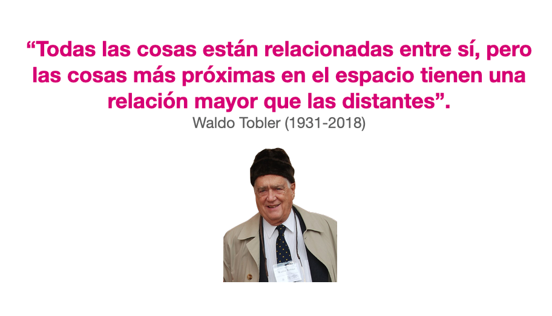
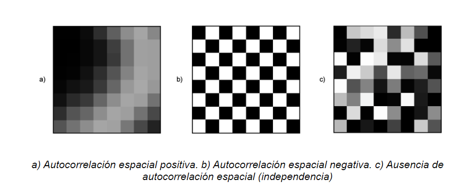
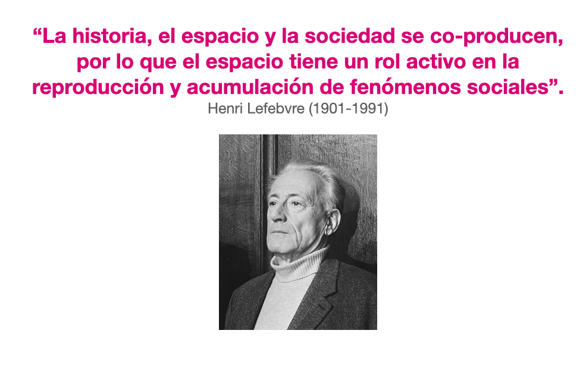
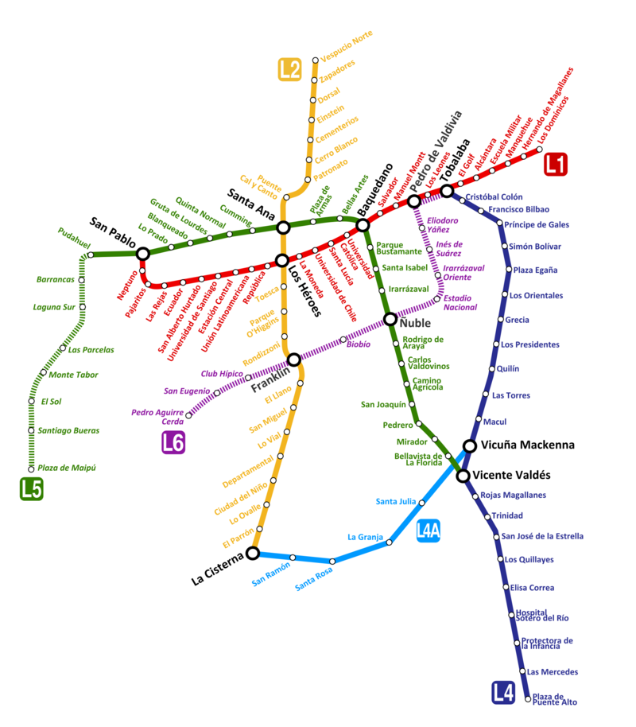
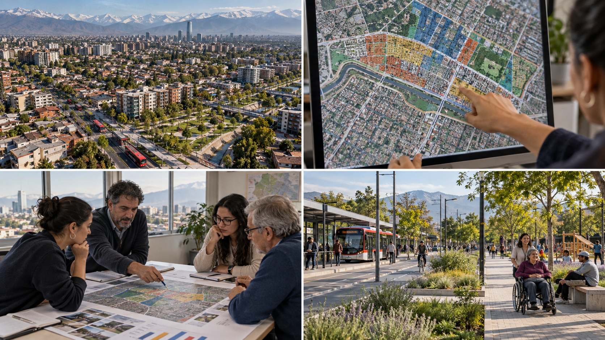

## Una decisión que depende del lugar

Imaginemos dos sectores de una ciudad. En cada uno viven 500 personas mayores. Si solo miramos ese número, ambos parecen necesitar la misma atención. Pero en uno hay calles arboladas y un centro de salud cercano; en el otro escasea la sombra y llegar a una consulta requiere un viaje largo. Si debemos decidir dónde instalar un punto de descanso durante una ola de calor, **saber cuántas personas viven allí no basta: necesitamos saber dónde están y a qué pueden acceder**.

La ubicación permite conectar los datos de población con las condiciones de cada lugar. También ayuda a ver diferencias que un total comunal puede esconder. Esa es la pregunta que guiará este capítulo: **¿qué cambia cuando sabemos dónde ocurre algo?**

## Una breve mirada al origen

La estadística y la cartografía han servido durante siglos para conocer y administrar territorios. Los censos reunían información sobre la población; los mapas mostraban dónde estaban los asentamientos, las rutas y los recursos. Leídos juntos, números y mapas permitían responder preguntas que ninguno resolvía por separado. Hoy usamos esa combinación para estudiar problemas públicos y evaluar dónde conviene actuar.

{#fig-mapa-africa width="70%"}

## De la estadística a la estadística espacial

La estadística nos ayuda a resumir datos, comparar grupos y estudiar relaciones. Por ejemplo, podemos calcular la edad promedio de una comuna o comparar los tiempos de viaje de dos grupos de personas. Algunas preguntas se responden sin conocer la ubicación exacta de cada observación.

{#fig-curva-normal width="65%"}

La estadística espacial agrega esa ubicación al análisis. Pregunta dónde se concentran los valores, qué ocurre en los lugares vecinos y si la distancia o la conexión entre lugares ayuda a entender un fenómeno. Los mismos datos pueden contar una historia distinta cuando los ubicamos en un mapa.

La diferencia no significa que toda la estadística convencional exija observaciones independientes. Algunos métodos usan ese supuesto; otros permiten estudiar relaciones entre observaciones. En el análisis espacial, la cercanía es una de esas posibles relaciones y debemos examinarla según la pregunta y los datos.

{#fig-grafo-vecindad width="65%"}

La curva normal es una imagen conocida de la estadística: muestra cómo se distribuye una variable bajo un modelo particular. En cambio, un grafo de vecindad representa qué lugares consideramos conectados. Son dos referencias visuales distintas para las preguntas que podemos hacer con los datos; ninguna resume por sí sola toda una disciplina.

## ¿Se parecen los lugares vecinos?

En algunos fenómenos, los lugares cercanos presentan valores semejantes. Un parque puede refrescar su entorno y una mejora del transporte puede beneficiar a varios sectores próximos. Waldo Tobler resumió esta intuición en su Primera Ley de la Geografía: las cosas cercanas suelen estar más relacionadas que las distantes [@Tobler_1970].

{#fig-tobler width="75%"}

**Es una hipótesis útil, no una regla universal.** Los vecinos también pueden ser muy diferentes: una avenida puede separar áreas con condiciones distintas, y un servicio puede ser más accesible desde un lugar lejano conectado por Metro que desde uno próximo sin una ruta directa. La relación depende del fenómeno, de la escala de análisis y de cómo definamos qué lugares son vecinos.

Cuando los valores semejantes se agrupan hablamos de *autocorrelación espacial positiva*. Cuando los lugares vecinos tienden a mostrar valores opuestos, hablamos de *autocorrelación espacial negativa*. Si no aparece un patrón de semejanza o contraste entre vecinos, no observamos autocorrelación espacial en los datos y la escala estudiados. Esto último no demuestra, por sí solo, que las observaciones sean independientes. La figura ilustra las tres posibilidades.

{#fig-autocorrelacion-dif width="85%"}

Encontrar un patrón no explica por sí solo su causa. Si varios barrios cercanos tienen tiempos de viaje altos, podríamos investigar la red de transporte, la ubicación de los empleos o las barreras físicas. El mapa nos ayuda a formular mejores preguntas; para responderlas necesitamos más evidencia.

## Las personas también transforman el territorio

La relación va en ambas direcciones. Las condiciones de un lugar influyen en las oportunidades de sus habitantes, y las decisiones de las personas y las instituciones modifican ese lugar. Esta idea suele llamarse *coproducción del espacio* [@Lefebvre_1974].

{#fig-lefebvre width="75%"}

Pensemos en una nueva estación de Metro. Puede acortar los viajes y facilitar el acceso a empleos y servicios. Con el tiempo, más personas y negocios pueden interesarse en el sector; eso puede cambiar la demanda de vivienda, transporte y espacio público. Esas nuevas necesidades influyen, a su vez, en futuras decisiones de inversión. El ejemplo describe un mecanismo posible: para saber si ocurrió en un barrio concreto habría que observar los cambios y considerar otras explicaciones.

El esquema del Metro de Santiago ayuda a visualizar este ejemplo: agregar una estación o una conexión puede cambiar los recorridos de un sector y, con ello, las oportunidades de quienes viven o trabajan allí. A medida que cambia el barrio, también pueden cambiar las decisiones sobre la red de transporte.

{#fig-metro-santiago width="65%"}

Algo parecido sucede cuando una actividad se expande hacia zonas cercanas. Por ejemplo, un aumento de denuncias por tráfico de drogas en sectores vecinos podría indicar una expansión de la actividad, pero también una mayor fiscalización o cambios en la disposición a denunciar. La concentración en un mapa no permite elegir entre esas explicaciones por sí sola.

## Los límites del mapa también importan

Para construir indicadores solemos reunir personas u observaciones en zonas: manzanas, barrios o comunas. Al cambiar los límites o el tamaño de esas zonas, puede cambiar el resultado agregado aunque las personas sigan viviendo en los mismos lugares. Este es el *problema de la unidad espacial modificable* (MAUP).

En la siguiente figura, los puntos y triángulos no se mueven. La primera división separa ambos grupos; la segunda cambia los límites y los mezcla; la tercera reúne todo en una sola zona. El patrón territorial que vemos depende, por tanto, de cómo agrupamos los datos.

{#fig-maup width="95%"}

Por eso conviene elegir unidades territoriales acordes con la pregunta, revisar qué diferencias quedan dentro de cada zona y, cuando sea posible, comprobar si la conclusión se mantiene con otra delimitación.

## De los datos a una decisión pública

Volvamos a los dos sectores del comienzo. Un análisis territorial podría reunir el número de personas mayores, la cobertura de sombra, las rutas peatonales, el tiempo de viaje a centros de salud y la ubicación de los puntos de descanso existentes. Con esa información podemos identificar dónde la necesidad es mayor y explicar por qué priorizamos un lugar. La decisión también requiere verificar la calidad de los datos y escuchar a quienes usan esos espacios.

A lo largo del curso aprenderemos a representar datos vectoriales y ráster, construir indicadores territoriales y explorar relaciones de vecindad, interpolación, autocorrelación y agrupamientos espaciales. Cada técnica responde una parte de la misma pregunta: **cómo usar la ubicación para comprender mejor un problema y orientar una decisión pública**.

{#fig-decision-publica width="95%"}
