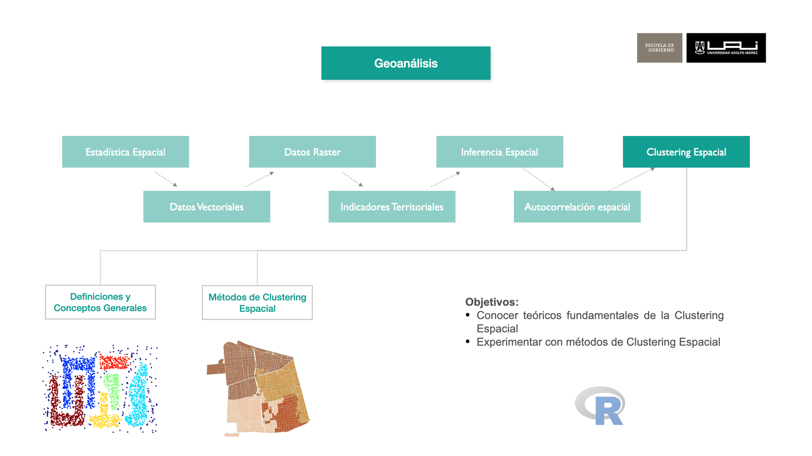
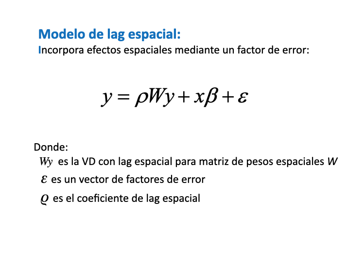
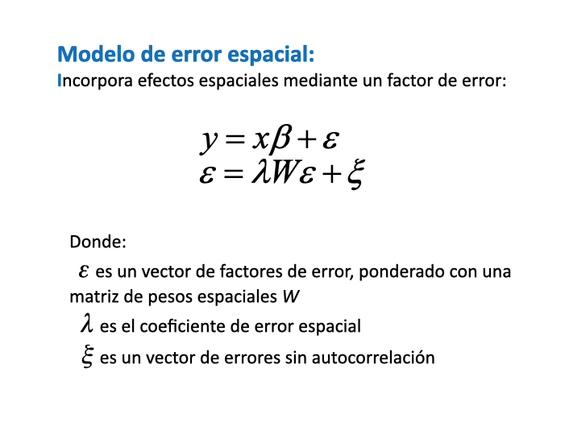
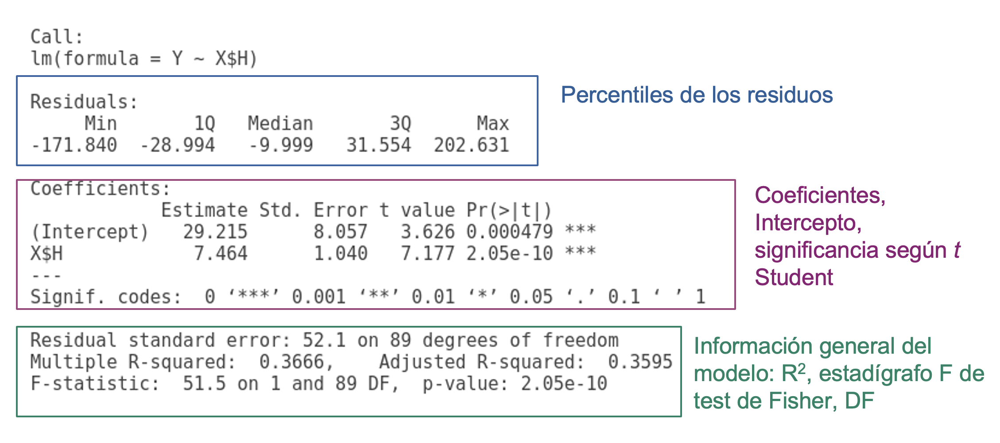
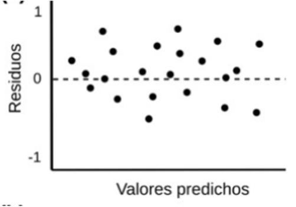

```{r setup, include=FALSE}
knitr::opts_chunk$set(echo = TRUE)
suppressPackageStartupMessages(library(dplyr))
suppressPackageStartupMessages(library(sf))
suppressPackageStartupMessages(library(raster))
suppressPackageStartupMessages(library(ggplot2))
suppressPackageStartupMessages(library(mapview))
suppressPackageStartupMessages(library(spdep))
suppressPackageStartupMessages(library(spatstat))
suppressPackageStartupMessages(library(tidyr))
suppressPackageStartupMessages(library(spatialreg))
```

# Regresión Espacial

## Objetivos



## Introducción

<!-- <span class="highlight">explicar</span>  -->

La regresión espacial es una técnica de análisis de datos que permite estudiar y modelar relaciones entre variables considerando no solo sus valores individuales, sino también cómo se relacionan en el espacio geográfico. A diferencia de los modelos tradicionales de regresión, que asumen que las observaciones son independientes entre sí, la regresión espacial reconoce que los datos pueden estar influenciados por la proximidad o las características de sus vecinos. Esta consideración es fundamental, ya que muchas veces los fenómenos sociales, económicos y ambientales no están distribuidos al azar, sino que muestran patrones de agrupamiento o dispersión en el territorio.

[¿Por qué es importante entender la regresión espacial y cuál es su relevancia para las políticas públicas?]{.highlight} Pensemos en ejemplos concretos: la distribución de la criminalidad en una ciudad, la propagación de enfermedades, o la accesibilidad a servicios básicos como la educación y la salud. Estos fenómenos no solo dependen de las características de una sola zona o comunidad, sino también de lo que ocurre en las áreas circundantes. Ignorar estas interrelaciones espaciales puede llevar a conclusiones erróneas y, por ende, a políticas públicas ineficaces.

En el ámbito de las políticas públicas, la regresión espacial se convierte en una herramienta esencial para la planificación y la toma de decisiones informadas. Por ejemplo, un análisis que considere la influencia espacial puede ayudar a los gobiernos locales a diseñar estrategias más efectivas de prevención del crimen, a ubicar servicios de salud en áreas estratégicas, o a implementar programas de desarrollo económico que beneficien no solo a un sector específico, sino a toda una región.

## Marco Teórico

### Dependencia Espacial y Autocorrelación Espacial

Imagina que estás en una ciudad y observas un barrio donde los precios de las viviendas son muy altos. Es común que los barrios vecinos también tengan precios elevados debido a factores compartidos como el acceso a servicios de calidad, seguridad o prestigio. Este es un ejemplo de dependencia espacial, donde las características de una región están relacionadas con las características de sus vecinas.

La autocorrelación espacial es una medida de esta dependencia. Si observamos que los valores altos o bajos de una variable (por ejemplo, ingresos, tasas de criminalidad o acceso a la salud) tienden a agruparse en el espacio, decimos que hay autocorrelación espacial positiva. Por otro lado, si observamos un patrón en el que las áreas con valores altos están rodeadas de áreas con valores bajos (y viceversa), hablamos de autocorrelación espacial negativa.

### Tipos de Modelos de Regresión Espacial

Cuando analizamos datos espaciales, es posible que un modelo de regresión lineal clásico (OLS) no capture adecuadamente la dependencia espacial, lo que podría llevar a conclusiones incorrectas. Por esta razón, se utilizan modelos de regresión espacial. A continuación, se explican los tipos principales:

### Modelo SAR (Spatial Autoregressive Model): {.unnumbered}

{width="60%"}

Definición: Este modelo incluye un término adicional que representa la influencia de la variable dependiente en las áreas vecinas.

> Ejemplo: Si analizamos la tasa de criminalidad de un barrio, el modelo SAR considerará cómo la tasa de criminalidad en los barrios vecinos afecta la tasa de criminalidad en el barrio analizado.

Analogía: Imagina que estás en una sala donde la temperatura de una sección afecta la temperatura de las secciones adyacentes. El modelo SAR capturaría cómo los cambios de temperatura en un área influyen en las áreas cercanas.

### Modelo SEM (Spatial Error Model): {.unnumbered}

{width="60%"}

Definición: Este modelo captura la autocorrelación que existe en los errores del modelo. Es útil cuando la dependencia espacial no se debe a la variable en sí, sino a factores no observados que afectan a varias áreas cercanas.

> Ejemplo: Supongamos que estamos analizando el nivel educativo en diferentes comunas y existe un factor común, como la infraestructura escolar de la región, que no se incluye explícitamente en el modelo. El SEM ajustaría los errores del modelo para reflejar esta influencia compartida.

Analogía: Es como si varias personas en la fiesta hablaran con diferentes volúmenes, pero todas estuvieran influenciadas por un ruido de fondo compartido, como la música que suena en la sala.

### Matrices de Ponderación Espacial

Una matriz de ponderación espacial es fundamental en el análisis de regresión espacial. Esta matriz define la relación de vecindad entre las áreas geográficas y asigna un peso a cada par de áreas. Referencias en @sec-matrizVec

### Cálculo de Regresión Espacial en R

A continuación se realizarán dos modelos de regresión espacial, el primero con error espacial y la variable a explicar es el nivel socioecómico. En segundo caso la variable a explicar será el indicador de delitos violentos en la comuna de Las Condes, y se aplicará modelo error y lag espacial, además del un modelo que combina ambos llamado `sacsar`.

##  Regresión Espacial a Nivel Educacional


Pasos de Regresion Espacial

0.  Selección de Área de Estudio
1.  Crear Matriz de Vecindad
2.  Analizar la Autorrelación Espacial de $y$
3.  Estimar un modelo de regresión ordinario (OLS)
4.  Seleccionar tipo de Regresión Espacial
5.  Estimar Modelo de Regresión Espacial

### Selección de Área de Estudio

**Cargar Librerías**

```{r eval=FALSE}
library(dplyr)
library(sf)
library(ggplot2)
library(mapview)
library(spdep)
library(spatstat)
library(purrr)
```

**Selección de Área de Estudio**

```{r}
mi_comuna <-  "LAS CONDES"
# ine
mz_comuna <- readRDS("data/censo/manzanas.rds") %>% 
  filter(NOM_COM == mi_comuna) %>% 
  mutate(CODINE017 = as.character(CODINE017)) %>% 
  distinct(COD_INE_ID, .keep_all = T) %>% 
  st_transform(32719)

```

**Agregar variables de estudio**

```{r}
# socioeconomicos
soc <-  st_read("data/socioeconomicos/resultados/R13_ind_socioeconomicos.shp") %>% 
  st_drop_geometry() %>%
  dplyr::select(ID_MANZ, ID_MANZCIT, IEJ, IEM, IPJ, IRH, IVI, ISV) %>% 
  distinct(ID_MANZ, .keep_all = T)


mz_comuna <-  mz_comuna %>% 
  left_join(soc,by = c("CODINE017" = "ID_MANZ"))
# head(mz_comuna)

```

**Agregar Variable de Densidad Poblacional**

Calcula la densidad poblacional por hetárea

```{r}
mz_comuna <- mz_comuna %>% 
  mutate(nived = IEJ) %>% 
  mutate(densidad_hec = round(as.numeric(POBLACION/(st_area(.)/10000))))

```

**Eliminar Valores Nulos**

Primero se crea una variable que se prentende explicar

```{r}
mz_comuna <-  mz_comuna %>% 
  filter(!is.na(nived))
```

```{r}
ggplot() +
  geom_sf(data = mz_comuna, aes(fill = nived), color ="gray80", 
          alpha=1,  size= 0.1)+
  scale_fill_distiller(palette= "RdPu", direction = 1)+
  ggtitle("Nivel Educacional del Jefe de Hogar") +
  theme_bw() +
  theme(plot.title = element_text(size=12))+
  theme(panel.grid.major = element_line(colour = "gray80"), 
        panel.grid.minor = element_line(colour = "gray80"))
```

### Crear Matriz de Vecindad

Definir un criterio de vecidad, para el caso de estudio es la distancia y asignar pesos espciales

**Polígonos a puntos**

```{r}
ptos_comuna <- mz_comuna%>%
  st_geometry() %>%
  st_centroid()

```

**Calcular Vecinos Cercanos (**$k$)

```{r}
# vecinos mas cercanos (neighbours)
k <- 8 # numero de vecinos a buscar
nb_mzs <- knearneigh(ptos_comuna, k = k) %>%  # por punto calcula K vecinos
  knn2nb() # Knn a matriz de vecindad

```

**Visualización de la relaciones por cada Centroide**

```{r}
# matri< de vecindad a lines solo oara visualizaciñon
neighbors_sf <- as(nb2lines(nb_mzs, coords = st_geometry(ptos_comuna)), 'sf')

p_mv <- ggplot() +
  geom_sf(data = mz_comuna, fill = NA, color ="gray60", alpha=1,  size= 0.3)+
  geom_sf(data = neighbors_sf,  color = "red", alpha=0.5,  size= 0.5)+
  geom_sf(data = ptos_comuna,  color ="#525252", alpha=1,  size= 1)+
  ggtitle("Relaciones de Vecindad por cada manzana (k = 8)") +
  theme_bw() +
  theme(plot.title = element_text(size=12))+
  theme(panel.grid.major = element_line(colour = "gray80"), 
        panel.grid.minor = element_line(colour = "gray80"))

p_mv
```

**Asignar Pesos Espaciales por población**

Primero crearemos una función

```{r}
# Definimos la función que calcula los pesos de la población
calcular_pesos_poblacion <- function(mz_comuna, nb, var = "POBLACION") {
  # Utilizamos map para iterar sobre los índices de las filas de mz_comuna
  nb$weights <- purrr::map(1:nrow(mz_comuna), ~ {
    vecinos <- nb$neighbours[[.x]]
    
    # Filtramos la población de los vecinos y calculamos los pesos
    poblacion_vecinos <- mz_comuna %>%
      filter(id %in% vecinos) %>%
      pull(!!var)
    
    poblacion_vecinos / sum(poblacion_vecinos)
  })
  
  return(nb)
}
```

Ahora asignaremos pesos por a los vecinos de acuerdo a su población

```{r}
nb <- nb2listw(nb_mzs)
mz_comuna$id <- 1:nrow(mz_comuna)


# Llamamos a la función para calcular los pesos de población
nb <- calcular_pesos_poblacion(mz_comuna, nb)

nb$weights %>% head(5)

```

### Analizar la Autorrelación Espacial de $y$

A través del test estadítico índice de Moran analizar la autocorrelación espacial de la variable dependiente que se pretende explicar.

```{r}
## Test de Moran
moran.test(mz_comuna$nived,listw=nb)
```

### Transformación de Variables

Las transformaciones de variables son una práctica común en análisis estadísticos, incluida la regresión espacial, para mejorar la relación entre las variables y garantizar que se cumplan los supuestos del modelo. A continuación, se explican los motivos y las implicaciones de realizar transformaciones de variables, junto con ejemplos y analogías que ayudan a comprender mejor la necesidad de hacerlo.

::: panel-tabset
## sin

```{r}

hist(mz_comuna$densidad_hec, breaks=100)
```

## Con

```{r}

hist(log(mz_comuna$densidad_hec), breaks=100)
```
:::

::: {.callout-tip collapse="true"}
## Por Qué Conviene Hacer Transformaciones

-   **Mejora la Linealidad**: En un modelo de regresión lineal, se asume que la relación entre la variable dependiente (por ejemplo, delitos violentos en una comuna, idelv) y las variables independientes es lineal. Sin embargo, en muchos casos, las relaciones entre las variables pueden no ser lineales. Transformar las variables puede ayudar a linealizar la relación, haciendo que los modelos lineales sean más precisos y apropiados.

> Analogía: Imagina que estás tratando de representar la relación entre la temperatura y el crecimiento de una planta. Si usas una línea recta para representarlo, es posible que no captures bien el patrón, ya que el crecimiento puede aumentar rápidamente al principio y luego estabilizarse. Transformar la variable puede ayudar a ajustar mejor la curva y hacer que la representación sea más precisa.

-   **Normaliza la Distribución**: Las transformaciones pueden ayudar a que la distribución de las variables sea más cercana a una distribución normal. Esto es importante porque muchos métodos estadísticos, incluida la regresión, asumen que los errores del modelo siguen una distribución normal.

> Ejemplo: Si la variable idelv tiene una distribución sesgada, aplicar una transformación logarítmica puede ayudar a reducir la asimetría y acercar la distribución a la normalidad, mejorando la validez del modelo.

-   **Reducción de la Heterocedasticidad**: La heterocedasticidad ocurre cuando la variabilidad de los errores del modelo no es constante a lo largo del rango de valores de la variable independiente. Las transformaciones pueden ayudar a homogeneizar la varianza de los errores, haciendo que el modelo sea más robusto.

> Analogía: Imagina que estás midiendo la velocidad del viento a lo largo de diferentes alturas. Si a mayor altura la variabilidad de la velocidad es mucho mayor, una transformación puede ayudar a estabilizar esa variabilidad.
:::

::: {.callout-tip collapse="true"}
## Por Qué No Conviene Hacer Transformaciones

-   **Pérdida de Interpretabilidad**: Transformar las variables puede hacer que los coeficientes del modelo sean más difíciles de interpretar directamente. Por ejemplo, interpretar el coeficiente de una variable transformada con log(y) es diferente a interpretar el coeficiente de la variable original.

> Ejemplo: Si transformas la variable idelv a log(idelv), el coeficiente del modelo indicará cómo cambia el logaritmo de idelv por cada unidad de cambio en la variable independiente, lo cual puede ser menos intuitivo para quienes no tienen un trasfondo en estadísticas avanzadas.

-   **Complejidad Adicional**: La transformación de variables añade un paso adicional al análisis que puede complicar la comparación con otros estudios o la interpretación de los resultados en un contexto de políticas públicas.

> Ejemplo: Si estás trabajando con un equipo multidisciplinario y usas transformaciones logarítmicas, algunos colegas podrían tener dificultades para entender cómo se relacionan los resultados transformados con los datos reales.
:::

::: {.callout-tip collapse="true"}
## Guía para Decidir Cuándo y Cómo Hacer Transformaciones

1.  Evalúa la Relación Original: Grafica la relación entre las variables para ver si es lineal o si muestra un patrón que pueda beneficiarse de una transformación.

2.  Prueba Diferentes Transformaciones: Aplica distintas transformaciones y evalúa si mejoran la linealidad, la normalidad y la homocedasticidad de los datos.

3.  Considera la Interpretabilidad: Decide si la mejora en el ajuste del modelo justifica la pérdida potencial de interpretabilidad.

4.  Usa Transformaciones Comunes Primero: Empieza con transformaciones comunes como log(y) o log(y) contra log(x) antes de probar opciones más complejas.

5.  Documenta y Justifica: Asegúrate de documentar y justificar por qué se ha aplicado una transformación específica para que otros investigadores y profesionales puedan entender y reproducir tu trabajo.
:::

#### Revisión de la distribución de Variables {.unnumbered}

::: panel-tabset
## Plot

```{r echo=FALSE}
colnames <- c("nived","densidad_hec","ISV","IRH", "IEM")

# Ciclo para graficos agrupados
par(mfrow=c(2, 3))

for (v in colnames) {
    hist(mz_comuna %>% st_drop_geometry() %>% pull(!!v), 
         breaks=100, main=v, probability= T, col="gray")
}
```

## Code

```{r eval=FALSE}
colnames <- c("nived","densidad_hec","ISV","IRH", "IEM")

# Ciclo para graficos agrupados
par(mfrow=c(2, 3))

for (v in colnames) {
    hist(mz_comuna %>% st_drop_geometry() %>% pull(!!v), 
         breaks=100, main=v, probability= T, col="gray")
}

# Lo mismo anterior pero usando programación funcional
# colnames %>%
#   purrr::map(\(x) hist(mz_comuna %>% st_drop_geometry() %>% pull(!!x),
#                        breaks = 100, main = x, probability = TRUE,
#                        col = "gray")) %>% 
#   invisible()# Para que no muestre resultados por consola del hist
```
:::

**Transformaciones de Datos en modelos**

Se pueden transformar los datos para obtener mejor linealidad entre sus relaciones entre las variables respuesta y predictivas.

::: panel-tabset
## Plot

```{r echo=FALSE}
mz_comuna <- mz_comuna %>% 
  mutate(
    l_nived = sqrt(nived),
    l_densidad_hec = log(densidad_hec + 1),
    l_ISV =log(ISV + 1e-6),, 
    l_IRH = log(IRH + 1e-6),
    l_IEM = IEM ^(1/3),
  )

colnames <- c("l_nived","l_densidad_hec",
              "l_ISV","l_IRH", "l_IEM")
# Ciclo para graficos agrupados
par(mfrow=c(2, 3))
com <- mz_comuna %>% st_drop_geometry() 
for (v in colnames) {
    hist(com %>% pull(!!v), breaks=100, main=v, probability=TRUE, col="gray")
}

par(mfrow=c(1, 1))
```

## Code

```{r eval=FALSE}
mz_comuna <- mz_comuna %>% 
  mutate(
    l_nived = sqrt(nived),
    l_densidad_hec = log(densidad_hec + 1),
    l_ISV =log(ISV + 1e-6),
    l_IRH = log(IRH + 1e-6),
    l_IEM = IEM ^(1/3),
  )

colnames <- c("l_nived","l_densidad_hec",
              "l_ISV","l_IRH", "l_IEM")
# Ciclo para graficos agrupados
par(mfrow=c(2, 3))
com <- mz_comuna %>% st_drop_geometry() 
for (v in colnames) {
    hist(com %>% pull(!!v), breaks=100, main=v, probability=TRUE, col="gray")
}

par(mfrow=c(1, 1))
```
:::

### Estimar un modelo de regresión ordinario (OLS)

**Modelo OLS**

Modelo estadístico que relaciona funcionalmente dos variables de forma lineal (una recta o, en su versión generalizada, un plano o un hiperplano). El caso más simple contiene una variable respuesta (Y; i.e. lo que se quiere explicar o predecir), y una variable explicativa o predictor (X; i.e., variables que se usan para explicar o predecir Y). A veces estas variables también son llamadas dependiente e independiente.

Que exista una relación funcional significativa entre ambas variables no implica una causalidad, ~~pero la puede sugerir~~.

$$y = b_0 + b_1*x_1 + b_2*x_2 + b_3*x_3 + … + b_n*x_n+\varepsilon$$

```{r}

mod_nived = lm(l_nived ~ l_densidad_hec + l_ISV  + l_IRH + l_IEM,
               data = mz_comuna)
summary(mod_nived)

# plot(mod_nived)

```

::: {.callout-note collapse="true"}
## Interpretación de Resultados de modelos de Regresión lineal



**P - Valor** $p-value$

$p-value$ Probabilidad de que el la H0 sea verdad. P-valores significativos, ej., bajo alpha = 0.05, lleva a interpretar la probabilidad de que el modelo de regresión no explique una porción significativa de la varianza de Y es baja.

-   $H_0$: El modelo NO explica la varianza de los datos Y
-   $H_1$: El modelo SI explica la varianza de los datos Y

**Coeficiente de determinación (**$R^2$)

El coeficiente de determinación (o el cuadrado de la correlación de Pearson) es una de las métricas más utilizadas. Si bien esta es muy útil, pueden haber ocasiones donde valores altos de R² se obtienen cuando la dispersión o error de las predicciones es alta. Los valores van entre 0 y 1. Es una medida de ajuste relativa (porcentual), por lo que puede ser usada para comparar modelos entre sí.

**Distribución F de Fisher**

Comparar si hay diferencias significativas entre dos varianzas. En caso de las regresiones proporciona esencialmente una medida de la cantidad de variación que explica el modelo frente a la cantidad de variación no explicada (por grados de libertad restantes).

Valores de $F$ altos significa que su modelo explica mucho más de la variación por parámetro que el error por grado de libertad restante.

**Residuos**

Los residuos son la diferencia entre los valores observados y los predichos (obs - pred). Los residuos se utilizan mucho en post-hoc tests (o tests para analizar los resultados de los modelos). Los residuos, por un lado, dan estimaciones de posibles sesgos del modelo.

Es muy importante que los residuos se distribuyan de manera aleatoria en el modelo.

{width="300"}
:::

#### Resultados Estadisticas Generales del Modelo {.unnumbered}

**Significancia global del modelo:**

El F-statistic (`62.21`) tiene un p-value extremadamente bajo (`< 2.2e-16`), lo que indica que el modelo en su conjunto es estadísticamente significativo. Sin embargo, el R² ajustado es de `0.142`, lo que significa que el modelo solo explica el `14.2%` de la variabilidad en el nivel educacional, lo cual es relativamente bajo.

**Análisis de coeficientes individuales:**

Todos los predictores son estadísticamente significativos (`p < 0.001`):

-   Densidad por hectárea (l_densidad_hec): Coeficiente: `-0.030132` Relación negativa: a mayor densidad poblacional, menor nivel educacional Por cada 1% de aumento en la densidad, el nivel educacional disminuye en aproximadamente `0.03%`

-   ISV: Coeficiente: `7.836936` El efecto más fuerte del modelo Relación positiva muy marcada con el nivel educacional

-   IRH: Coeficiente: `0.281087` Relación positiva moderada con el nivel educacional

-   IEM: Coeficiente: `4.130982` Segunda variable con mayor impacto Relación positiva fuerte con el nivel educacional

**Análisis de residuos:**

Rango de residuos: `-1.32156` a `0.63572` La mediana (`0.05718`) está cerca de cero. Hay cierta asimetría en los residuos, ya que el valor mínimo (`-1.32`) es más extremo que el máximo (`0.64`) Los cuartiles sugieren una distribución no perfectamente simétrica

### Autocorrelación de los residuos

La aplicación del I de Moran a los residuos es fundamental en el contexto de análisis espacial por varias razones clave:

Detección de Autocorrelación Espacial:

:   El I de Moran nos permite identificar si existe dependencia espacial en los residuos Si los residuos están espacialmente autocorrelacionados, significa que nuestro modelo OLS está violando el supuesto de independencia de las observaciones Un I de Moran significativo en los residuos indica que hay patrones espaciales que no han sido capturados por el modelo tradicional

Justificación para Modelos Espaciales:

:   Si encontramos autocorrelación espacial significativa en los residuos, esto justifica el uso de Modelo de Error Espacial (SEM): si la autocorrelación está en el término de error Modelo de Rezago Espacial (SLM/LAG): si la autocorrelación está en la variable dependiente

Diagnóstico para la Selección del Modelo:

:   El tipo y la magnitud de la autocorrelación espacial en los residuos nos ayuda a decidir qué modelo espacial es más apropiado: Si la autocorrelación es fuerte en los residuos → SEM podría ser más apropiado Si la variable dependiente muestra fuerte dependencia espacial → SLM podría ser mejor opción

Eficiencia de los Estimadores:

:   La presencia de autocorrelación espacial en los residuos indica que los estimadores OLS: No son eficientes (no tienen varianza mínima) Pueden llevar a inferencias estadísticas incorrectas Los errores estándar podrían estar subestimados

Guía para la Especificación de la Matriz W:

:   El análisis de autocorrelación espacial en los residuos también puede ayudar a evaluar diferentes especificaciones de la matriz de pesos espaciales (W) Nos permite validar si nuestra definición de "vecindad" es apropiada

```{r}
residuals_mod_nived <- residuals(mod_nived)
moran.test(residuals_mod_nived, listw = nb,  randomisation = TRUE)
```

**Estadístico I de Moran:**

:   El valor `I = 0.6680655640` es positivo y relativamente alto (el I de Moran varía entre -1 y 1). Este valor indica una fuerte autocorrelación espacial positiva en los residuos. Significa que residuos similares tienden a agruparse espacialmente (clusters)

**Significancia Estadística:**

-   El z-score (desviación estándar) es extremadamente alto: `45.8`
-   El p-valor es muy pequeño (`< 2.2e-16`)

Esto indica que la autocorrelación espacial es altamente significativa por ende podemos rechazar contundentemente la hipótesis nula de aleatoriedad espacial

**Implicaciones para el Modelo:**

La fuerte autocorrelación espacial positiva en los residuos indica que:

-   El modelo OLS actual está mal especificado espacialmente
-   Está violando el supuesto de independencia de las observaciones
-   Hay patrones espaciales importantes que no están siendo capturados
-   Los estimadores OLS no son eficientes y podrían ser sesgados

```{r eval=FALSE, echo=FALSE}
# moran_res <- moran.mc(residuals_mod_nived, nb, nsim=599)
# plot(moran_res)
```

### Seleccionar tipo de Regresión Espacial

```{r eval=FALSE, echo=FALSE}
## Test Moran residuos
# lm.morantest(mod_nived,nb,alternative="two.sided")
```

Para determinar si es necesario utilizar un modelo espacial (de error o de lag) en lugar del modelo OLS, se tiene que utilizar el test de Lagrange Multiplier (LM) se utiliza para diagnosticar la presencia de dependencia espacial en un modelo de regresión lineal tradicional. El cual realiza los siguientes tipos de análisis:

Tipos de tests:

-   `LMerr`: Test para detectar dependencia espacial en el término de error.
-   `LMlag`: Test para detectar dependencia espacial en la variable dependiente (rezago espacial).
-   `RLMerr` y `RLMlag`: Versiones "robustas" de los tests anteriores, que son más confiables cuando se viola algún supuesto.
-   `SARMA`: Test conjunto para detectar dependencia espacial tanto en el error como en la variable dependiente.

```{r}
## Tipo de dependencia
lm.LMtests(mod_nived,nb,test="all")
```

**Interpretación de Resultados:**

-   Todos los tests muestran p-valores extremadamente bajos (`< 2.2e-16`).
-   Esto indica que tanto el test LMerr como el LMlag son altamente significativos.
-   Los resultados robustos (RLMerr y RLMlag) también son significativos.
-   El test SARMA también es significativo, lo que sugiere que hay una dependencia espacial general.

**Conclusiones e implicaciones:**

-   Los resultados del test de Lagrange Multiplier proporcionan evidencia sólida de que existe dependencia espacial significativa en tu modelo.
-   Esto confirma que el modelo OLS original está mal especificado y que debes proceder con la estimación de modelos espaciales.
-   Tanto el modelo de error espacial (SEM) como el modelo de rezago espacial (SLM) parecen ser apropiados para abordar esta dependencia espacial.

### Modelo de error Espacial

A pesar de que nuestro modelo goza de las características ideales asociadas a un modelo de regresión líneal estándar, hemos comprobado que los residuos de la regresión presentan autocorrelación espacial. Por tanto, para reconocer la existencia de esta estructura espacial en los errores, usamos el Modelo del Error Espacial. Este modelo se define como:

$$y=\beta_0+X\beta+\varepsilon$$

$$\varepsilon= \lambda W \varepsilon+ \xi$$

Donde $X$ son las variables predictoras, mientras que $W$ es la matriz de peso espacial. El parámetro $\lambda$ es el indicador que mide la fuerza espacial de los residuos y los residuos de los vecinos.

En R, estimamos el modelo vía Maximum Likelihood (máxima verosimilitud) de la siguiente forma:

$$
l\_nived = \beta_0 + \beta_1 \times l\_densidad\_hec + \beta_2 \times l\_ISV + \beta_3 \times l\_IRH + \beta_4 \times l\_IEM + u
$$

donde $u$ es el término de error que sigue un proceso de autocorrelación espacial con el parámetro $\lambda$.

::: {.callout-note collapse="true"}
## Maximum Likelihood

Es un método estadístico para encontrar los valores de los parámetros que mejor explican los datos observados. En términos simples, busca los valores que hacen que nuestros datos sean "más probables" o "más verosímiles". Es como buscar el mejor ajuste posible entre nuestro modelo y los datos reales.

Funciona así:

-   Prueba diferentes valores para los parámetros del modelo
-   Calcula qué tan probable es obtener los datos observados con cada conjunto de valores
-   Selecciona los valores que maximizan esta probabilidad
:::

```{r eval=FALSE}
## SDEM Spatial Durbin Error Model
fit.err = spatialreg::errorsarlm(
  l_nived ~ l_densidad_hec + l_ISV  + l_IRH + l_IEM,
  data = mz_comuna,
  listw = spdep::nb2listw(nb_mzs),
  etype = "error",
  method = "eigen"
)
```

```{r}
# saveRDS(fit.err, "data/models/fit.err_nived.rds")
fit.err <- readRDS("data/models/fit.err_nived.rds")
```

```{r}
summary(fit.err, Nagelkerke=T)
```

**Interpretación de Resultados**

**1. Coeficientes del Modelo**

```{r echo=FALSE}
dt_r <- data.table::data.table(
     check.names = FALSE,
        Variable = c("(Intercepto)","l_densidad_hec",
                     "l_ISV","l_IRH","l_IEM"),
      Estimación = c(3.378, 0.0145, 1.211, 0.146, 0.536),
  Error.Estándar = c(0.309, 0.0054, 0.464, 0.0416, 0.308),
         Valor.z = c(10.92, 2.68, 2.61, 3.51, 1.74),
       `p-value` = c("< 0.0001", "0.0074", "0.0091", "0.0004", "0.0822"),
  Interpretación = c("El nivel educativo transformado (l_nived) tiene un valor base de 3.378 cuando todas las otras variables son 0.",
                     "Un aumento de una unidad en l_densidad_hec se asocia con un incremento significativo de 0.0145 en l_nived.",
                     "Un aumento en l_ISV se asocia con un incremento significativo de 1.211 en l_nived.",
                     "Un aumento de una unidad en l_IRH se asocia con un incremento de 0.146 en l_nived, con un alto nivel de significancia.",
                     "La variable l_IEM tiene un coeficiente positivo, pero es marginalmente significativa (p < 0.1).")
)


require(knitr)
require(kableExtra)
kable_styling(
              kable(dt_r, digits = 3, row.names = FALSE, align = "c",
              caption = NULL, format = "html"),
        bootstrap_options = c("striped", "hover", "condensed"),
        position = "center", full_width = FALSE) 


```

**2. Parámetro** $\lambda$

$\lambda$ (Lambda): `0.88656`

:   Interpretación: El parámetro \lambda mide la autocorrelación espacial en los errores del modelo. Un valor cercano a 1 indica una fuerte correlación espacial entre los errores. El hecho de que \lambda sea 0.88656 y altamente significativo (p \< 0.0001) confirma que la dependencia espacial es importante y que el modelo espacial es más adecuado que un modelo de regresión lineal clásico.

**3. Pruebas de Significancia y Estadísticas del Modelo**

`LR Test Value: 1809.1, p-value < 0.0001`

:   Interpretación: Esta prueba de razón de verosimilitud muestra que el modelo espacial es significativamente mejor que un modelo de regresión lineal clásico sin corrección por autocorrelación.

`Wald Statistic: 4679.3, p-value < 0.0001`

:   Interpretación: Indica la significancia global del modelo y confirma que el parámetro \lambda es altamente significativo.

`Log Likelihood: 805.3594`

:   Interpretación: Un valor de log-verosimilitud más alto indica un mejor ajuste del modelo.

`Nagelkerke pseudo-R-squared: 0.74775`

:   Interpretación: Este pseudo-R² sugiere que el modelo explica aproximadamente el 74.78% de la variabilidad en l_nived, lo cual es un buen ajuste.

`AIC: -1596.7` (comparado con 210.37 del modelo OLS)

:   Interpretación: Un AIC más bajo indica que el modelo de errores espaciales es preferible al modelo OLS.

**4. Residuos del Modelo**

-   Resumen de los residuos: Los residuos tienen un rango de -1.073 a 0.825, con un cuartil superior e inferior relativamente cercano a 0, lo que sugiere que los errores están centrados en torno a la media y que el modelo ajusta bien los datos. Los residuos tienen un rango de -1.073 a 0.825, con un cuartil superior e inferior relativamente cercano a 0, lo que sugiere que los errores están centrados en torno a la media y que el modelo ajusta bien los datos.

**Conclusiones**

Variables Significativas: `l_densidad_hec`, `l_ISV`, y `l_IRH` son significativamente positivas, lo que sugiere que estas variables están positivamente asociadas con el nivel educativo transformado (l_nived).

Dependencia Espacial: La inclusión de un término de error espacial ($\lambda$) es esencial, dado su alto valor y significancia, lo que indica que existe una dependencia espacial significativa en los errores del modelo.

Modelo Robusto: Las estadísticas de ajuste (pseudo-R² y AIC) indican que este modelo es una mejora significativa sobre un modelo OLS simple, capturando adecuadamente la autocorrelación espacial en los errores.

Estos resultados confirman que un modelo de errores espaciales es apropiado y ofrece un ajuste superior al modelo lineal clásico al incorporar la dependencia espacial en los errores.

#### Análisis de Residuos {.unnumbered}

```{r}
## Test Moran residuos
res.err=fit.err$residuals
moran.test(res.err,nb)
```

Prueba de Moran I: Esta prueba evalúa la autocorrelación espacial en los residuos de un modelo de regresión. Si la autocorrelación espacial persiste en los residuos, significa que el **modelo no ha capturado completamente la dependencia espacial en los datos**.

**Resultados Detallados**

`Moran I statistic: -0.0255`

:   Interpretación: El valor de Moran I es cercano a 0, lo que indica que no hay autocorrelación espacial significativa en los residuos del modelo. Un valor de Moran I negativo y cercano a 0 sugiere una ligera tendencia a una distribución aleatoria de los residuos.

`p-value: 0.9557`

:   Interpretación: Un p-value alto (mayor que 0.05) indica que no hay evidencia suficiente para rechazar la hipótesis nula de que no existe autocorrelación espacial en los residuos. En este caso, el p-value de 0.9557 confirma que los residuos se distribuyen de forma aleatoria, y no hay autocorrelación espacial remanente.

`Expectation: -0.0007`

:   Interpretación: Este es el valor esperado de Moran I bajo la hipótesis nula. Es cercano a 0, lo que refuerza la idea de que no debería haber autocorrelación espacial si los residuos siguen una distribución aleatoria.

`Variance: 0.0002`

:   Interpretación: La varianza del estadístico de Moran I se usa para calcular el valor z y evaluar la significancia de la prueba.

**Conclusión**

-   No hay autocorrelación espacial en los residuos: El valor de Moran I (`-0.0255`) y el p-value (`0.9557`) indican que los residuos del modelo de errores espaciales no presentan autocorrelación espacial significativa. Esto significa que el modelo ha capturado adecuadamente la dependencia espacial presente en los datos.

-   Modelo bien especificado: La ausencia de autocorrelación espacial en los residuos sugiere que el modelo de errores espaciales fue una buena elección y ha capturado eficazmente la estructura espacial de los datos. No es necesario realizar ajustes adicionales para controlar la autocorrelación en los residuos.

En resumen, los resultados de la prueba de Moran I confirman que el modelo de errores espaciales ha manejado de manera adecuada la autocorrelación espacial, ya que los residuos del modelo no muestran patrones espaciales significativos. Esto respalda la validez del modelo para inferencias y análisis posteriores.

## Regresión Espacial a Delitos Violentos

### Consolidación de Datos

INE

```{r}
mi_comuna <-  "LAS CONDES"
# ine
mz_comuna <- readRDS("data/censo/manzanas.rds") %>% 
  filter(NOM_COM == mi_comuna) %>% 
  st_transform(32719)
```

socioeconomicos

```{r}
soc <-  st_read("data/socioeconomicos/resultados/R13_ind_socioeconomicos.shp") %>% 
  st_drop_geometry() %>%
  dplyr::select(ID_MANZ, ID_MANZCIT, IEJ, IEM, IPJ, IRH, IVI, ISV)
```

Sii

```{r}
sii <-  st_read("data/sii/urbes.shp") %>% 
  filter(n_com == mi_comuna) %>% 
  st_set_crs(4326) %>% 
  st_transform(32719)
sii_com <- st_intersection(sii, mz_comuna %>% 
                             dplyr::select(CODINE017)) %>% 
  dplyr::select(CODINE017,oficinas: atractor) %>% 
  mutate(CODINE017 = as.character(CODINE017)) %>% 
  st_drop_geometry()


# mapview(sii, zcol ="atractor", cex=2)
```

delitos

```{r}

idel_violentos_LC <- readRDS("data/delitos/idel_violentos_LC.rds") %>% 
  dplyr::select(CODINE017, idelv) %>% 
  mutate(CODINE017 = as.character(CODINE017)) %>% 
  st_drop_geometry()
```

Consolidación

```{r}
mz_estudio <-  mz_comuna %>% 
  mutate(CODINE017 = as.character(CODINE017)) %>% 
  left_join(soc,by = c("CODINE017" = "ID_MANZ")) %>% 
  left_join(sii_com,by = "CODINE017") %>% 
  left_join(idel_violentos_LC,by = "CODINE017") %>% drop_na() %>%
  distinct(CODINE017, .keep_all = T)
  
```

Selección de variables

```{r}

mz_estudio <- mz_estudio%>% 
  dplyr::select(CODINE017, POBLACION, IEJ,IEM,IPJ, IRH, IVI, ISV,
                vivienda, atractor,idelv) %>% 
  mutate(densidad_hec = round(as.numeric(POBLACION/(st_area(.)/10000))))

```

### Matriz de Vecidad {.unnumbered}

```{r}
ptos_comuna <- mz_estudio%>%
  st_geometry() %>%
  st_centroid()

```

**Calcular Vecinos Cercanos** ($k$)

```{r}
# vecinos mas cercanos (neighbours)
k <- 8 # numero de vecinos a buscar
nb_mzs <- knearneigh(ptos_comuna, k = k) %>%  # por punto calcula K vecinos
  knn2nb() # Knn a matriz de vecindad

```

```{r}
nb <- nb2listw(nb_mzs)
mz_estudio$id <- 1:nrow(mz_estudio)


# Llamamos a la función para calcular los pesos de población
nb <- calcular_pesos_poblacion(mz_estudio, nb)
```

### Transformaciones {.unnumbered}

```{r}
colnames <- c("idelv", "IEJ","IEM","IPJ", "IRH", "IVI", "ISV",
                "vivienda", "atractor","densidad_hec")

# Ciclo para graficos agrupados
par(mfrow=c(4,3))
for (v in colnames) {
    hist(mz_estudio %>% st_drop_geometry() %>% pull(!!v), breaks=100, main=v, probability=TRUE, col="gray")
}


```

```{r}

mz_estudio <- mz_estudio %>% 
  mutate(
    rc_idelv = idelv^(1/3),
    c_IEJ = IEJ **3,
    c_IEM = IEM **3,
    c_IPJ = IPJ **3,
    c_IRH = IRH **3,
    l_vivienda= log(ifelse(vivienda==0, 0.001, vivienda)),
    l_atractor= log(ifelse(atractor==0, 0.001, atractor)),
    densidad_hec= log(ifelse(densidad_hec==0, 0.001, densidad_hec))
  )
```

```{r}
colnames <- c("rc_idelv","c_IEJ","c_IEM","c_IPJ","c_IRH", 
              "l_vivienda", "l_atractor", "densidad_hec")


# Ciclo para graficos agrupados
par(mfrow=c(4, 3))
for (v in colnames) {
    hist(mz_estudio %>% st_drop_geometry() %>% pull(!!v), breaks=100, main=v, probability=TRUE, col="gray")
}

par(mfrow=c(1, 1))
```

### Modelo OLS

```{r}
mod_idelv = lm(rc_idelv ~ c_IEJ + c_IEM + c_IPJ + c_IRH+
               IVI+ ISV+l_vivienda+l_atractor+densidad_hec, 
               data = mz_estudio)
summary(mod_idelv)
```

**Resultados de los Coeficientes**

```{r echo=FALSE}
ols_idelv  <- data.table::data.table(
     check.names = FALSE,
        Variable = c("(Intercepto)","c_IEJ","c_IEM",
                     "c_IPJ","c_IRH","IVI","ISV","l_vivienda","l_atractor",
                     "densidad_hec"),
      Estimación = c(19.3345,-0.0004375,-0.4696,
                     -0.2431,0.5925,0.5544,-15.4154,-0.0043,0.0311,0.5862),
  Error.Estándar = c(2.6033,0.0000192,0.2222,0.1209,
                     0.1275,1.5449,2.3005,0.0049,0.0027,0.0504),
         Valor.t = c(7.427,-22.768,-2.113,-2.011,
                     4.647,0.359,-6.701,-0.879,11.58,11.63),
       `p-valor` = c("0.000000000000193",
                     "< 0.0000000000000002","0.0348","0.0446","0.0000037","0.7198",
                     "0.000000000030026","0.3796","< 0.0000000000000002",
                     "< 0.0000000000000002"),
  Interpretación = c("Significativo, representa el valor base de rc_idelv cuando todas las variables independientes son cero.",
                     "Muy significativo, un aumento en c_IEJ se asocia con una ligera disminución en rc_idelv.",
                     "Significativo, un aumento en c_IEM se asocia con una disminución en rc_idelv.",
                     "Significativo, un aumento en c_IPJ se asocia con una disminución en rc_idelv.",
                     "Muy significativo, un aumento en c_IRH se asocia con un aumento en rc_idelv.",
                     "No significativa, no tiene un impacto claro en rc_idelv.",
                     "Muy significativo, un aumento en ISV se asocia con una fuerte disminución en rc_idelv.",
                     "No significativa, no tiene un impacto claro en rc_idelv.",
                     "Muy significativo, un aumento en l_atractor se asocia con un aumento en rc_idelv.",
                     "Muy significativo, un aumento en densidad_hec se asocia con un aumento en rc_idelv.")
)


require(knitr)
require(kableExtra)
kable_styling(
              kable(ols_idelv, digits = 3, row.names = FALSE, align = "c",
              caption = NULL, format = "html"),
        bootstrap_options = c("striped", "hover", "condensed"),
        position = "center", full_width = FALSE) 

```

**Interpretación de resaultados**

Variables significativamente predictoras (p \< 0.05):

:   `c_IEJ`, `c_IEM`, `c_IPJ`, `c_IRH`, `ISV`, `l_atractor`, y densidad_hec son significativas y contribuyen de manera importante al modelo.

Variables no significativas (p \> 0.05):

:   `IVI` y `l_vivienda` no son significativas, lo que sugiere que no tienen un impacto claro en la variable dependiente rc_idelv.

Interpretación de Coeficientes:

:   Los coeficientes significativos indican el cambio en rc_idelv asociado con un cambio de una unidad en la variable predictora, manteniendo constantes las demás variables.

Signos de los coeficientes:

:   Coeficientes positivos (e.g., `c_IRH`, `l_atractor`, `densidad_hec`) indican que a medida que estas variables aumentan, también lo hace `rc_idelv.` Coeficientes negativos (e.g., `c_IEJ`, `c_IEM`, `c_IPJ`, `ISV`) sugieren que un aumento en estas variables se asocia con una disminución en `rc_idelv.`

```{r eval=FALSE}
residuals_idelv <-residuals(mod_idelv)
moran.test(residuals_idelv, listw = spdep::nb2listw(nb_mzs),  randomisation = TRUE)

```

Presencia de autocorrelación espacial en los residuos: Dado que el valor de Moran I es alto y positivo (`0.6275`) y el p-value es menor que cualquier umbral de significancia común (`p < 0.05`), se concluye que los residuos del modelo OLS presentan autocorrelación espacial significativa. Esto sugiere que el modelo OLS no ha capturado adecuadamente la estructura espacial de los datos.

```{r}
moran.test(mz_estudio$rc_idelv,listw=nb)
```

### Modelo de Error espacial

```{r eval=FALSE}
## SDEM Spatial Durbin Error Model
fit.errdurb_del=errorsarlm(rc_idelv ~ c_IEJ + c_IEM + c_IPJ + c_IRH+
               IVI+ ISV+l_vivienda+l_atractor+densidad_hec, 
               data = mz_estudio,
               listw=spdep::nb2listw(nb_mzs),
               etype="error",method="eigen")
```

```{r echo=FALSE}
# saveRDS(fit.errdurb_del, "data/models/fit.errdurb_del.rds")
fit.errdurb_del <-  readRDS("data/models/fit.errdurb_del.rds")
```

Modelo ajustado: Se ha utilizado un modelo de error espacial Durbin para capturar tanto la autocorrelación espacial en los errores como las interacciones espaciales de las variables independientes.

Ecuación del modelo:

$$rc\_idelv = \beta_0 + \beta_1 \times c\_IEJ + \beta_2 \times c\_IEM + \beta_3 \times c\_IPJ + \ldots + u$$

donde $u$ es el término de error que sigue un proceso de autocorrelación espacial con el parámetro $\lambda$.

```{r}
summary(fit.errdurb_del, Nagelkerke=T)
```


```{r echo=FALSE}
dt_error <- data.table::data.table(
     check.names = FALSE,
        Variable = c("(Intercepto)","c_IEJ","c_IEM",
                     "c_IPJ","c_IRH","IVI","ISV","l_vivienda","l_atractor",
                     "densidad_hec"),
      Estimación = c(3.0199,-0.0000221,-0.0018,
                     -0.0095,0.0095,0.1376,-0.7271,-0.003,0.0045,0.063),
  Error.Estándar = c(0.8222,0.0000084,0.0583,0.0321,
                     0.0346,0.4167,0.6954,0.0013,0.0009,0.0084),
         Valor.z = c(3.673,-2.643,-0.031,-0.296,
                     0.276,0.33,-1.046,-2.284,4.948,7.493),
       `p-valor` = c("0.0002399","0.0082","0.9753",
                     "0.7673","0.7829","0.7413","0.2958","0.0224","< 0.0001",
                     "< 0.0001"),
  Interpretación = c("El valor base de rc_idelv es 3.0199 cuando todas las demás variables son cero.",
                     "Significativo, un aumento en c_IEJ se asocia con una ligera disminución en rc_idelv.",
                     "No significativa, c_IEM no tiene un impacto claro en rc_idelv.",
                     "No significativa, c_IPJ no tiene un impacto claro en rc_idelv.",
                     "No significativa, c_IRH no muestra un impacto claro en rc_idelv.",
                     "No significativa, IVI no muestra un impacto claro en rc_idelv.",
                     "No significativa, ISV no tiene un impacto claro en rc_idelv.",
                     "Significativa, un aumento en l_vivienda se asocia con una ligera disminución en rc_idelv.",
                     "Muy significativa, un aumento en l_atractor se asocia con un aumento en rc_idelv.",
                     "Muy significativa, un aumento en densidad_hec se asocia con un aumento en rc_idelv.")
)


require(knitr)
require(kableExtra)
kable_styling(
              kable(dt_error, digits = 3, row.names = FALSE, align = "c",
              caption = NULL, format = "html"),
        bootstrap_options = c("striped", "hover", "condensed"),
        position = "center", full_width = FALSE) 
```

`Lambda: 0.98379`

:   Interpretación: El valor de $\lambda$ cercano a 1 indica una fuerte autocorrelación espacial en los errores del modelo, lo que justifica el uso de un modelo de error espacial.

Resumen:

-   Variables Significativas: Las variables `c_IEJ`, `l_vivienda`, `l_atractor`, y densidad_hec tienen un impacto significativo en `rc_idelv.`
-   Autocorrelación Espacial: El parámetro $\lambda$ y las pruebas de significancia confirman la presencia de autocorrelación espacial, justificando el uso del modelo espacial.
-   Modelo Robusto: El alto valor de pseudo-R² y el bajo AIC sugieren que el modelo SDEM ofrece un ajuste superior y captura adecuadamente la dependencia espacial.

El modelo SDEM es adecuado para capturar tanto la dependencia espacial en los errores como las influencias espaciales de las variables independientes, proporcionando un análisis más robusto y preciso para la explicar de delitos violentos.

```{r eval=TRUE}
## Test Moran residuos
res.err=fit.errdurb_del$residuals
moran.test(res.err,nb)
```

Presencia de autocorrelación espacial

:   A pesar de que el modelo SDEM ha mejorado el ajuste y ha capturado parte de la dependencia espacial, los residuos todavía muestran autocorrelación espacial significativa. Esto indica que aún queda estructura espacial en los datos que no ha sido completamente modelada.

Implicaciones

:   La persistencia de la autocorrelación espacial en los residuos sugiere que, aunque el modelo SDEM es una mejora con respecto al OLS, puede que no haya capturado toda la complejidad de la dependencia espacial en los datos.

Próximos Pasos

1.  Revisar la matriz de ponderación espacial: Podría ser útil probar diferentes configuraciones de la matriz de vecindad (por ejemplo, incluir más vecinos o cambiar la distancia) para ver si se captura mejor la estructura espacial.
2.  Probar otros modelos espaciales: Modelos como el Spatial Lag Model (SAR) o modelos mixtos que combinen efectos de rezago y error podrían proporcionar un mejor ajuste.
3.  Incluir más variables explicativas: Puede ser que variables omitidas importantes estén influyendo en los residuos y creando autocorrelación espacial.
4.  Incluir más variables explicativas: Puede ser que variables omitidas importantes estén influyendo en los residuos y creando autocorrelación espacial.

### MOdelo de Lag Espacial

Modelo ajustado: Este es un modelo de regresión con rezago espacial (lag), que incluye tanto los efectos de las variables explicativas como la influencia espacial de la variable dependiente.

Ecuación del modelo:

$$rc\_idelv = \rho W(rc\_idelv) + \beta_0 + \beta_1 \times c\_IEJ + \beta_2 \times c\_IEM + \beta_3 \times c\_IPJ + \ldots + \epsilon$$

donde $\rho$ es el coeficiente de lag espacial y $W(rc\_idelv)$ representa los valores rezagados espacialmente de la variable dependiente.

```{r eval=FALSE}
## SDM Spatial Durbin Lag Model
fit.durb=lagsarlm(rc_idelv ~ c_IEJ + c_IEM + c_IPJ + c_IRH+
               IVI+ ISV+l_vivienda+l_atractor+densidad_hec, 
               data = mz_estudio,
               listw=spdep::nb2listw(nb_mzs),
               type="lag",method="eigen")
```

```{r echo=FALSE}
# saveRDS(fit.durb, "data/models/fit.durb_lag.rds")
fit.durb <-  readRDS("data/models/fit.durb_lag.rds")
```

```{r eval=TRUE}
summary(fit.durb, Nagelkerke=T)
```

```{r echo = F}
tb_lag = data.table::data.table(
     check.names = FALSE,
        Variable = c("(Intercepto)","c_IEJ","c_IEM",
                     "c_IPJ","c_IRH","IVI","ISV","l_vivienda","l_atractor",
                     "densidad_hec"),
      Estimación = c(-0.8446,-0.000021,-0.0506,-0.008,
                     0.0111,0.8129,0.0297,-0.0038,0.0056,0.0731),
  Error.Estándar = c(0.7368,0.0000056,0.0599,0.0326,
                     0.0345,0.4141,0.6595,0.0013,0.0007,0.0072),
         Valor.z = c(-1.146,-3.778,-0.845,-0.246,
                     0.322,1.963,0.045,-2.897,7.559,10.158),
       `p-valor` = c("0.2517","0.0002","0.3981",
                     "0.8057","0.7476","0.0496","0.9640","0.0038","< 0.0001",
                     "< 0.0001"),
  Interpretación = c("No significativa, el intercepto no tiene un impacto claro en rc_idelv.",
                     "Significativo, un aumento en c_IEJ se asocia con una disminución en rc_idelv.",
                     "No significativa, c_IEM no tiene un impacto claro en rc_idelv.",
                     "No significativa, c_IPJ no tiene un impacto claro en rc_idelv.",
                     "No significativa, c_IRH no muestra un impacto claro en rc_idelv.",
                     "Marginalmente significativa, un aumento en IVI se asocia con un aumento en rc_idelv.",
                     "No significativa, ISV no tiene un impacto claro en rc_idelv.",
                     "Significativa, un aumento en l_vivienda se asocia con una ligera disminución en rc_idelv.",
                     "Muy significativa, un aumento en l_atractor se asocia con un aumento en rc_idelv.",
                     "Muy significativa, un aumento en densidad_hec se asocia con un aumento en rc_idelv.")
)


require(knitr)
require(kableExtra)
kable_styling(
              kable(tb_lag, digits = 3, row.names = FALSE, align = "c",
              caption = NULL, format = "html"),
        bootstrap_options = c("striped", "hover", "condensed"),
        position = "center", full_width = FALSE) 

```

`Rho: 0.94859`

:   Interpretación: Un valor de \rho cercano a 1 indica una fuerte dependencia espacial en la variable dependiente. Esto confirma que los valores de `rc_idelv` en una región están altamente influenciados por los valores en las regiones vecinas.

**Pruebas de Significancia y Estadísticas del Modelo**

`LR Test Value`: 3158.1, p-value \< 0.0001

:   Interpretación: La prueba de razón de verosimilitud indica que el modelo espacial es significativamente mejor que un modelo OLS.

`Wald Statistic`: 27547, p-value \< 0.0001

:   Interpretación: La prueba de Wald confirma la significancia de $\rho$ y, por lo tanto, la relevancia de la dependencia espacial.

`Log Likelihood`: 279.5202 :Interpretación: Un valor de log-verosimilitud más alto sugiere un buen ajuste del modelo.

`Nagelkerke pseudo-R-squared`: 0.9561

:   Interpretación: Indica que el modelo explica aproximadamente el 95.61% de la variabilidad en rc_idelv, lo cual es excelente.

`AIC`: -535.04 (comparado con 2621.1 del modelo OLS)

:   Interpretación: Un AIC significativamente más bajo indica que el modelo SDM es preferible al modelo OLS.

**Conclusión**

-   Variables significativas: Las variables `c_IEJ`, `l_vivienda`, `l_atractor`, y `densidad_hec` tienen un impacto significativo en la predicción de rc_idelv.
-   Autocorrelación espacial: El valor alto de \rho y la significancia del modelo confirman que la dependencia espacial es un componente crítico en la estructura de los datos.
-   Modelo robusto: El alto pseudo-R² y el bajo AIC sugieren que el modelo SDM es robusto y captura adecuadamente la influencia espacial en los datos.

El modelo SDM proporciona un análisis más detallado al incluir tanto el efecto de las variables independientes como el rezago espacial de la variable dependiente. Esto lo convierte en una herramienta poderosa para entender y predecir la distribución espacial de los delitos violentos.

```{r eval=TRUE}
## Test Moran residuos
res.lag=fit.durb$residuals
moran.test(res.lag,nb)
```

Los resultados de la prueba de Moran I aplicada a los residuos del modelo Spatial Durbin Lag Model (SDM) indican que todavía hay autocorrelación espacial significativa en los residuos. Aquí tienes la interpretación:

Resultados de la Prueba de Moran I en los Residuos del Modelo SDM

`Moran I statistic`: 0.2202

:   Interpretación: Un valor de Moran I positivo de 0.2202 indica que hay autocorrelación espacial positiva en los residuos del modelo. Aunque menor que en el modelo OLS, sigue siendo significativa.

`p-value`: \< 0.00000000000000022

:   Interpretación: Un p-value extremadamente bajo indica que hay evidencia estadísticamente significativa para rechazar la hipótesis nula de ausencia de autocorrelación espacial. Esto confirma que la autocorrelación espacial en los residuos es significativa.

**Conclusión**

La presencia de autocorrelación espacial en los residuos indica que el modelo, aunque mejor que el OLS, no ha logrado capturar completamente toda la estructura espacial. Esto puede sugerir que hay características espaciales adicionales o interacciones no modeladas que contribuyen a la autocorrelación.

**Posibles ajustes:**

-   Revisar la matriz de vecindad: Modificar la matriz de ponderación espacial (por ejemplo, aumentar el número de vecinos o cambiar el criterio de distancia) podría ayudar a capturar mejor la estructura espacial.
-   **Modelos más complejos: Considerar modelos espaciales mixtos o modelos que combinen efectos de error y rezago podría mejorar el ajuste.**
-   Incluir variables adicionales: Podría haber variables omisas que capturen parte de la variabilidad espacial no explicada.

### Modelo de Error y Lag espacial

Modelo ajustado: El modelo SAC es una combinación de un modelo de rezago espacial (SAR) y un modelo de error espacial (SEM), lo que permite capturar tanto la dependencia espacial en la variable dependiente como la autocorrelación espacial en los errores.

Ecuación del modelo:

$rc\_idelv = \rho W(rc\_idelv) + \beta_0 + \beta_1 \times c\_IEJ + \beta_2 \times c\_IEM + \ldots + \epsilon$

donde $\epsilon$ sigue un proceso de autocorrelación espacial con el parámetro $\lambda$.

```{r eval=FALSE}
## SAC Spatial Autocorrelation Model
fit.sac=sacsarlm(rc_idelv ~ c_IEJ + c_IEM + c_IPJ + c_IRH+
               IVI+ ISV+l_vivienda+l_atractor+densidad_hec, 
               data = mz_estudio,
               listw=spdep::nb2listw(nb_mzs),
               type="sac",method="eigen")
```

```{r echo=FALSE}
# saveRDS(fit.sac, "data/models/fit.sac.rds")
fit.sac <-  readRDS("data/models/fit.sac.rds")
```

```{r}
summary(fit.sac, Nagelkerke=T)
```

**Resultados de los Coeficientes**

```{r echo=FALSE}

tb_sac <- data.table::data.table(
     check.names = FALSE,
        Variable = c("(Intercepto)","c_IEJ","c_IEM",
                     "c_IPJ","c_IRH","IVI","ISV","l_vivienda","l_atractor",
                     "densidad_hec"),
      Estimación = c(1.5853,-0.0000202,-0.0261,
                     -0.0358,0.0044,0.1239,-1.2742,-0.0022,0.0035,0.0898),
  Error.Estándar = c(0.7209,0.0000072,0.0517,0.0283,
                     0.0307,0.3712,0.5868,0.0012,0.0008,0.0123),
         Valor.z = c(2.199,-2.79,-0.505,-1.266,0.145,
                     0.334,-2.171,-1.953,4.513,7.288),
       `p-valor` = c("0.0279","0.0053","0.6134",
                     "0.2055","0.8847","0.7385","0.0299","0.0509","< 0.0001",
                     "< 0.0001"),
  Interpretación = c("Significativa, indica el valor base de rc_idelv cuando todas las variables explicativas son cero.",
                     "Significativa, un aumento en c_IEJ se asocia con una disminución en rc_idelv.",
                     "No significativa, c_IEM no tiene un impacto claro en rc_idelv.",
                     "No significativa, c_IPJ no tiene un impacto claro en rc_idelv.",
                     "No significativa, c_IRH no tiene un impacto claro en rc_idelv.",
                     "No significativa, IVI no tiene un impacto claro en rc_idelv.",
                     "Significativa, un aumento en ISV se asocia con una disminución en rc_idelv.",
                     "Marginalmente significativa, un aumento en l_vivienda se asocia con una ligera disminución en rc_idelv.",
                     "Muy significativa, un aumento en l_atractor se asocia con un aumento en rc_idelv.",
                     "Muy significativa, un aumento en densidad_hec se asocia con un aumento en rc_idelv.")
)


require(knitr)
require(kableExtra)
kable_styling(
              kable(tb_sac, digits = 3, row.names = FALSE, align = "c",
              caption = NULL, format = "html"),
        bootstrap_options = c("striped", "hover", "condensed"),
        position = "center", full_width = FALSE) 

```

**Parámetros Espaciales**

Rho ($\rho$): 0.8624

:   Interpretación: El valor de \rho cercano a 1 indica una fuerte dependencia espacial en la variable dependiente, sugiriendo que rc_idelv en una región está fuertemente influenciada por los valores en las regiones vecinas.

Lambda ($\lambda$): 0.8105

:   Interpretación: El valor de \lambda también cercano a 1 sugiere una significativa autocorrelación espacial en los errores, lo que respalda la elección de un modelo SAC.

**Conclusión**

-   Variables significativas: Las variables `c_IEJ`,  `l_vivienda`, `l_atractor`, y `densidad_hec` son significativas y contribuyen al modelo.
-   Dependencia espacial: Los parámetros $\rho$ y $\lambda$ indican que tanto la dependencia espacial de la variable dependiente como la autocorrelación en los errores son significativas y necesarias para modelar adecuadamente los datos.
-   Modelo robusto: El alto valor de pseudo-R² y el AIC bajo sugieren que el modelo SAC proporciona un ajuste muy robusto y captura adecuadamente la estructura espacial de los datos.

El modelo SAC es adecuado cuando se necesita capturar tanto la autocorrelación espacial en los residuos como la influencia espacial de la variable dependiente. Este modelo proporciona un ajuste superior para análisis de datos geoespaciales complejos como la distribución de delitos violentos.

```{r}
## Test Moran residuos
res.sac=fit.sac$residuals
moran.test(res.sac,nb)
```

Los resultados de la prueba de Moran I aplicada a los residuos del modelo SAC (Spatial Autoregressive Combined Model) muestran que todavía hay autocorrelación espacial significativa en los residuos, aunque menor que en los modelos anteriores. Aquí tienes la interpretación detallada:

`Moran I statistic`: 0.07671

:   Interpretación: Un valor de Moran I de 0.0856 indica que todavía hay una leve autocorrelación espacial positiva en los residuos. Este valor es menor que en modelos anteriores, lo que sugiere una mejora, pero no elimina por completo la dependencia espacial.

`p-value`: 0.000000003402

:   Interpretación: Un p-value muy bajo indica que hay evidencia estadísticamente significativa para rechazar la hipótesis nula de ausencia de autocorrelación espacial. Esto confirma que los residuos aún muestran una dependencia espacial significativa.

**Conclusión**

Persistencia de la autocorrelación espacial: A pesar de que el modelo SAC ha capturado una gran parte de la estructura espacial de los datos, los residuos todavía muestran autocorrelación espacial significativa. Esto sugiere que, aunque el modelo es una mejora con respecto a modelos anteriores, la complejidad espacial de los datos aún no se ha modelado completamente.

**Implicaciones y Próximos Pasos**

1.  Revisar la especificación del modelo: Puede ser útil explorar la inclusión de más variables explicativas que capturen patrones espaciales no modelados o interacciones espaciales adicionales.

2.  Evaluar la matriz de ponderación espacial: Probar diferentes configuraciones de la matriz de vecindad (por ejemplo, matrices basadas en distancias o incluir más vecinos) para ver si mejora la captura de la dependencia espacial.

3.  Modelos más avanzados: Si la autocorrelación persiste, considerar modelos más avanzados o híbridos que combinen efectos espaciales y no espaciales, como modelos de rezago y error mixtos.

## Referencias de Capítulo:

-   [GEO 200CN: Quantitative Geography](https://geo200cn.github.io/spatialreg.html#Why_run_a_spatial_regression)

-   [Spatial Regression 10. Specification Tests](https://spatial.uchicago.edu/sites/spatial.uchicago.edu/files/10_specification_tests_2_slides.pdf)

-   [Spatial Regression Analysis in R A Workbook - Luc Anselin](https://dces.wisc.edu/wp-content/uploads/sites/128/2013/08/W14_Anselin2007.pdf)
