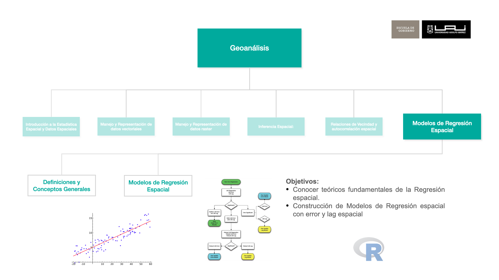

```{r setup, include=FALSE}
knitr::opts_chunk$set(echo = TRUE)
suppressPackageStartupMessages(library(dplyr))
suppressPackageStartupMessages(library(sf))
suppressPackageStartupMessages(library(raster))
suppressPackageStartupMessages(library(ggplot2))
suppressPackageStartupMessages(library(mapview))
suppressPackageStartupMessages(library(spdep))
suppressPackageStartupMessages(library(spatstat))
suppressPackageStartupMessages(library(tidyr))
suppressPackageStartupMessages(library(spatialreg))
```


# Regresión Espacial


## Objetivos



## Fundamentos Teóricos de Regresión Espacial

### Introducción

El análisis de regresión le permite modelar, examinar y explorar relaciones espaciales y puede ayudar a explicar los factores detrás de los patrones espaciales observados. Sin embargo, hay una motivación adicional importante: incorporar explícitamente la dependencia espacial en el modelo. Hay dos tipos comunes de regresión espacial: el modelo de error espacial (SEM) y el modelo de retraso espacial (SLM).

### Tipos de Regresión

**Modelo de error espacial: **

{width=60%}

La principal razón para aplicar un modelo de error espacial es controlar la autocorrelación espacial general. Queremos hacerlo porque la autocorrelación espacial rompe el importante supuesto de que nuestros errores de regresión no están correlacionados. 


**Modelo de retraso (lag) espacial:**

{width=60%}

La principal razón para ejecutar un modelo de retraso espacial es modelar formalmente el contagio espacial. Estamos modelando el impacto de los resultados de nuestros vecinos en nuestro propio resultado. 


## Cálculo de Regresión Espacial

A continuación se realizarán dos modelos de regresión espacial, el primero con error espacial y la variable a explicar es el nivel socioecómico. En segundo caso la variable a explicar será el indicador de delitos violentos en la comuna de Las Condes, y se aplicará modelo error y lag espacial, además del un modelo que combina ambos llamado `sacsar`.

### Pasos de Regresion Espacial

0. Selección de Área de Estudio
1. Crear Matriz de Vecindad
2. Analizar la Autorrelación Espacial de $y$
3. Estimar un modelo de regresión ordinario (OLS)
4. Seleccionar tipo de Regresión Espacial
4. Estimar Modelo de Regresión Espacial

### Selección de Área de Estudio


**Cargar Librerías**

```{r echo=FALSE}
library(dplyr)
library(sf)
library(ggplot2)
library(raster)
library(mapview)
library(spdep)
library(spatstat)
```

**Selección de Área de Estudio**
```{r}
mi_comuna <-  "LAS CONDES"
# ine
mz_comuna <- readRDS("data/censo/manzanas.rds") %>% 
  filter(NOM_COM == mi_comuna) %>% 
  st_transform(32719)
```


```{r}
# socioeconomicos
soc <-  st_read("data/socioeconomicos/resultados/R13_ind_socioeconomicos.shp") %>% 
  st_drop_geometry() %>%
  dplyr::select(ID_MANZ, ID_MANZCIT, IEJ, IEM, IPJ, IRH, IVI, ISV) 


mz_comuna <-  mz_comuna %>% 
  mutate(CODINE017 = as.character(CODINE017)) %>% 
  left_join(soc,by = c("CODINE017" = "ID_MANZ"))
# head(mz_comuna)

```

**Agregar Variable de Densidad Poblacional**

Calcula la densidad poblacional por hetárea
```{r}
mz_comuna <- mz_comuna %>% 
  mutate(densidad_hec = round(as.numeric(POBLACION/(st_area(.)/10000))))

```


**Eliminar Valores Nulos**

Primero se cfrea una variable que se prentende explicar

```{r}
mz_comuna <-  mz_comuna %>% 
  mutate(nived = JH_ESC_P) %>% # Usaremos variable auxiliar de nivel educacional
  filter(!is.na(nived))
```


```{r}
ggplot() +
  geom_sf(data = mz_comuna, aes(fill = nived), color ="gray80", 
          alpha=1,  size= 0.1)+
  scale_fill_distiller(palette= "YlGnBu", direction = 1)+
  ggtitle("Nivel Educacional del Jefe de Hogar") +
  theme_bw() +
  theme(plot.title = element_text(size=12))+
  theme(panel.grid.major = element_line(colour = "gray80"), 
        panel.grid.minor = element_line(colour = "gray80"))
```

### Crear Matriz de Vecindad

Definir un criterio de vecidad, para el caso de estudio es la distancia y asignar pesos espciales


**Polígonos a puntos**

```{r}
ptos_comuna <- mz_comuna%>%
  st_geometry() %>%
  st_centroid()

```

**Calcular Vecinos Cercanos ($k$)**

```{r}
# vecinos mas cercanos (neighbours)
k <- 8 # numero de vecinos a buscar
nb_mzs <- knearneigh(ptos_comuna, k = k) %>%  # por punto calcula K vecinos
  knn2nb() # Knn a matriz de vecindad

```


**Visualización de la relaciones por cada Centroide**


```{r}
# matri< de vecindad a lines solo oara visualizaciñon
neighbors_sf <- as(nb2lines(nb_mzs, coords = st_geometry(ptos_comuna)), 'sf')

p_mv <- ggplot() +
  geom_sf(data = mz_comuna, fill = NA, color ="gray60", alpha=1,  size= 0.3)+
  geom_sf(data = neighbors_sf,  color = "red", alpha=0.5,  size= 0.5)+
  geom_sf(data = ptos_comuna,  color ="#525252", alpha=1,  size= 1)+
  ggtitle("Relaciones de Vecindad por cada manzana (k = 8)") +
  theme_bw() +
  theme(plot.title = element_text(size=12))+
  theme(panel.grid.major = element_line(colour = "gray80"), 
        panel.grid.minor = element_line(colour = "gray80"))

p_mv
```

**Asignar Pesos Espaciales por población**


```{r}
nb <-nb2listw(nb_mzs)
mz_comuna$id <- 1:nrow(mz_comuna)
nb$weights = lapply(1:nrow(mz_comuna), function(i)
  mz_comuna$POBLACION[mz_comuna$id %in% nb$neighbours[[i]]] / 
    sum(mz_comuna$POBLACION[mz_comuna$id %in% nb$neighbours[[i]]]))

```


### Analizar la Autorrelación Espacial de $y$

A través del test estadítico índice de Moran analizar la autocorrelación espacial de la variable dependiente que se pretende explicar.


```{r}
## Test de Moran
moran.test(mz_comuna$nived,listw=nb)
```


### Estimar un modelo de regresión ordinario (OLS)

**Transformación de Variables**


Revisión  de la distribución de Variables

```{r}
hist(mz_comuna$densidad_hec, breaks=100)
hist(log(mz_comuna$densidad_hec), breaks=100)
```

```{r}
colnames <- c("nived","densidad_hec","ISV","IVI","IRH", "IEM")

# Ciclo para graficos agrupados
par(mfrow=c(3, 3))
for (v in colnames) {
    hist(mz_comuna %>% st_drop_geometry() %>% pull(!!v), breaks=100, main=v, probability=TRUE, col="gray")
}
```

**Transformaciones de Datos en modelos**

Se pueden transformar los datos para obtener mejor linealidad entre sus relaciones entre las variables respuesta y predictivas. Las transformaciones más utilizadas son:

* `log(y)` frente a x para relaciones exponenciales
* `log(y)` contra log(x) para funciones de potencia;
* `exp(y)` contra x para relaciones logarítmicas;
* `1/y` contra `1/x` para las relaciones asintóticas;
* `log(p/(1 - p))` contra x para datos de proporción.


```{r}
mz_comuna <- mz_comuna %>% 
  mutate(
    l_nived = nived^3,
    l_densidad_hec = log(densidad_hec),
    l_ISV = log(ISV),
    l_IVI = log(IVI),
    l_IRH = log(IRH),
    l_IEM = log(IEM)
  )
```


```{r}
colnames <- c("l_nived","l_densidad_hec","l_ISV","l_IVI","l_IRH", "l_IEM")


# Ciclo para graficos agrupados
par(mfrow=c(3, 3))
com <- mz_comuna %>% st_drop_geometry() 
for (v in colnames) {
    hist(com %>% pull(!!v), breaks=100, main=v, probability=TRUE, col="gray")
}

par(mfrow=c(1, 1))
```


**Modelo OLS**

Modelo estadístico que relaciona funcionalmente dos variables de forma lineal (una recta o, en su versión generalizada, un plano o un hiperplano). El caso más simple contiene una variable respuesta (Y; i.e. lo que se quiere explicar o predecir), y una variable explicativa o predictor (X; i.e., variables que se usan para explicar o predecir Y). A veces estas variables también son llamadas dependiente e independiente.

Que exista una relación funcional significativa entre ambas variables no implica una causalidad, ~~pero la puede sugerir~~.

$$y = b_0 + b_1*x_1 + b-_2*x_2 + b_3*x_3 + … + b_n*x_n+\varepsilon$$

```{r}

mod_nived = lm(l_nived ~ l_densidad_hec + l_ISV + l_IVI + l_IRH + l_IEM,
               data = mz_comuna)
summary(mod_nived)

# plot(mod_nived)

```

**Output Modelo de Regresión**


**P - Valor**    $p-value$

$p-value$ Probabilidad de que el la H0 sea verdad. P-valores significativos, ej., bajo alpha = 0.05, lleva a interpretar la probabilidad de que el modelo de regresión no explique una porción significativa de la varianza de Y es baja.

- $H_0$: El modelo NO explica la varianza de los datos Y
- $H_1$: El modelo SI explica la varianza de los datos Y

**Coeficiente de determinación ($R^2$)**

El coeficiente de determinación (o el cuadrado de la correlación de Pearson) es una de las métricas más utilizadas. Si bien esta es muy útil, pueden haber ocasiones donde valores altos de R² se obtienen cuando la dispersión o error de las predicciones es alta. Los valores van entre 0 y 1. Es una medida de ajuste relativa (porcentual), por lo que puede ser usada para comparar modelos entre sí.


**Distribución F de Fisher**

Comparar si hay diferencias significativas entre dos varianzas. En caso de las regresiones proporciona esencialmente una medida de la cantidad de variación que explica el modelo frente a la cantidad de variación no explicada (por grados de libertad restantes).

Valores de $F$ altos significa que su modelo explica mucho más de la variación por parámetro que el error por grado de libertad restante. 


**Residuos**

Los residuos son la diferencia entre los valores observados y los predichos (obs - pred). Los residuos se utilizan mucho en post-hoc tests (o tests para analizar los resultados de los modelos). Los residuos, por un lado, dan estimaciones de posibles sesgos del modelo.

Es muy importante que los residuos se distribuyan de manera aleatoria en el modelo.

{width="300"}


**Análisis de Residuos**


Para verificar que la relación a estudiar no genera residuos que se encuentren correlacionados espacialmente, extraemos los errores del modelo OLS y aplicamos el contraste de hipótesis usual, usando el estadístico de Moran (ó Moran’s I):


```{r}
residuals_mod_nived<-residuals(mod_nived)
moran.test(residuals_mod_nived, listw = nb,  randomisation = TRUE)
```

```{r}
moran_res <-moran.mc(residuals_mod_nived, nb, nsim=599)
plot(moran_res)
```


### Seleccionar tipo de Regresión Espacial


```{r}
## Test Moran residuos
lm.morantest(mod_nived,nb,alternative="greater")
```


```{r}
## Tipo de dependencia
lm.LMtests(mod_nived,nb,test="all")
```


### Modelo de error Espacial

A pesar de que nuestro modelo goza de las características ideales asociadas a un modelo de regresión líneal estándar, hemos comprobado que los residuos de la regresión presentan autocorrelación espacial. Por tanto, para reconocer la existencia de esta estructura espacial en los errores, usamos el Modelo del Error Espacial. Este modelo se define como:

$$y=\beta_0+X\beta+\varepsilon$$

$$\varepsilon= \lambda W \varepsilon+ \xi$$

Donde $X$ son las variables predictoras, mientras que $W$ es la matriz de peso espacial. El parámetro $\lambda$ es el indicador que mide la fuerza espacial de los residuos y los residuos de los vecinos. 

En R, estimamos el modelo vía Maximum Likelihood (máxima verosimilitud) de la siguiente forma:

```{r eval=FALSE}
## SDEM Spatial Durbin Error Model
fit.err = spatialreg::errorsarlm(
  l_nived ~ l_densidad_hec + l_ISV + l_IVI + l_IRH + l_IEM,
  data = mz_comuna,
  listw = spdep::nb2listw(nb_mzs),
  etype = "error",
  method = "eigen"
)
```


```{r}
# saveRDS(fit.err, "data/models/fit.err_nived.rds")
fit.err <- readRDS("data/models/fit.err_nived.rds")
```

```{r}
summary(fit.err, Nagelkerke=T)
```

En este modelo, las variables `l_densidad_hec`, `l_ISV` dejaron de ser significativa. Mientras que $\lambda$ nos indica que el modelo tiene una fuerte correlación espacial en los residuos.


```{r}
## Test Moran residuos
res.err=fit.err$residuals
moran.test(res.err,nb)
```


### Modelo de Lag Espacial

**Consolidar Base Inicial**

INE
```{r}
mi_comuna <-  "LAS CONDES"
# ine
mz_comuna <- readRDS("data/censo/manzanas.rds") %>% 
  filter(NOM_COM == mi_comuna) %>% 
  st_transform(32719)
```


socioeconomicos
```{r}
soc <-  st_read("data/socioeconomicos/resultados/R13_ind_socioeconomicos.shp") %>% 
  st_drop_geometry() %>%
  dplyr::select(ID_MANZ, ID_MANZCIT, IEJ, IEM, IPJ, IRH, IVI, ISV)
```

Sii

```{r}
sii <-  st_read("data/sii/urbes.shp") %>% 
  filter(n_com == mi_comuna) %>% 
  st_set_crs(4326) %>% 
  st_transform(32719)
sii_com <- st_intersection(sii, mz_comuna %>% 
                             dplyr::select(CODINE017)) %>% 
  dplyr::select(CODINE017,oficinas: atractor) %>% 
  mutate(CODINE017 = as.character(CODINE017)) %>% 
  st_drop_geometry()


# mapview(sii, zcol ="atractor", cex=2)
```


delitos

```{r}

idel_violentos_LC <- readRDS("data/delitos/idel_violentos_LC.rds") %>% 
  dplyr::select(CODINE017, idelv) %>% 
  mutate(CODINE017 = as.character(CODINE017)) %>% 
  st_drop_geometry()
```


Consolidación


```{r}
mz_estudio <-  mz_comuna %>% 
  mutate(CODINE017 = as.character(CODINE017)) %>% 
  left_join(soc,by = c("CODINE017" = "ID_MANZ")) %>% 
  left_join(sii_com,by = "CODINE017") %>% 
  left_join(idel_violentos_LC,by = "CODINE017") %>% drop_na()
```


Selección de variables

```{r}

mz_estudio <- mz_estudio%>% 
  dplyr::select(CODINE017, POBLACION, IEJ,IEM,IPJ, IRH, IVI, ISV,
                vivienda, atractor,idelv) %>% 
  mutate(densidad_hec = round(as.numeric(POBLACION/(st_area(.)/10000))))

```


#### Transformaciones

```{r}
colnames <- c("idelv", "IEJ","IEM","IPJ", "IRH", "IVI", "ISV",
                "vivienda", "atractor","densidad_hec")

# Ciclo para graficos agrupados
par(mfrow=c(3, 3))
for (v in colnames) {
    hist(mz_estudio %>% st_drop_geometry() %>% pull(!!v), breaks=100, main=v, probability=TRUE, col="gray")
}
par(mfrow=c(1, 1))
```


```{r}

mz_estudio <- mz_estudio %>% 
  mutate(
    rc_idelv = idelv^(1/3),
    c_IEJ = IEJ **3,
    c_IEM = IEM **3,
    c_IPJ = IPJ **3,
    c_IRH = IRH **3,
    l_vivienda= log(ifelse(vivienda==0, 0.001, vivienda)),
    l_atractor= log(ifelse(atractor==0, 0.001, atractor)),
    densidad_hec= log(ifelse(densidad_hec==0, 0.001, densidad_hec))
  )
```


```{r}
colnames <- c("rc_idelv","c_IEJ","c_IEM","c_IPJ","c_IRH", 
              "l_vivienda", "l_atractor", "densidad_hec")


# Ciclo para graficos agrupados
par(mfrow=c(3, 3))
for (v in colnames) {
    hist(mz_estudio %>% st_drop_geometry() %>% pull(!!v), breaks=100, main=v, probability=TRUE, col="gray")
}

par(mfrow=c(1, 1))
```

Modelo OLS

```{r}
mod_idelv = lm(rc_idelv ~ c_IEJ + c_IEM + c_IPJ + c_IRH+
               IVI+ ISV+l_vivienda+l_atractor+densidad_hec, 
               data = mz_estudio)
summary(mod_idelv)
```

```{r eval=FALSE}
residuals_idelv <-residuals(mod_idelv)
moran.test(residuals_idelv, listw = spdep::nb2listw(nb_mzs),  randomisation = TRUE)

```

 
#### Autocorrelación Espacial
 
 
```{r warning=FALSE}
ptos_comuna <- mz_estudio%>%
  st_geometry() %>%
  st_centroid()

# vecinos mas cercanos (neighbours)
k <- 8 # numero de vecinos a buscar
nb_mzs <- knearneigh(ptos_comuna, k = k) %>%  # por punto calcula K vecinos
  knn2nb() # Knn a matriz de vecindad

nb <-nb2listw(nb_mzs)
mz_estudio$id <- 1:nrow(mz_estudio)
nb$weights = lapply(1:nrow(mz_estudio), function(i)
  mz_estudio$POBLACION[mz_estudio$id %in% nb$neighbours[[i]]] / 
    sum(mz_estudio$POBLACION[mz_estudio$id %in% nb$neighbours[[i]]]))

## Test de Moran
```


```{r}
moran.test(mz_estudio$rc_idelv,listw=nb)
```
 
 
 Error espacial
```{r eval=FALSE}
## SDEM Spatial Durbin Error Model
fit.errdurb_del=errorsarlm(rc_idelv ~ c_IEJ + c_IEM + c_IPJ + c_IRH+
               IVI+ ISV+l_vivienda+l_atractor+densidad_hec, 
               data = mz_estudio,
               listw=spdep::nb2listw(nb_mzs),
               etype="error",method="eigen")
```

```{r echo=FALSE}
# saveRDS(fit.errdurb_del, "data/models/fit.errdurb_del.rds")
fit.errdurb_del <-  readRDS("data/models/fit.errdurb_del.rds")
```


```{r eval=TRUE}
summary(fit.errdurb_del, Nagelkerke=T)
## Test Moran residuos
res.err=fit.errdurb_del$residuals
moran.test(res.err,nb)
```
 
 

Lag espacial
```{r eval=FALSE}
## SDM Spatial Durbin Lag Model
fit.durb=lagsarlm(rc_idelv ~ c_IEJ + c_IEM + c_IPJ + c_IRH+
               IVI+ ISV+l_vivienda+l_atractor+densidad_hec, 
               data = mz_estudio,
               listw=spdep::nb2listw(nb_mzs),
               type="lag",method="eigen")
```

```{r echo=FALSE}
# saveRDS(fit.durb, "data/models/fit.durb_lag.rds")
fit.durb <-  readRDS("data/models/fit.durb_lag.rds")
```


```{r eval=TRUE}
summary(fit.durb, Nagelkerke=T)
## Test Moran residuos
res.lag=fit.durb$residuals
moran.test(res.lag,nb)
```

Error y Lag espacial
```{r eval=FALSE}
## SAC Spatial Autocorrelation Model
fit.sac=sacsarlm(rc_idelv ~ c_IEJ + c_IEM + c_IPJ + c_IRH+
               IVI+ ISV+l_vivienda+l_atractor+densidad_hec, 
               data = mz_estudio,
               listw=spdep::nb2listw(nb_mzs),
               type="sac",method="eigen")
```


```{r echo=FALSE}
# saveRDS(fit.sac, "data/models/fit.sac.rds")
fit.sac <-  readRDS("data/models/fit.sac.rds")
```

```{r}
summary(fit.sac, Nagelkerke=T)
## Test Moran residuos
res.sac=fit.sac$residuals
moran.test(res.sac,nb)
```

## Referencias de Capítulo:

- [GEO 200CN: Quantitative Geography](https://geo200cn.github.io/spatialreg.html#Why_run_a_spatial_regression)

- [Spatial Regression 10. Specification Tests](https://spatial.uchicago.edu/sites/spatial.uchicago.edu/files/10_specification_tests_2_slides.pdf)

- [Spatial Regression Analysis in R A Workbook - Luc Anselin](https://dces.wisc.edu/wp-content/uploads/sites/128/2013/08/W14_Anselin2007.pdf)

