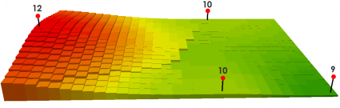
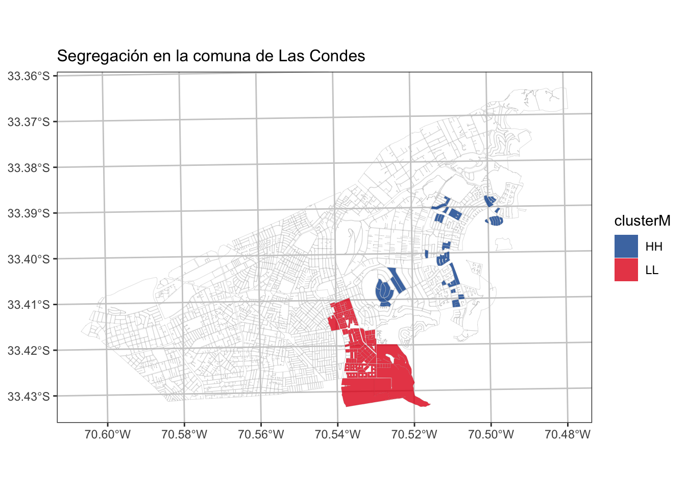

# Tarea 2 {.unnumbered}

## Antecedentes

- Fecha de entrega: **23 de Noviembre 2022**
- Formato: Informe (pdf o html) + Código (.r o .rmd)
- Integrantes: 1

## Instrucciones

### Parte 1: Interpolación de Inverso a la Distancia Poderada.

1. Defina un área de estudio Urbana (no la comunas vistas en clases)
2. Realice 3 calculos de interpolación de Inverso a al Distancia (IDW) con los datos del SII correspodiente a _comercio_, _oficina_ y _atractor_. _(1.5 pt)_
3. Calcule un indicador de territorial por cada uno de los resultados de las IDW  del punto anterio y visualice los los resultados. _(1.5 pt)_

### Parte 2: Autocorrelación espacial.

1. Defina un área de estudio Urbana (no la comunas vistas en clases) y visualice una variable que usted decida evaluar su autocorrelación espacial (Ej: Nivel Educacional). Justifique la selwcción de variable a modo de hipótesis.  _(1 pt)_

2. Genere una Matriz de Vecidad ponderada por la variable que usted encuentre idónea (Ej: Población) _(1 pt)_

3. Cálculo de índice de Moran (global) y visualice sus resultados en gráfico de cuadrantes. Interprete los resultados de forma general. _(1 pt)_

4. Cálculo de índice de local Moran e identifique los grupos o cluster haciendo uso de los resultados significancia estadística, visualice los resultados en un Mapa e  Interprete los resultados de forma general. _(1 pt)_

{width=60%}